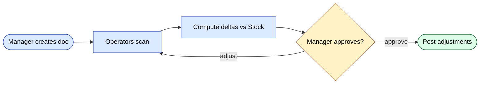
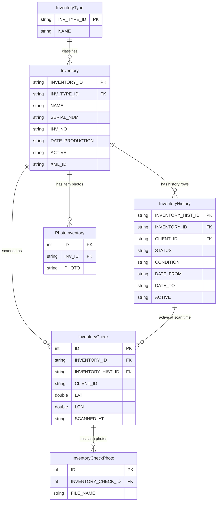
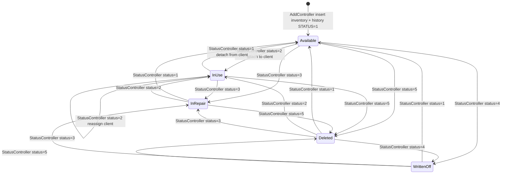
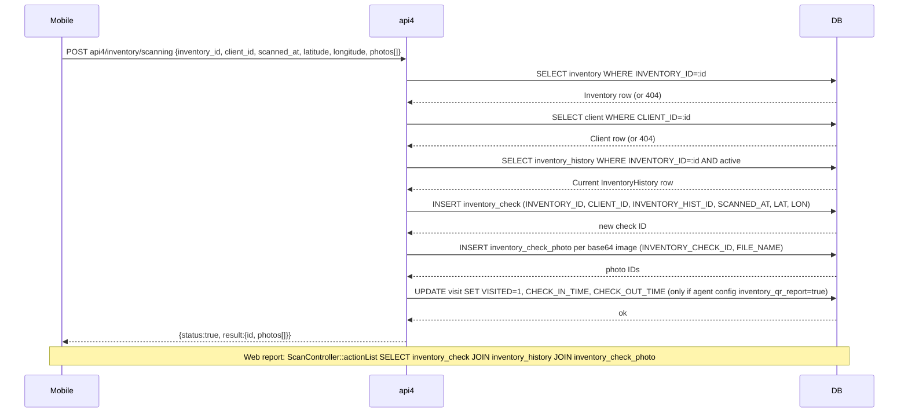

# `inventory` moduli

Mobil shtrix-kod skanerlash va tizim zaxirasi bilan kelishtirish bilan jismoniy inventarizatsiya hisoblari (stocktake'lar).

## Asosiy xususiyatlar

| Xususiyat | Nima qiladi | Egasi rol(lar) |
|---------|--------------|---------------|
| Inventarizatsiya hujjati yaratish | Yangi stocktake boshlash; `inventory_type` ni tanlash | 1 / 2 / 9 |
| Mijoz / ombor bo'yicha qamrov | Hujjatni ma'lum do'kon yoki ombor bilan cheklash | 1 / 9 |
| Mobil skanerlash | Operatorlar api3 orqali shtrix-kodlarni birma-bir skanerlaydi | 4 / ombor xodimi |
| Foto dalil | Shikastlangan yoki kam tovarlarning fotolarini biriktirish | 4 |
| Kelishtirish | Joriy `Stock` ga nisbatan delta'larni hisoblash | tizim |
| Tuzatishlar | Tasdiqlashda delta'lar zaxiraga tuzatish sifatida post qilinadi | 1 / 9 |
| Tarix | Hujjat bo'yicha tahrirlar va tasdiqlashlar tarixi | tizim |

## Papka

```
protected/modules/inventory/
├── controllers/
│   ├── AddController.php
│   ├── EditController.php
│   ├── DeleteController.php
│   ├── ListController.php
│   ├── HistoryController.php
│   ├── PhotoController.php
│   ├── ScanController.php
│   └── StatusController.php
└── views/
```

## Workflow

1. Menejer inventarizatsiya hujjatini yaratadi (`AddController`).
2. Operatorlar omborda mahsulotlarni `ScanController` (mobil, api3) orqali skanerlaydi.
3. Tizim joriy zaxiraga nisbatan delta'larni hisoblaydi.
4. Menejer tasdiqlaydi; delta'lar `stock` ga tuzatish sifatida post qilinadi.

## Asosiy xususiyat oqimi — Stocktake



## Fotolar

`PhotoController` qator bo'yicha foto dalilni biriktiradi (masalan, shikastlangan tovarlar). `upload/inventory/<doc_id>/` ostida saqlanadi.

## Ruxsatlar

| Amal | Rollar |
|--------|-------|
| Yaratish | 1 / 2 / 9 |
| Skanerlash (mobil) | 4 / ombor xodimi |
| Tasdiqlash | 1 / 2 / 9 |

## Workflow'lar

### Kirish nuqtalari

| Trigger | Controller / Action / Job | Izohlar |
|---|---|---|
| Web (menejer) | `AddController::actionIndex` | Yagona inventarizatsiya elementi yaratadi; `InventoryType` va ixtiyoriy `Client` ni tasdiqlaydi |
| Web (menejer, paket) | `AddController::actionBatch` | Import qilingan ro'yxatdan elementlarni paket bilan yaratadi |
| Web (menejer) | `EditController::actionInventory` | Element metama'lumotlarini tahrirlaydi (nom, seriya, tur) |
| Web (menejer) | `EditController::actionHistory` | Elementni boshqa mijozga qayta-biriktiradi / qayta-tayinlaydi; eski `InventoryHistory` qatorini yopadi |
| Web (menejer) | `StatusController::actionEdit` | Yagona-element status o'tishi; `InventoryService::CAN_CHANGE_STATUS_TO` orqali ruxsat etilgan o'tishlarni himoya qiladi |
| Web (menejer, paket) | `StatusController::actionBulkEdit` | Element ID'lari to'plami bo'ylab paket status o'zgarishi |
| Web (menejer) | `PhotoController::actionAdd` | Elementga dalil fotosini biriktiradi (maks 3, maks 5 MB) |
| Mobil (agent) | `api4/InventoryController::actionScanning` | Mijoz joyida element uchun shtrix-kod/QR skanerlash voqeasini qayd etadi |
| Mobil (agent) | `api4/InventoryController::actionScanningPhoto` | Skanerlash voqeasi fotosini yuklaydi (`InventoryCheckPhoto`) |
| Web (hisobot) | `ScanController::actionList` | Skanerlash voqeasi jurnalini oladi (`inventory_check` + `inventory_history` + `inventory_check_photo` ni birlashtiradi) |
| Web (hisobot) | `HistoryController::actionData` | Barcha elementlar bo'ylab to'liq tayinlash tarixini oladi |

### Soha entitylari



### Workflow 1.1 — Inventarizatsiya elementi hayot davri (yaratish va status o'tishlari)

Menejer `AddController::actionIndex` orqali jismoniy aktivni ro'yxatga oladi, u esa atomik ravishda `Inventory` qatorini va boshlang'ich `InventoryHistory` qatorini qo'shadi. Shu nuqtadan boshlab element nazorat qilinadigan statuslar to'plami bo'ylab harakatlanadi. Barcha o'tishlar `InventoryService::CAN_CHANGE_STATUS_TO` ga qarshi tasdiqlanadi; noqonuniy sakrashlar har qanday DB yozuvidan oldin rad etiladi.



### Workflow 1.2 — Mobil skanerlash voqeasi (agent mijoz joyida QR/shtrix-kod skanerlaydi)

Daladagi agent `api4/InventoryController::actionScanning` ni ochadi. Endpoint elementni va mijozni tasdiqlaydi, joriy `InventoryHistory` qatorini aniqlaydi, `InventoryCheck` yozuvini saqlaydi (GPS koordinatalari bilan), biriktirilgan har qanday fotolarni `InventoryCheckPhoto` qatorlari sifatida saqlaydi va — agar agentning konfiguratsiyasida `visiting.inventory_qr_report` yoqilgan bo'lsa — mos keluvchi `Visit` ni tashrif buyurilgan deb belgilaydi. Web `ScanController::actionList` keyinchalik skanerlash voqeasi hisobotini ishlab chiqarish uchun `inventory_check`, `inventory_history` va `inventory_check_photo` ni birlashtiradi.



### Modullar aro tutash nuqtalari

- O'qiydi: `client.Client` (`AddController::actionIndex`, `EditController::actionHistory`, `api4/InventoryController::actionScanning` da maqsadli mijozni tasdiqlash)
- O'qiydi: `visiting.Visiting` (`api4/InventoryController::actionList` da agentning mijozlar ro'yxatini aniqlash)
- Yozadi: `visiting.Visit` (`api4/InventoryController::actionScanning` ichida `inventory_qr_report` agent konfi yoqilganda tashrifni `VISITED=1` deb belgilash)
- API'lar: `api4/inventory/scanning`, `api4/inventory/scanningPhoto`, `api4/inventory/add`, `api4/inventory/edit`, `api4/inventory/list`

### Tuzoqlar

- `InventoryHistory` **soft-close** patternidan foydalanadi: status o'zgarganda, oldingi aktiv qatorga `ACTIVE='N'` va `DATE_TO=now` alohida `UPDATE` da belgilanadi, so'ng yangi qator qo'shiladi — status ustunining joyida yangilanishi yo'q. `ACTIVE='Y'` filtrini unutgan so'rovlar ikki nusxadagi joriy holatlarni ko'radi.
- `StatusController::actionEdit` yagona-element o'tishlari uchun `InventoryService::CAN_CHANGE_STATUS_TO` ni tekshiradi, lekin `StatusController::actionBulkEdit` `InventoryHistory::model()->statuses` ga qaytadi (eski instance-property massiv, status `5` ni o'z ichiga olmaydi). Ikki himoya sinxron emas.
- Soft-delete (`Inventory` qatorida `ACTIVE='N'`) `ServerSettings::enableInventoryDeletion()` orqasida bloklangan. Agar bayroq o'chirilgan bo'lsa, status `5` `InventoryHistory` ga yozilishi mumkin, ammo element `ListController::actionData` da ko'rinib turaveradi.
- `api3/InventoryController::actionSet` `InventoryService` factory'siz `Inventory` + `InventoryHistory` ni yaratuvchi eski mobil endpoint; u har doim `STATUS=2` va `DILER_ID='d0_1'` ni qattiq kodlaydi. Yangi ish uchun `api4` ni afzal ko'ring.
