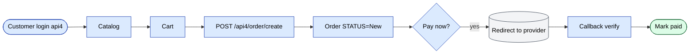

# `onlineOrder` moduli

B2B online do'kon + Telegram bot orqali buyurtma kanali. Mijozlar (yoki ularning operatorlari) agent tashrifisiz buyurtmalar joylashtiradi.

## Asosiy xususiyatlar

| Xususiyat | Nima qiladi | Egasi rol(lar) |
|---------|--------------|---------------|
| Ochiq katalogni ko'rib chiqish | Mijoz mahsulotlarni kategoriya / brend / zaxira filtrlari bilan ko'rib chiqadi | yakuniy mijoz |
| Savatcha + buyurtma joylashtirish | Mijoz api4 orqali yuboradi | yakuniy mijoz |
| Online to'lovga yo'naltirish | To'lov uchun Click / Payme / Paynet ga o'tkazib berish | yakuniy mijoz |
| Keyin-to'lash oqimi | Krediti bor mijozlar uchun; standart buyurtma quvuriga o'tadi | yakuniy mijoz |
| Buyurtma tarixi | Mijoz o'tgan buyurtmalar + statuslar + yuklab olinadigan invoyslarni ko'radi | yakuniy mijoz |
| Aloqa formasi | Portal'dan operator jamoasiga murojaat qilish | yakuniy mijoz |
| Hisobotlar | Mijozning o'z iste'mol hisobotlari | yakuniy mijoz |
| Rejalashtirilgan hisobotlar | Davriy email orqali yuboriladigan hisobot xulosalari | yakuniy mijoz |
| Telegram bot | `/start`, `/catalog`, `/order`, `/orders`, `/help` | yakuniy mijoz |
| Telegram WebApp | To'liq buyurtma uchun Telegram ichida joylashtirilgan SPA | yakuniy mijoz |

## Kontrollerlar

| Kontroller | Maqsad |
|------------|---------|
| `CatalogController` | Ochiq katalogni ko'rib chiqish |
| `ContactController` | Aloqa formasi / xabar |
| `OrderController` | Buyurtma joylashtirish va tarix |
| `PaymentController` | Online to'lovga yo'naltirish |
| `ReportController` | Mijozning o'z hisobotlari |
| `ScheduledReportController` | Davriy email hisobotlari |
| `TelegramController` | Telegram bot webhook |
| `WebAppController` | Telegram WebApp host |

## Auth

Online foydalanuvchilar bir xil `User` jadvaliga qarshi autentifikatsiya qiladi, lekin boshqa `ROLE` bilan. Sessiyalar `HTTP_HOST` prefiksi bilan Redis db0 orqali o'tadi.

## Asosiy xususiyat oqimi — Online buyurtma

[FigJam · sd-main · Feature Flows](https://www.figma.com/board/MyvyaeEluqvHofH4E2qIoU) ichida **Feature · Online order + Defect/Return** ga qarang.

