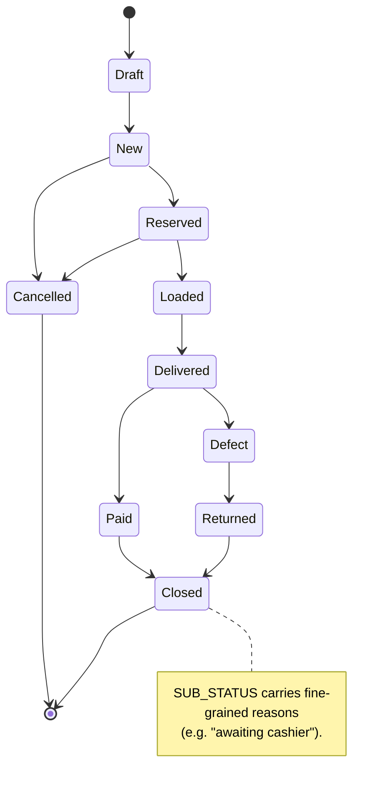
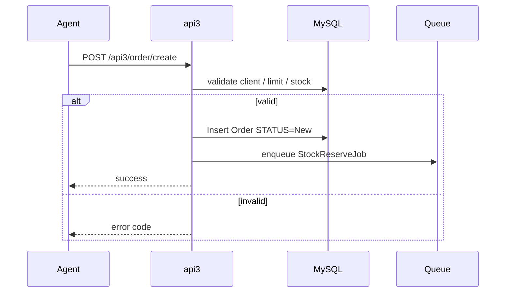
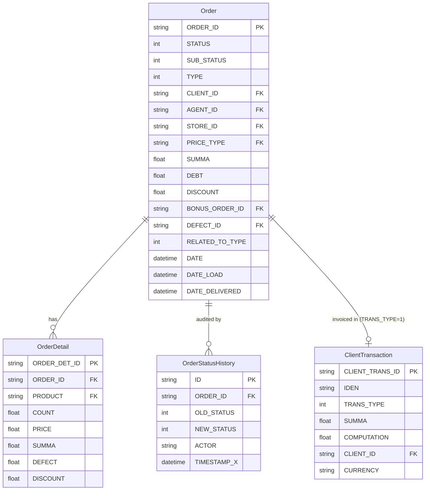
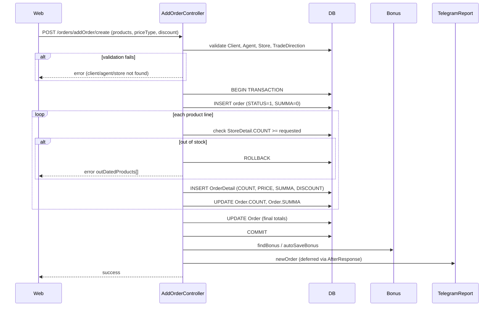
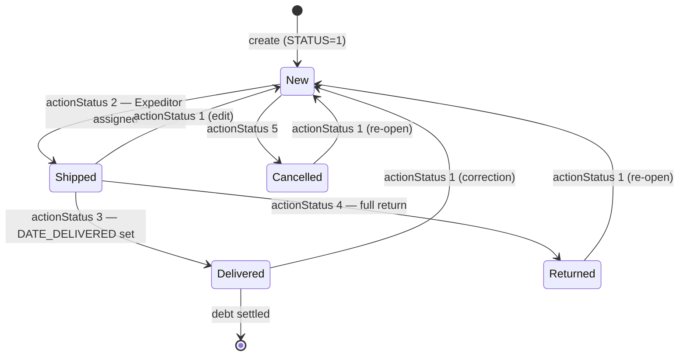
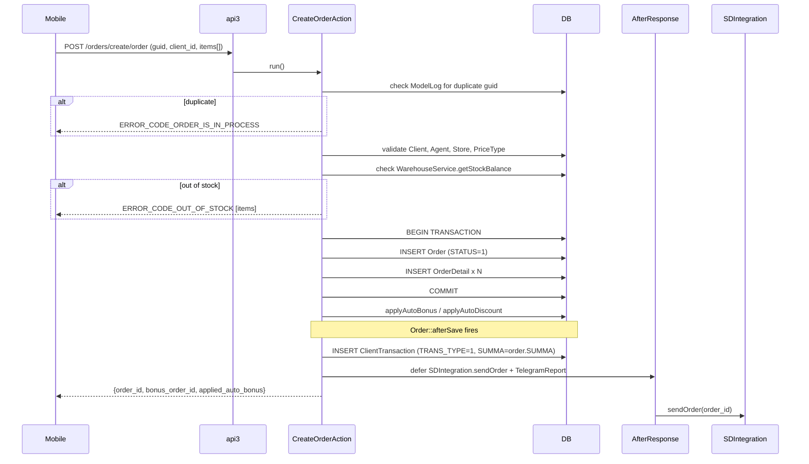
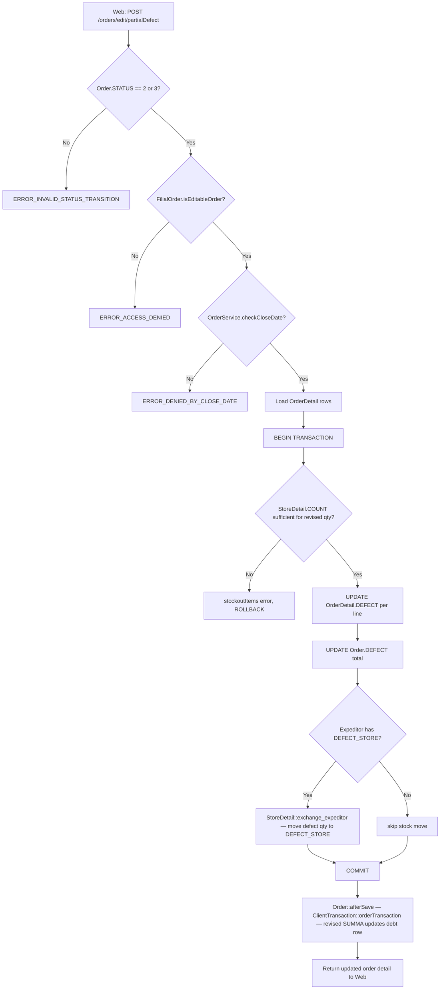

# `orders` moduli

sd-main ning yuragi. Buyurtmalarni qabul qiladi, narxlaydi, tasdiqlaydi va to'liq hayot davri bo'ylab kuzatib boradi.

## Asosiy xususiyatlar

| Xususiyat | Nima qiladi | Egasi rol(lar) |
|---------|--------------|---------------|
| **Buyurtma qabul qilish (web)** | Operator/menejer admin UI da buyurtmani satr-satr quradi | 1 / 2 / 3 / 5 / 9 |
| **Buyurtma qabul qilish (mobil)** | Dala agenti tashrif vaqtida api3 orqali buyurtma yuboradi | 4 |
| **Buyurtma qabul qilish (online / B2B)** | Mijoz o'z-o'ziga xizmat ko'rsatish: api4 / WebApp / Telegram orqali | yakuniy mijoz |
| **Narxlash va narx turlari** | Har bir buyurtma uchun aktiv narxnoma; `enableMarkupPerProduct` yoqilgan bo'lsa, har bir mahsulot uchun ustama | – |
| **Chegirmalar** | Satr bo'yicha chegirmalar + sarlavha darajasidagi chegirma; hisobotlar uchun satr g'olib | 4 / 9 |
| **Bonuslar** | `BONUS_ORDER_ID` orqali bog'langan promo bonus buyurtmalar | 1 / 9 |
| **Tasdiqlash workflow'i** | Zaxira rezervatsiyasidan oldin menejer/admin tasdiqlashi (sozlanadigan) | 1 / 2 / 9 |
| **Status o'tishlari** | Draft → New → Reserved → Loaded → Delivered → Paid → Closed (+ Cancelled / Defect / Returned) | tizim |
| **Yetkazib berishda defekt / rad** | Foto dalil bilan satr bo'yicha defekt; avtomatik zaxiraga qaytarish | 10 / 9 |
| **Excel importlar** | `enableImportOrders` yoqilgan bo'lsa, CSV / Excel paket bilan buyurtma yaratish | 1 / 5 |
| **1C / Faktura.uz / Didox eksporti** | Status o'zgarganda buxgalteriya / EDI ga yuborish | tizim |
| **Push + SMS bildirishnomalari** | Status o'zgarishlari mijoz va agentga xabar qiladi | tizim |
| **Bosma shablonlar** | Har bir tenant uchun maxsus invoys / yuk hujjatining bosma maketi | 1 |
| **Audit izi** | Har bir o'tish uchun `OrderStatusHistory` qatori (aktor + vaqt belgisi) | tizim |

## Papka

```
protected/modules/orders/
├── controllers/
│   ├── AddOrderController.php
│   ├── ApiController.php
│   ├── CleanOrdersController.php
│   ├── CreateController.php
│   ├── ListController.php
│   ├── EditController.php
│   ├── DeleteController.php
│   ├── ApproveController.php
│   ├── DeliveryController.php
│   └── ImportController.php
├── models/
└── views/
```

## Asosiy entitylar

| Entity | Model | Modul egasi | Izohlar |
|--------|-------|-----------------|-------|
| Buyurtma | `Order` | `orders` | Sarlavha (~50 ustun) |
| Buyurtma satri | `OrderProduct` | `orders` | Mahsulot bo'yicha satr (narx, miqdor) |
| Buyurtma status tarixi | `OrderStatusHistory` | `orders` | Audit izi |
| **Defekt** | `Defect` | **`orders`** | Yetkazib berilgan buyurtmadagi satr bo'yicha defekt e'lonlari. `audit` modulining `AFacing` / `AuditResult` bilan **bog'liq emas** (ular merchandayzing tekshiruvlarini yozib oladi, yetkazib berish defektlari emas). |
| **Rad** | `Order` da inline ishlanadi | **`orders`** | Yetkazib berish vaqtida butun buyurtmani rad etish. Satr bo'yicha defektdan farqli: rad butun buyurtmani zaxiraga qaytaradi. |
| Bonus | `Bonus*` | `orders` | `BONUS_ORDER_ID` orqali bog'langan promo bonus buyurtmalar |

## Status mashinasi

[FigJam · sd-main · System Design](https://www.figma.com/board/tw0B3eE1bKNbvmmny8TVvx) ichida **sd-main · Order state machine** diagrammasiga qarang.



## Asosiy xususiyat oqimi — Buyurtma yaratish

[FigJam · sd-main · Feature Flows](https://www.figma.com/board/MyvyaeEluqvHofH4E2qIoU) ichida **Feature · Create Order (mobile / api3)** ga qarang.



## API endpointlari

| Endpoint | Modul | Maqsad |
|----------|--------|---------|
| `POST /api3/order/create` | api3 | Mobil agent tomonidan buyurtma yaratish |
| `POST /api4/order/create` | api4 | B2B / online yaratish |
| `GET /api3/order/list` | api3 | Agentning o'z buyurtmalari |
| `POST /orders/approve` | orders | Web tasdiqlash |

To'liq payloadlar uchun [API v3 ma'lumotnomasi](../api/api-v3-mobile/index.md) ga qarang.

## Ruxsatlar

| Amal | Rollar |
|--------|-------|
| Yaratish | 1, 2, 3, 4, 5, 9 |
| Tasdiqlash | 1, 2, 9 |
| Bekor qilish | 1, 2 |
| O'chirish | 1 (faqat `enableDeleteOrders` bilan) |

## Shuningdek qarang

- [`clients`](./clients.md) · [`agents`](./agents.md) ·
  [`stock`](./stock.md) · [`payment`](./payment.md)

## Workflow'lar

### Kirish nuqtalari

| Trigger | Controller / Action / Job | Izohlar |
|---|---|---|
| Web – operator buyurtma quradi | `AddOrderController::actionCreate` (line 432) | Detal qatorlari, chegirma, bonus bilan to'liq web buyurtma yaratish |
| Web – operator buyurtmani yangilaydi | `AddOrderController::actionUpdate` (line 744) | Yaratish bilan bir xil tasdiqlash yo'li |
| Mobil – agent buyurtma yuboradi | `CreateController` → `CreateOrderAction::run` (line 16) | api3 endpoint `/orders/create/order` |
| Mobil – agent buyurtmani oladi | `GetController` → `GetOrderAction::run` | api3 endpoint `/orders/get/order` |
| Mobil – ekspeditor to'lovni qayd etadi | `PaymentController` → `SetAction::run` (line 5) | api3 endpoint `/orders/payment/set`; `ClientTransaction` yozadi |
| Web – status o'zgarishi (bitta yoki paket) | `EditController::actionStatus` (line 1029) | `VALID_STATUS_TRANSITIONS` orqali tasdiqlanadi; `Order::afterSave` ishga tushiradi |
| Web – paket status o'zgarishi | `EditController::actionStatusBatch` (line 1331) | Buyurtma bo'yicha Telegram shovqinini bostirish uchun `BULK_STATUS_CHANGE = true` belgilaydi |
| Web – qisman defekt e'loni | `EditController::actionPartialDefect` (line 689) | Faqat STATUS 2 yoki 3 da ruxsat etiladi |
| Web – buyurtmalar ro'yxati ko'rinishi | `ListController::actionOrders` (line 33) | Buyurtmalar gridi uchun sahifalashtirilgan JSON |
| Web – buyurtma tafsilotlari ko'rinishi | `OrdersController::actionView` (line 1369) | Buyurtma ko'rish sahifasini render qiladi |
| Web – sub-status o'zgarishi | `EditController::actionSubstatus` (line 1754) | `SUB_STATUS` maydonida saqlanadigan nozik sub-status |
| Web – yetkazib beruvchidan qabul | `SupplierController::actionReceipt` (line 5) | `operation.orders.supplier.receipt` ruxsati |
| Cron / Queue – CIS kodini tekshirish | `CheckOrderCisesJob::handle` | XTrace API orqali mahsulot CIS kodlarini tasdiqlaydi |

---

### Soha entitylari



---

### Workflow 1.1 — Web buyurtma yaratish

Operator `/orders/addOrder` ni ochadi, mijoz / mahsulotlar / chegirmani to'ldiradi va yuboradi.
`AddOrderController::actionCreate` DB tranzaksiyasini ishga tushiradi: `Order` sarlavhasini STATUS=1 (New) bilan saqlaydi, so'ng har bir mahsulot uchun bitta `OrderDetail` qatorini qo'shadi.
Bonus va chegirma qoidalari tranzaksiya commit qilingandan keyin qo'llaniladi.



---

### Workflow 1.2 — Buyurtma hayot davri (status o'tishlari)

`Order` entityasi beshta raqamli status orasida harakatlanadi. O'tishlar `EditController::VALID_STATUS_TRANSITIONS` (line 21) tomonidan tasdiqlanadi. Har bir saqlash `Order::afterSave` (line 383) orqali o'tadi, u esa qarz ledgerini sinxron saqlash uchun `ClientTransaction::orderTransaction` ni ishga tushiradi.



---

### Workflow 1.3 — api3 orqali mobil buyurtma yaratish va qarz to'planishi

Dala agenti mobil ilovadan buyurtma yuboradi. `CreateOrderAction` (api3) buyurtmani saqlaydi va SDIntegration va Telegram chaqiruvlarini `AfterResponse` orqali kechiktiradi. Xuddi shu `Order::afterSave` hookida `ClientTransaction::orderTransaction` `client_transaction` jadvaliga `TRANS_TYPE=1` invoys qatorini qo'shadi va qarz yozuvini yaratadi.



---

### Workflow 1.4 — Qisman defekt e'loni va zaxiraga qaytarish

Ekspeditor shikastlangan tovarlar bilan buyurtmani yetkazganda, operator `EditController::actionPartialDefect` (line 689) ni chaqiradi. Defekt miqdori har bir `OrderDetail.DEFECT` ga yoziladi, `Order.DEFECT` umumiy yangilanadi, va agar ekspeditorda `DEFECT_STORE` sozlangan bo'lsa, zaxira `StoreDetail::exchange_expeditor` orqali defekt omboriga qaytariladi.



---

### Modullar aro tutash nuqtalari

- O'qiydi: `clients.Client` (CLIENT_ID ni tasdiqlash, CLIENT_CAT, CITY, EXPEDITOR ni olish)
- O'qiydi: `stock.Store` / `stock.StoreDetail` (zaxira balansini tekshirish, ombor tanlash)
- O'qiydi: `agents.Agent` (VAN_SELLING turi ekspeditor va ombor mosligini aniqlaydi)
- O'qiydi: `price.PriceType` / `price.OldPrice` (narx turi bo'yicha satr narxlari)
- O'qiydi: `discount.SkidkaManual` (mahsulot / agent bo'yicha qo'lda chegirma tasdiqlash)
- Yozadi: `finans.ClientTransaction` (`Order::afterSave` orqali STATUS o'zgarganda TRANS_TYPE=1 invoys)
- Yozadi: `finans.ClientFinans` (`ClientFinans::correct` orqali qarz balansi tuzatish)
- Yozadi: `bonus.BonusOrder` / `bonus.BonusOrderDetail` (yaratishda avto-bonus va retro-bonus)
- Yozadi: `stock.StoreLog` (har bir status o'zgarishida DATE_LOAD sinxronizatsiyasi)
- API'lar: `api3/orders/create/order` (mobil buyurtma yaratish)
- API'lar: `api3/orders/get/order` (mobil buyurtmani olish)
- API'lar: `api3/orders/payment/set` (mobil to'lovni qayd etish)
- Tashqi: `SDIntegration::sendOrder` har qanday buyurtma saqlangandan keyin `AfterResponse` orqali kechiktirib ishga tushadi

---

### Tuzoqlar

- **STATUS butun sonlardir, konstantalar emas.** `Order` 1–5 (va "edit" yorlig'i uchun 7) yalang'och butun sonlarni ishlatadi. `Order` modelida nomlangan `STATUS_*` konstantalar yo'q — faqat `OrderIdokon` da bor. Kodni o'qiyotganda `EditController::STATUS_NAMES` (line 29) ga murojaat qiling.
- **`BULK_STATUS_CHANGE` bayrog'i.** Paket status chaqiruvlari saqlashdan oldin `$order->BULK_STATUS_CHANGE = true` ni belgilaydi, bu `Order::afterSave` ichidagi har bir buyurtma bo'yicha `notifyInoutReporter` chaqiruvini bostirish uchun. Bu bayroqni qoldirib ketish paket yangilanishlarda N ta Telegram xabariga sabab bo'ladi.
- **Qarz `afterSave` da yoziladi, kontroller tomonidan emas.** `ClientTransaction::orderTransaction` `Order::afterSave` ichida buyurtma har safar saqlanganda ishga tushadi, faqat status o'tishlarida emas. Chegirma yoki bonus yangilanishlari tomonidan qo'zg'atilgan qayta-saqlashlar ham qarz qatorini qayta hisoblaydi — yordamchi skriptlarda `$order->save()` ni chaqirayotganda ehtiyot bo'ling.
- **`debtNewOrder` va standart finans yo'li.** Agar `Yii::app()->params['debtNewOrder']` true bo'lsa va agent VAN_SELLING yoki SELLER bo'lsa, `orderTransaction` o'rniga `newOrderTransaction` chaqiriladi. Bu ikki metod turli tranzaksiya shakllarini yaratadi — ularni aralashtirish hisob-kitob nomuvofiqliklariga olib keladi.
- **Qisman defekt faqat STATUS 2 yoki 3 da ruxsat etiladi.** To'liq qaytarish yo'li (STATUS → 4) alohida status o'tishi, `actionPartialDefect` orqali emas. `Order.DEFECT` (qisman defekt miqdori) ni `Order.TYPE=2` (butun-buyurtma javon qaytarish) bilan aralashtirib yubormang.
- **`Create2Controller`, `Create3Controller`, `CreateOrder2Controller`, `CreateOrder3Controller` `.obsolete` hisoblanadi.** Aktiv web yaratish yo'li `AddOrderController`. Aktiv api3 yo'li `CreateController` + `CreateOrderAction`.
- **`SetAction` (to'lov) `ClientTransaction.TRANS_TYPE=3` ni yozadi.** Bu to'lov kvitansiyasi, `orderTransaction` tomonidan yozilgan invoys qatoridan (`TRANS_TYPE=1`) farq qiladi. Ikkalasi ham `IDEN` maydoni orqali bir xil `ORDER_ID` ga murojaat qiladi. `payment` moduli xuddi shu qatorlarni o'qiydi — `orders` moduli faqat buyurtma tomonidagi kvitansiyani yozadi.
