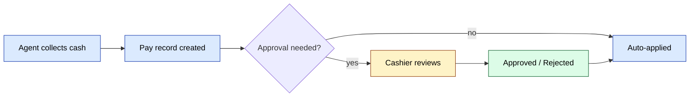

# `payment` va `pay` modullari

Ikki bog'liq modul:

- **`pay`** — past darajadagi to'lov qaydi (buyurtmalarga nisbatan yozuvlar).
- **`payment`** — `pay` ustidagi tasdiqlash workflow'i.

## Asosiy xususiyatlar

| Xususiyat | Nima qiladi | Egasi rol(lar) |
|---------|--------------|---------------|
| To'lovni qayd etish | Buyurtmaga bog'langan `Payment` qatorini yaratish | Agent / Operator |
| To'lovni tasdiqlash | Kassir to'lovning haqiqiyligini tasdiqlaydi | Kassir |
| To'lovni rad etish | Kassir sabab bilan rad etadi | Kassir |
| Qarzga qo'llash | Tasdiqlashda mijozning qarziga + kassaga qo'llanadi | tizim |
| Boshqa buyurtmaga qayta tayinlash | Operator noto'g'ri joylashgan to'lovni qayta yo'naltirishi mumkin | 1 / 6 |
| Bildirishnoma | Agent + mijoz natija haqida xabardor qilinadi | tizim |

## Tasdiqlash oqimi

[FigJam · sd-main · Feature Flows](https://www.figma.com/board/MyvyaeEluqvHofH4E2qIoU) ichida **Feature · Payment Collection & Approval** ga qarang.

`payment/ApprovalController` kassirning ko'rib chiqish ekrani.

## Workflow auditi

[Workflow dizayn standartlari](../team/workflow-design.md) ga qarang — bu oqim 12 dizayn tamoyiliga nisbatan baholangan. Ochiq amallar: avto-tasdiqlash chegarasini qo'shish, rad etish sababini qayd etish, SLA taymerini qo'shish.

## Ruxsatlar

| Amal | Rollar |
|--------|-------|
| Yaratish | 4 / 5 / 6 |
| Tasdiqlash / rad etish | 6 (kassir) / 1 / 2 |
| Qayta tayinlash | 1 / 6 |
