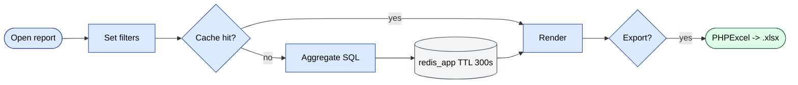

# `report` moduli

Eng yirik yagona modul (80+ hisobot). Har bir hisobot HTML + Excel qaytaradigan o'z kontrolleri.

## Asosiy xususiyatlar

| Xususiyat | Nima qiladi | Egasi rol(lar) |
|---------|--------------|---------------|
| 80+ nomlangan hisobotlar | Savdo, qarz, defektlar, KPI, auditlar, GPS, bonuslar va h.k. | 1 / 2 / 8 / 9 |
| Saqlangan filtr presetlar | Filtr birikmalarini nomlangan presetlar sifatida saqlash | 1 / 9 |
| Excel eksport | Doimiy raqam formatlari bilan PHPExcel orqali katta ma'lumotlar to'plamini oqim qilish | 1 / 2 / 9 |
| Keshlangan birlashmalar | Og'ir SQL `redis_app` da 5 daqiqa keshlanadi | tizim |
| Sub-hisobot batafsil ko'rish | Qatorni bosing → bir xil entity bo'yicha tafsilotli hisobot | 1 / 9 |
| Hisobot bo'yicha ruxsatlar | Har bir hisobot RBAC tomonidan boshqariladi | 1 |

## Kontrollerlar (tanlangan)

`AgentController`, `AnalyzeController`, `BonusController`,
`BonusAccumulationController`, va savdo, qarz, qaytarishlar, defektlar, auditlar, GPS, KPI va boshqalar uchun o'nlab qo'shimcha.

## Hisobot yaratish

1. `protected/modules/report/controllers/` ostida kontroller yarating.
2. `BaseReport` (`protected/components/BaseReport.php`) ni subklass qiling.
3. `dataProvider()`, `columns()` va `excel()` override'larini belgilang.
4. Hisobot navigatsiya konfiguratsiyasiga yon panel yozuvini qo'shing.

## Excel eksport

`phpexcel` tomonidan ta'minlanadi. Raqam formatlash konvensiyalari `params.excelFormat` bilan boshqariladi:

```php
'excelFormat' => [
    'count'  => 1, // formatted with thin space
    'volume' => 0, // raw float
    'summa'  => 2, // currency style ("$1,234.00")
],
```

## Asosiy xususiyat oqimi — Hisobotni ishga tushirish

[FigJam · sd-main · Feature Flows](https://www.figma.com/board/MyvyaeEluqvHofH4E2qIoU) ichida **Feature · Report Run & Excel Export** ga qarang.


