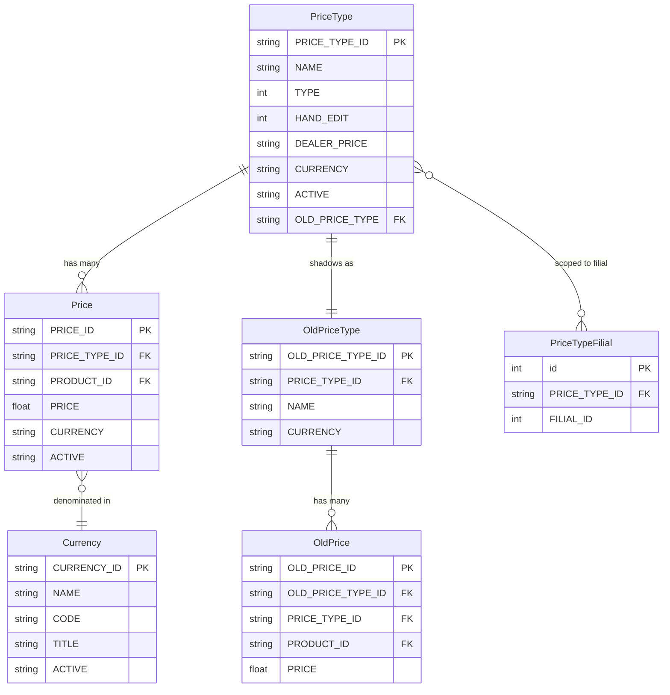
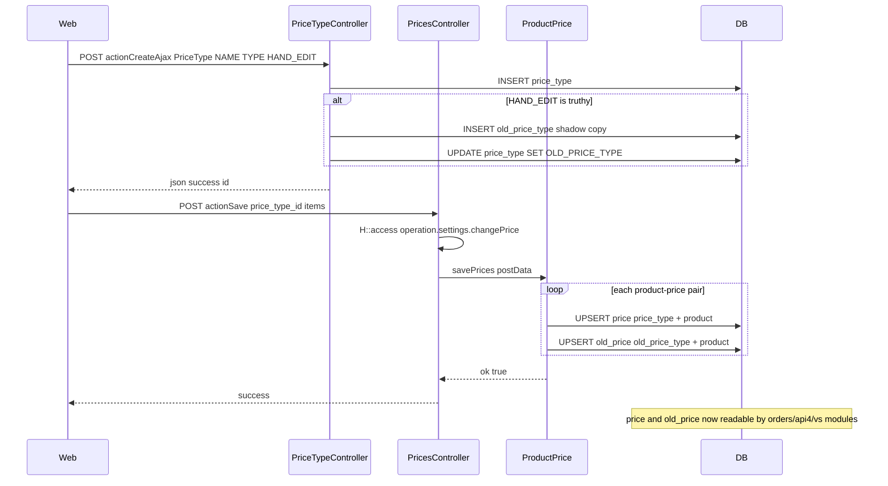
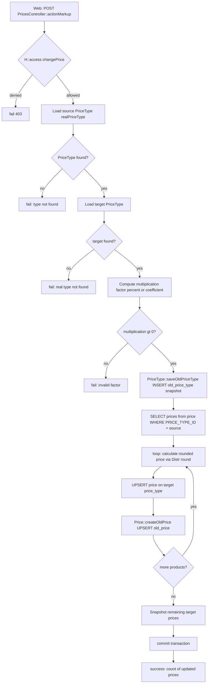
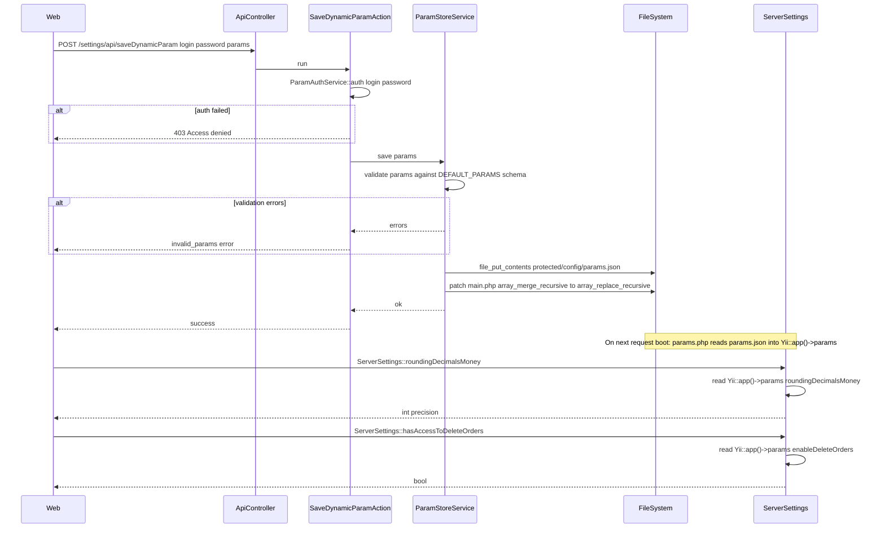

# `settings`, `access`, `staff` modullari

Admin tomonidagi platforma konfiguratsiyasi.

## Asosiy xususiyatlar

### `settings`

| Xususiyat | Nima qiladi | Egasi rol(lar) |
|---------|--------------|---------------|
| Raqam formatlari | Mingliklar ajratuvchilari, kasr xonalari, valyuta belgilari | 1 |
| Valyutalar | Qo'llab-quvvatlanadigan valyutalar + ayirboshlash kurslari | 1 / Moliya |
| Bosma shablonlari | Invoys / yuk hujjati / buyurtma bosma maketlari | 1 |
| Invoys shablonlari | Tenant bo'yicha invoys formatlash | 1 |
| Feature flag'lari | Tenant bo'yicha eksperimental xususiyatlarni yoqish/o'chirish | 1 |
| Tizim log ko'rsatuvchi | Runtime loglarini ko'rib chiqish | 1 |

### `access`

| Xususiyat | Nima qiladi | Egasi rol(lar) |
|---------|--------------|---------------|
| Rol tayinlash | Foydalanuvchilarga rollarni tayinlash | 1 / 2 |
| Ruxsatlar gridi | Operatsiyalar bo'yicha rol-ruxsatlarni tahrirlash | 1 |
| Filial ko'rinishi | Foydalanuvchilarni filiallarning bir qismi bilan cheklash | 1 / 2 |
| Keshni yangilash | Authitem ierarxiyasini qayta-yuklashga majburlash | 1 |

Rol ierarxiyasining o'zi `protected/config/auth.php` da joylashgan.

### `staff`

| Xususiyat | Nima qiladi | Egasi rol(lar) |
|---------|--------------|---------------|
| User CRUD | Ichki xodimlarni yaratish / tahrirlash / o'chirish | 1 / 2 |
| Rol tayinlash | Ichki xodimlarni menejer, nazoratchi, ekspeditor kabi rollarga tayinlash | 1 / 2 |
| Foydalanuvchi tarixini ko'rish | Foydalanuvchi bo'yicha audit izi | 1 |

`CreateController`, `EditController`, `DeleteController`,
`ListController`, `ViewController`.

## Workflow'lar

> Eslatma: `access` va `staff` sub-modullari bir xil yon panel sahifasini ulashadi, lekin bu yerda qamrovdan tashqari (Faza 2). Bu bo'lim faqat `settings` modulini yoritadi.

> **Faza 1 qamrovi:** Bu Workflow'lar bo'limi narx-, parametr- va sozlamalar-konfiguratsiya oqimlarini hujjatlashtiradi. Sozlamalar moduli yana ~50 ta boshqa kontrollerlarga ham egalik qiladi (mahsulotlar, brendlar, kategoriyalar, birliklar, regionlar, valyutalar, integratsiyalar va h.k.) — ular Faza 2 ga kechiktirilgan va quyidagi kirish nuqtalarida sanalmagan.

### Kirish nuqtalari

| Trigger | Controller / Action / Job | Izohlar |
|---|---|---|
| Web (admin) | `PriceTypeController::actionIndex` | Narx turlarini ro'yxatlash / yaratish / yangilash; `operation.settings.priceType` bilan himoyalangan |
| Web (admin) | `PriceTypeController::actionCreateAjax` | Yangi `PriceType` yozuvini yaratish; `HAND_EDIT=1` bo'lganda `OldPriceType` shadow ham bootstrap qilinadi |
| Web (admin) | `PriceTypeController::actionUpdateAjax` | Mavjud `PriceType` ni yangilash; `FilialComponent::isOnlyFilial()` orqali filial-faqat himoya |
| Web (admin) | `PricesController::actionIndex` | Berilgan narx turi uchun mahsulot bo'yicha narx gridini render qilish |
| Web (admin) | `PricesController::actionSave` | Yagona mahsulot-narx paketini saqlash; `ProductPrice::savePrices` ni chaqiradi; `operation.settings.changePrice` bilan himoyalangan |
| Web (admin) | `PricesController::actionMultiSave` | Joriy filialga tayinlangan barcha diler narx turlari uchun narxlarni paket bilan saqlash |
| Web (admin) | `PricesController::actionSaveWithout` | HAND_EDIT bo'lmagan narx turida har bir element bo'yicha qo'lda narx override; `price` + `old_price` qatorlarini yozadi |
| Web (admin) | `PricesController::actionMarkup` | Kategoriya bo'ylab foiz yoki koeffitsient ustamasini hisoblash va qo'llash; `operation.settings.changePrice` bilan himoyalangan |
| Web (admin) | `PricesController::actionImportExcel` | Narxlarni paket bilan import qilish uchun Excel faylini yuklash (`Price::ImportExcel`) |
| Web (admin) | `CurrencyController::actionIndex` | Valyuta yozuvlarini ro'yxatlash / yaratish / yangilash |
| Web (admin) | `CurrencyController::actionUpdateAjax` | `Currency` yozuvini joyida yangilash |
| Web (admin) | `ParamsController::actionIndex` | Dinamik parametrlar konfiguratsiya UI ni render qilish |
| API (autentifikatsiyalangan) | `ApiController` → `SaveDynamicParamAction` | POST: dinamik parametrlarni `protected/config/params.json` ga tasdiqlash va saqlash; `main.php` ni `array_merge_recursive` → `array_replace_recursive` ga ham patch qiladi |
| API (autentifikatsiyalangan) | `ApiController` → `GetDynamicParamAction` | POST: joriy dinamik parametrlar + standart sxemani qaytaradi |
| API (autentifikatsiyalangan) | `ApiController` → `GetSubstatusesAction` | POST: joriy buyurtma sub-status konfiguratsiyasini qaytaradi |
| Web — substatus saqlash | `ApiController` → `SaveDynamicParamAction` (substatus tarmog'i) | Sub-status saqlash `SaveDynamicParamAction::run()` ichidagi tarmoq tomonidan boshqariladi (27–43 qatorlar) — alohida action sinfi yo'q |
| Web (admin) | `SettingsController::actionSaveSettings` | Foydalanuvchi bo'yicha datatable ustun/filtr afzalliklarini `tableControl` ga saqlaydi |
| Web (admin) | `SettingsController::actionSaveHeaderOrders` | Foydalanuvchi bo'yicha datatable ustun tartibini `tableControl` ga saqlaydi |
| Web (admin) | `SettingsController::actionTruncateCache` | `cache` jadvalini truncate qiladi va yo'naltiradi |

### Soha entitylari

### Workflow 1.1 — Narx turi va mahsulot bo'yicha narxni sozlash

Admin narx turini belgilaydi (masalan, "Chakana", "Diler"), so'ng o'sha tur ostidagi har bir mahsulot uchun sotish narxini belgilaydi. Saqlangan narxlar darhol buyurtma yaratish va mobil agent zaxira ko'rinishiga ko'rinadi.

### Workflow 1.2 — Paket ustama qayta hisoblash

Admin manba narx turiga foiz yoki koeffitsient ustamani qo'llaydi va hisoblangan narxlarni maqsadli narx turiga yozadi. Barcha ta'sir qilingan mahsulotlar tarixiy farq uchun ham `price` qatori, ham `old_price` snapshot oladi.

### Workflow 1.3 — Dinamik parametrlar konfiguratsiyasi

Admin (yoki serverlar aro avtomatlashtirish) tasdiqlangan tenant-bo'ylab feature flag'lari va raqamli sozlamalarning JSON to'plamini `params.json` ga yozadi. Fayl yuklash vaqtida `Yii::app()->params` ga birlashtiriladi va hamma joyda `ServerSettings` yordamchi metodlari orqali iste'mol qilinadi.

### Modullar aro tutash nuqtalari

- O'qiydi: `settings.PriceType` — `orders.CreateOrderController`, `orders.ImportOrderController`, `vs.CreateOrderController` tomonidan iste'mol qilinadi (buyurtma satri narxlash)
- O'qiydi: `settings.Price` — `api4.CreateVsReturnAction`, `api4.CreateReplaceAction`, `api4.CreateDefectAction`, `PriceService::getPrices` tomonidan iste'mol qilinadi (mobil agent zaxira narxini qidirish)
- O'qiydi: `settings.OldPrice` — `vs.CreateOrderController` (tarixiy narx farqi), `clients.FinansController` (yetkazib berishda qarz hisoblash) tomonidan iste'mol qilinadi
- O'qiydi: `settings.PriceType` + `settings.OldPriceType` — `orders.RecoveryOrderController` tomonidan iste'mol qilinadi (buyurtmani tiklash narxlash)
- O'qiydi: `settings.Currency` — `PricesController::actionConfig` (format bloki), `PriceTypeController::actionCreateAjax` (valyuta tayinlash) tomonidan iste'mol qilinadi
- O'qiydi: `settings.PriceTypeFilial` — `PricesController::actionMultiSave` tomonidan iste'mol qilinadi (narx turlarini joriy filialning diler turlariga filtrlash)
- Yozadi: `Yii::app()->params` (`params.json` orqali) — `models.Order` (`debtNewOrder` bayrog'i), `models.ServerSettings` (`roundingDecimalsMoney`, `visitDistance`, `enableDeleteOrders`, `hasNotAccessToEditPurchase` va h.k.), `components.Formatter` (ilova bo'ylab pul/miqdor yaxlitlash) tomonidan iste'mol qilinadi
- Yozadi: `upload/status_config.txt` — `ServerSettings::substatuses()` tomonidan iste'mol qilinadi (buyurtma ko'rinishlarida buyurtma sub-status yorliqlari)
- Yozadi: `tableControl` — `SettingsController::actionSaveSettings` / `actionSaveHeaderOrders` (foydalanuvchi bo'yicha datatable afzalliklari, barcha datatable sahifalari tomonidan qayta o'qiladi) tomonidan iste'mol qilinadi

### Tuzoqlar

- `PricesController::actionSaveWithout` faqat `HAND_EDIT = 0` narx turlarida ishlaydi; agar narx turi allaqachon qo'lda-tahrirlash rejimida bo'lsa, metod xato javobsiz jim ravishda hech narsa qilmaydi.
- `PricesController::actionMultiSave` `price_type_filial` ga xom SQL join orqali filial-ko'lamli diler narx turlariga filtrlaydi; agar `FilialComponent::isOnlyFilial()` false qaytarsa (super-admin konteksti), filtr o'tkazib yuboriladi va barcha narx turlari ishlanadi.
- `ParamStoreService::save` dinamik parametrlar statik konfiguratsiyadan ustun bo'lishi uchun `protected/config/main.php` ni o'rnida ham patch qiladi (`array_merge_recursive` ni `array_replace_recursive` ga almashtirib). Bu ilova konfiguratsiyasiga fayl tizimi mutatsiyasi bo'lib, runtime'da `main.php` ga yozish ruxsatini talab qiladi.
- `SaveDynamicParamAction` standart Yii sessiya autentifikatsiyasi ustida maxsus `ParamAuthService::auth` ma'lumotlar tekshiruvini ishlatadi; tizimga kirgan admin uchun ham yo'qolgan yoki noto'g'ri ma'lumot 403 ni qaytaradi.
- Sub-statuslar `upload/status_config.txt` da oddiy matnli JSON fayl sifatida saqlanadi (`protected/` dan tashqarida). Saqlashdan keyin `ServerSettings::$_substatuses` PHP `ReflectionClass` orqali tozalanadi, chunki statik kesh oddiy so'rov hayot davri tomonidan qayta tiklanmaydi.
- Buyurtmalardagi narx-tarix farqi uchun `OldPrice` / `OldPriceType` shadow jadvallari mavjud. Har bir paket ustama ishga tushishi avval `PriceType::saveOldPriceType()` ni chaqiradi; sikl o'rtasida tranzaksiya rollback bo'lganida ustamani o'tkazib yuborish yoki qisman-tugatish shadow'ni nomuvofiq holatda qoldirishi mumkin.
- `DEALER_PRICE = 1` bo'lgan `PriceType` qatorlari `api4` orqali mobil ilovaga uzatiladigan yagona qatorlar; diler bo'lmagan narx turlari dala agentlariga ko'rinmaydi.
