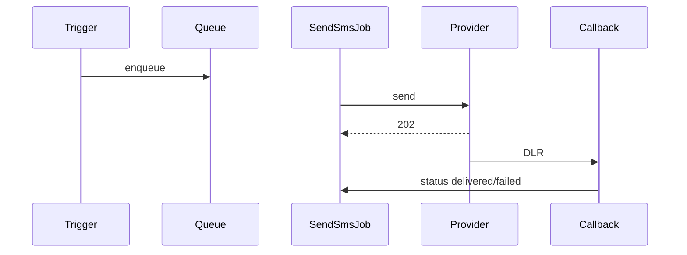

# `sms` moduli

Sozlanadigan shlyuz orqali tashqi SMS. Shablonlar, paketlar, rejalashtirilgan xabarlar, yetkazib berish callback'lari.

## Kontrollerlar

`MessageController`, `PackageController`, `TemplateController`,
`ViewController`, `CallbackController`.

## Oqim

1. Shablon Settings → SMS → Templates ostida belgilanadi.
2. Trigger voqea (masalan, buyurtma yetkazib berildi) `SendSmsJob` ni navbatga qo'yadi.
3. Job SMS shlyuz HTTP API ga post qiladi.
4. Shlyuz `CallbackController` ga yetkazib berish statusi bilan callback qiladi.
5. Status `SmsMessage` ga saqlanadi va hisobotlarda ko'rsatiladi.

## Asosiy xususiyat oqimi — SMS jo'natish

[FigJam board](../architecture/diagrams.md) da **Feature — SMS / Notification Dispatch** ga qarang.

