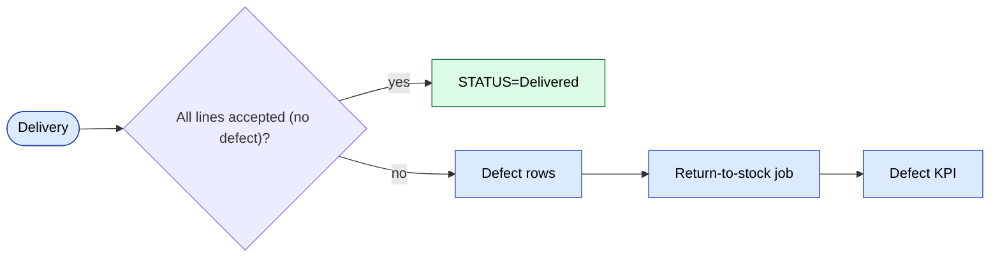

# `stock` moduli

Ombor qatlami ustidagi miqdor darajasidagi operatsiyalar: qaytarishlar, do'konlar o'rtasida almashish, hisobdan chiqarish, xarid. [`warehouse`](./warehouse.md) ni to'ldiradi (u hujjat sarlavhalarini saqlaydi).

## Asosiy xususiyatlar

| Xususiyat | Nima qiladi | Egasi rol(lar) |
|---------|--------------|---------------|
| Qaytarish qo'shish | Defekt / rad'dan zaxiraga qaytarishni qayd etish | 1 / 9 / ombor |
| Sotib olish / xarid | Yetkazib beruvchidan kiruvchi xarid | 1 / 9 |
| Do'konlar o'rtasida almashish | Chakana do'konlar o'rtasida zaxira ko'chirish | 1 / 9 |
| Olib tashlash / hisobdan chiqarish | Doimiy olib tashlash (shikast, o'g'irlik) | 1 |
| Moliyaviy hisobot | Zaxira qiymati, yoshi, o'lik zaxira | 1 / 9 |
| Do'kon hisoboti | Do'kon bo'yicha zaxira holati | 1 / 9 |
| Atomik rezervatsiya operatsiyasi | `Stock::reserveForOrder()` tranzaksiyada ishga tushadi | tizim |

## Papka

```
protected/modules/stock/
├── controllers/
│   ├── AddReturnController.php
│   ├── BuyController.php
│   ├── ExchangeStoresController.php
│   ├── ExcretionController.php
│   ├── FinancialReportController.php
│   └── …
└── views/
```

## Zaxira xizmatlari

Umumiy `StockService` (`protected/components/` da) `stock` qatorlarini o'zgartiruvchi **yagona nuqta**. Qo'lda yozilgan SQL'dan saqlaning — u yerda parallellik xatolari yashirin.

## Rezervatsiyalar

Buyurtma `Reserved` ga o'tganda, `Stock::reserveForOrder()` `available` miqdorni kamaytiradi va `reserved` miqdorni oshiradi — bularning hammasi bitta tranzaksiyada **atomik** tarzda.

## Asosiy xususiyat oqimi — Defekt va Qaytarish

[FigJam · sd-main · Feature Flows](https://www.figma.com/board/MyvyaeEluqvHofH4E2qIoU) ichida **Feature · Online order + Defect/Return** ga qarang.



## Ruxsatlar

| Amal | Rollar |
|--------|-------|
| Qaytarish / hisobdan chiqarish | 1 / 9 |
| Xarid | 1 / 9 |
| Do'konlar o'rtasida almashish | 1 / 9 |
