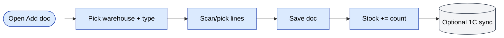
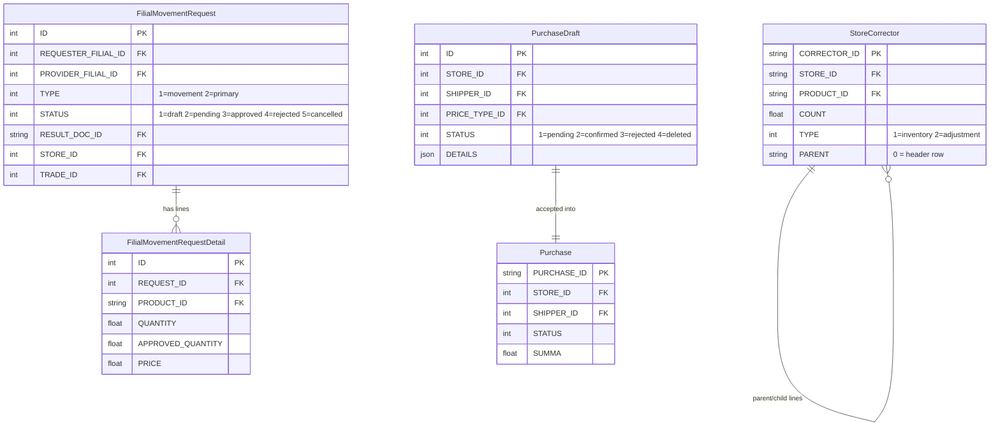
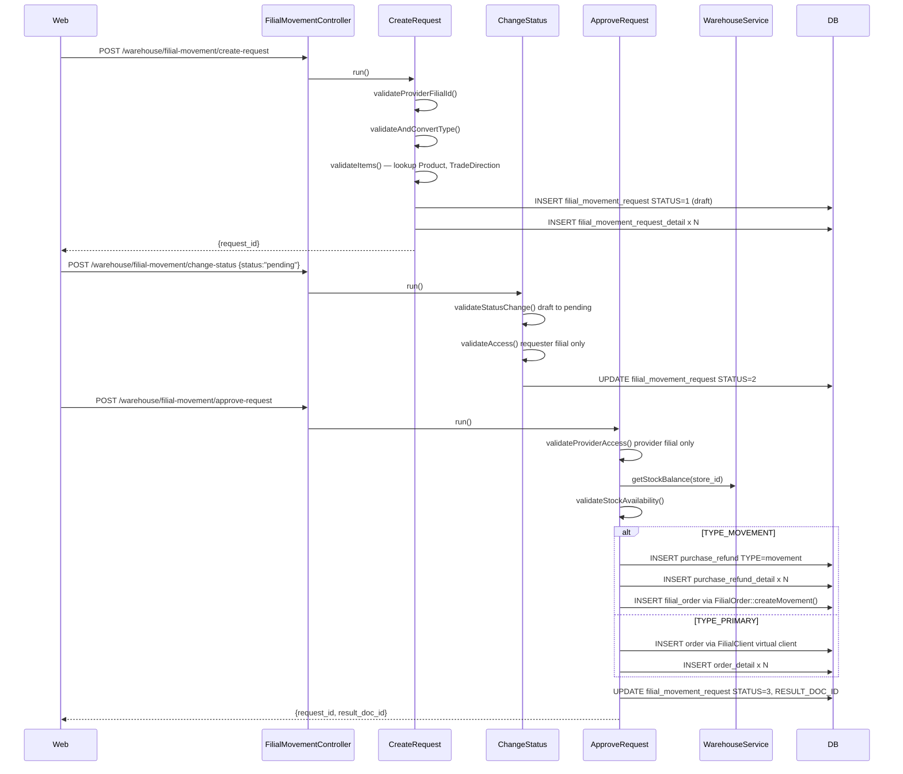
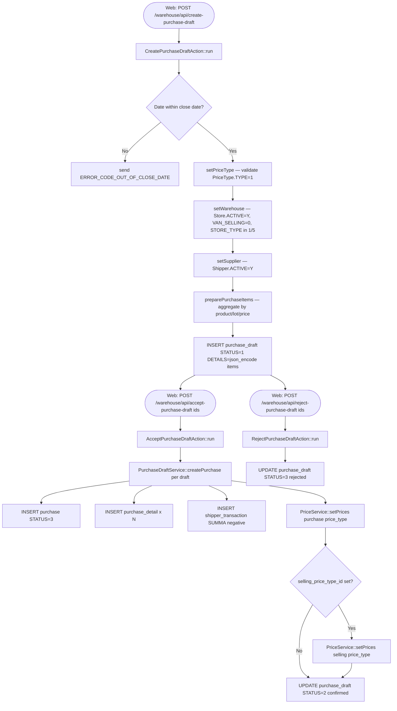
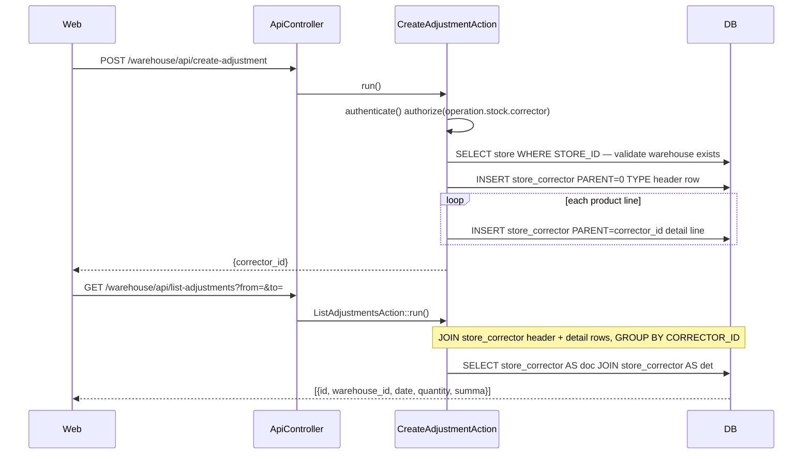

# `warehouse` moduli

Ko'p omborli operatsiyalar: **qabul qilish** (tovarlar kelishi), **ko'chirish** (omborlar yoki filiallar o'rtasida), **terish / jo'natish** (buyurtmalar uchun), va **filiallar aro harakatlar**.

## Asosiy xususiyatlar

| Xususiyat | Nima qiladi | Egasi rol(lar) |
|---------|--------------|---------------|
| Tovar qabul qilish | Yangi qabul hujjati qo'shish; zaxira += miqdor | 1 / 2 / 9 / ombor xodimi |
| Qabul turlari | `sales` / `defect` / `reserve` (turli oqibatlar) | 1 / 9 |
| Zaxira ko'chirish | Bir filial ichida ikki ombor o'rtasida zaxira ko'chirish | 1 / 9 |
| Filial harakati | Filiallar o'rtasida zaxira ko'chirish (filiallar aro) | 1 |
| Terish va paketlash | Buyurtma bajarish vaqtida satrlarni rezerv qilish va yuklash | 1 / 9 / ombor xodimi |
| Audit izi | Har bir hujjatda yaratish/tasdiqlash/post vaqt belgilari bor | tizim |
| 1C sinxronizatsiyasi | Qabul va harakatlarning ixtiyoriy tashqi XML/JSON | tizim |

## Papka

```
protected/modules/warehouse/
├── controllers/
│   ├── AddController.php
│   ├── EditController.php
│   ├── ListController.php
│   ├── ViewController.php
│   ├── ExchangeController.php           # transfer
│   ├── FilialMovementController.php     # inter-filial
│   └── ApiController.php
└── views/
```

## Tushunchalar

- **Ombor (Warehouse)** — jismoniy yoki mantiqiy zaxira joylashuvi.
- **Hujjat (Document)** — zaxira harakatining huquqiy/operatsion qog'oz izi (qabul / ko'chirish / hisobdan chiqarish / inventarizatsiya).
- **Zaxira qatori (Stock row)** — `(warehouse_id, product_id, lot, batch, count)`.
- **Rezervatsiya (Reservation)** — `Reserved` statusidagi `Order` tomonidan bloklangan miqdor.

## Asosiy xususiyat oqimi — Tovar qabul qilish

[FigJam · sd-main · Feature Flows](https://www.figma.com/board/MyvyaeEluqvHofH4E2qIoU) ichida **Feature · Warehouse + Stock + Inventory** ga qarang.



## Ruxsatlar

| Amal | Rollar |
|--------|-------|
| Qabul yaratish | 1 / 2 / 9 |
| Ko'chirishni tasdiqlash | 1 / 2 / 9 |
| Filiallar aro harakat | 1 |

## Shuningdek qarang

- [`stock`](./stock.md) — sof miqdor operatsiyalari
- [`inventory`](./inventory.md) — jismoniy inventarizatsiya hisoblari
- [`store`](./store.md) — chakana do'kon tomonidagi operatsiyalar

## Workflow'lar

### Kirish nuqtalari

| Trigger | Controller / Action / Job | Izohlar |
|---|---|---|
| Web | `AddController::actionIndex` | Yangi `Store` (ombor) yaratish — POST JSON |
| Web | `FilialMovementController` via `CreateRequest` | So'rovchi filial filiallar aro zaxira so'rovini yuboradi |
| Web | `FilialMovementController` via `ApproveRequest` | Ta'minotchi filial kutilayotgan so'rovni tasdiqlaydi va keyingi hujjat yaratadi |
| Web | `FilialMovementController` via `ChangeStatus` | Draft → Pending → Cancelled / Rejected hayot davri |
| Web | `ApiController` via `CreatePurchaseDraftAction` | Mobil/web menejer ko'rib chiqishi uchun xarid qoralamasini yuboradi |
| Web | `ApiController` via `AcceptPurchaseDraftAction` | Menejer qoralamani qabul qiladi; `PurchaseDraftService::createPurchase` `Purchase` ga aylantiradi |
| Web | `ApiController` via `CreateAdjustmentAction` | Ombor xodimi zaxira tuzatishini (`StoreCorrector`) yaratadi |

### Soha entitylari



### Workflow 1.1 — Filiallar aro zaxira harakati so'rovi hayot davri

So'rovchi filial zaxira so'rovini yaratadi, ta'minotchi filial uni tasdiqlaydi va `PurchaseRefund` (type=movement) yoki `Order` (type=primary) atomik tarzda yoziladi.



### Workflow 1.2 — Xarid qoralamasini ko'rib chiqish va qabul qilish

Xarid qoralamasi yuboriladi (odatda mobil ilova yoki web dan) va menejer qabul qilmaguncha yoki rad etmaguncha status=pending da qoladi. Qabul qilish `PurchaseDraftService::createPurchase` ni chaqiradi, u esa kanonik `Purchase` + `PurchaseDetail` + `ShipperTransaction` ni yozadi va narxlarni yangilaydi.



### Workflow 1.3 — Zaxira tuzatish (StoreCorrector)

Ombor xodimi yoki ombor menejeri `CreateAdjustmentAction` orqali qo'lda zaxira tuzatishini qayd etadi. `StoreCorrector` jadvali parent/child qator strukturasidan foydalanadi: sarlavha qatorida `PARENT='0'`, detal qatorlari unga `CORRECTOR_ID` orqali murojaat qiladi.



### Modullar aro tutash nuqtalari

- O'qiydi: `models.FilialClient` (`ApproveRequest::createPrimaryDocument` da primary-type tasdiqlash davomida virtual mijoz qidiruvi)
- O'qiydi: `models.PriceType`, `PriceService::getPrices` (`PurchaseDraftService` va `ApproveRequest` da narx aniqlash)
- O'qiydi: `models.TradeDirection` (`CreateRequest` da savdo yo'nalishini tasdiqlash)
- Yozadi: `models.Order` + `models.OrderDetail` (`ApproveRequest::createPrimaryDocument` da filial primary so'rovi → yangi savdo buyurtmasi)
- Yozadi: `models.PurchaseRefund` + `models.PurchaseRefundDetail` (`ApproveRequest::createMovementDocument` da filial harakati so'rovi → zaxira refund)
- Yozadi: `models.FilialOrder` `FilialOrder::createMovement` orqali (harakat hujjatini so'rovchi filialga ulaydi)
- Yozadi: `models.ShipperTransaction` (`PurchaseDraftService::createDocument` da yetkazib beruvchi qarz ledger yozuvi)
- API'lar: `warehouse/api/get-stock-balance` — `ApproveRequest` tomonidan `WarehouseService::getStockBalance` orqali ichki chaqiriladi

### Tuzoqlar

- `FilialMovementRequest::STATUS_APPROVED` terminal — `ChangeStatus` har qanday keyingi status o'zgartirishni qattiq bloklaydi. Tasdiqlangan so'rovni bekor qilish yoki rad etishga urinish `ERROR_CODE_INVALID_STATUS` ni qaytaradi.
- `ApproveRequest::createMovementDocument` `PurchaseRefund` ga `DILER_ID = "d0_1"` va `FILIAL_ID = 1` ni qattiq kodlaydi; bu ko'p-diler joylashtirishlarda buziladi.
- `PurchaseDraftService::createPurchase` `$purchaseModel->tgNotify()` ni chaqiradi — Telegram bildirishnoma yon ta'siri; bot tokeni sozlanganligiga ishonch hosil qiling, aks holda chaqiruv jim ravishda muvaffaqiyatsiz bo'ladi, lekin tranzaksiyani rollback qilmaydi.
- `CreateAdjustmentAction.php` joriy branchda (`btx-51207`) bo'sh (1 qator) topildi. Ro'yxat va get action'lari `StoreCorrector` ga to'g'ri murojaat qiladi, lekin yaratish work-in-progress bo'lishi mumkin.
- `delete-purchase-draft` action `ApiController` da ataylab o'chirilgan ("disabled by now" izohi bilan).
- `WarehouseService::getStockBalance` qatorlarni qulflamaydi; `ApproveRequest` ichidagi mavjudlik tekshiruvi va `PurchaseRefund` insert orasida poyga sharti mumkin.
