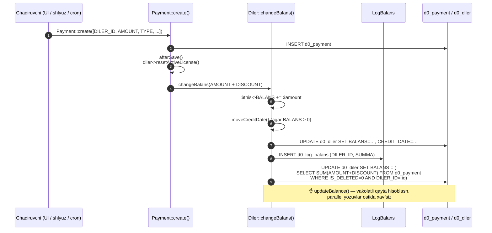
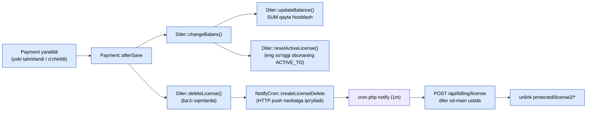

# Balans va pul matematikasi

> **Ehtiyot bo'ling — keng tarqalgan hujjat/kod nomuvofiqligi.** Eski hujjatlarda "DB triggerlar `Diler.BALANS`ni saqlaydi" deyilgan. Ular saqlamaydi. Trigger migratsiyasi `m221114_070346_create_triggers_to_payment.php` **atayin izohga olingan** (`// $this->execute($sql); // xato ishlayapti, shunga komment qilindi`). Balans PHPda saqlanadi. Bu sahifa haqiqatdir.

## TL;DR

| Bosqich | Qayerda | Nima qiladi |
|---------|---------|-------------|
| 1 | `Payment::create([...])` | `d0_payment`da qator qo'shish (har qanday chaqiruvchi — UI, shlyuz, cron) |
| 2 | `Payment::afterSave()` | Agar `disabledAfterSave` **o'chirilgan** bo'lsa va `diler` o'rnatilgan bo'lsa: `diler->resetActiveLicense()` ni chaqirish, keyin `diler->changeBalans($amount)` |
| 3 | `Diler::changeBalans($amount)` | `$this->BALANS += $amount`, saqlash, `LogBalans`ga log yozish, keyin `updateBalance()` ni chaqirish |
| 4 | `Diler::updateBalance()` | Vakolatli SQL qayta hisoblashi: `UPDATE diler SET BALANS = SUM(payment.AMOUNT + payment.DISCOUNT) WHERE diler_id = X AND IS_DELETED = 0` |

3-bosqichdagi PHP inkrementi **tezkor yo'l**; 4-bosqich **xavfsizlik to'ri** —
parallel yozuvlar siljimasligi uchun butun balansni `Payment` jadvalidan
qayta hisoblaydi.

## Ketma-ketlik



## `afterSave` orqali to'rtta kod yo'li

`Payment::afterSave` qator holatiga qarab tarmoqlanadi:

```php
if ($this->isNewRecord) {
    $amount = $this->AMOUNT + $this->DISCOUNT;
    $this->diler->changeBalans($amount);
}
else if ($this->IS_DELETED == self::ACTIVE_DELETED) {
    $amount = $this->AMOUNT + $this->DISCOUNT;
    $this->diler->changeBalans($amount * -1);   // hissani teskari qaytarish
    $this->uncomputeDebt();
}
else {
    $amount = $this->AMOUNT - $this->OLD_AMOUNT;  // tahrir qilingan
    if ((float) $amount != 0) {
        $this->diler->changeBalans($amount);
        $this->uncomputeDebt();
    }
}
```

| Trigger | Tarmoq | Effekt |
|---------|--------|--------|
| `Payment::create([...])` | yangi qator | `BALANS += AMOUNT + DISCOUNT` |
| Yumshoq-o'chirish (`IS_DELETED = 1`) | o'chirilgan tarmoq | `BALANS -= AMOUNT + DISCOUNT`, mos keluvchi `DistrPayment`ni ham ortga qaytaradi |
| `AMOUNT`ni tahrirlash | tahrirlangan tarmoq | `BALANS += yangi − eski`, plyus mos keluvchi `DistrPayment.AMOUNT` yangilanishi |
| `disabledAfterSave(true)` | chetlab o'tish | yo'q — keyin qayta hisoblaydigan ommaviy yuklagichlar tomonidan ishlatiladi |

## `Payment.TYPE` bo'yicha `AMOUNT` yo'nalishi (belgisi)

`AMOUNT` belgilangan. Konventsiya:

| `Payment.TYPE` | Yo'nalish | AMOUNT belgisi | Manba |
|----------------|-----------|----------------|-------|
| `cash`, `cashless`, `p2p` | kiruvchi (oflayn) | **+** | kassir / boshqaruv paneli |
| `payme`, `click`, `paynet`, `mbank` | kiruvchi (onlayn) | **+** | shlyuz kontrollerlari |
| `license` | chiquvchi (iste'mol qilingan) | **−** | `LicenseController::actionBuyPackages` |
| `service` | kiruvchi (qo'lda to'lov) | **+** | qo'lda kiritish |
| `distribute` | settlement | o'zgaradi (juftlangan) | `cron settlement` |

`distribute` qatorlari distribyutor + diler bo'ylab nolga teng bo'ladigan
**juftlikda** keladi, shuning uchun joriy umumiy summalar tizim bo'ylab izchil qoladi.

## Balans o'zgarishlaridan keyin — litsenziyani yangilash

Pul yetib kelganidan keyin, dilerning `sd-main`dagi litsenziyasi bekor qilinadi,
shunda keyingi sahifa yuklanishi yangi holatni oladi:



`deleteLicense()` o'zi `sd-main`ga sinxron urilmaydi — `license_delete` tipidagi
`NotifyCron` qatorini navbatga qo'yadi (URL `Diler.DOMAIN + /api/billing/license`).
Daqiqalik cron navbatni bo'shatadi (Bildirishnomalar sahifasi kutilmoqda — cron tomonidagi
tafsilot uchun [Cron va settlement](./cron-and-settlement.md) sahifasiga qarang).

## Vakolatli qayta hisoblash SQL

Bu `Diler::updateBalance()` ishlaydigan narsa (`Diler.php:478`):

```sql
UPDATE d0_diler
   SET BALANS = (
       SELECT IF(SUM(pay.AMOUNT + pay.DISCOUNT) IS NULL, 0,
                 SUM(pay.AMOUNT + pay.DISCOUNT))
         FROM d0_payment pay
        WHERE pay.IS_DELETED = 0
          AND pay.DILER_ID   = :dilerId
   )
 WHERE ID = :dilerId;
```

Agar dilerning `BALANS`i siljiganligiga shubha qilsangiz, `Diler::updateBalance()`ni
qayta ishga tushirish (yoki to'g'ridan-to'g'ri bu SQLni) **har doim xavfsiz** —
bu `d0_payment`dan toza qayta hisoblash.

## Distribyutor balansi

`Distributor::BALANS` **olingan**, inkremental saqlanmaydi:

```php
// Distributor.php:169
$this->BALANS = $this->getTranBalans(null);
```

`getTranBalans` `DistrPayment` qatorlarini aylanib chiqadi. Bu qayta hisoblashdan
tashqari `Distributor.BALANS`ni to'g'ridan-to'g'ri o'zgartiradigan yozuv yo'li yo'q.

## Audit izi — `LogBalans` va `LogDistrBalans`

| Jadval | Granulyatsiya | Qachon yoziladi |
|--------|---------------|-----------------|
| `d0_log_balans` | Har bir `Diler.changeBalans` chaqiruvi uchun bitta qator | dileri balansiga har PHP o'zgarish |
| `d0_log_distr_balans` | Har bir distribyutor settlement bosqichi uchun bitta qator | `SettlementCommand` tomonidan yoziladi |

Ikkalasi ham faqat-qo'shish. "Bu dileri balansi X sanasida qanday ko'rinardi"
so'rovlari uchun ulardan foydalaning — `Diler.BALANS` joriy umumiy summa, lekin
`LogBalans` jurnaldir.

## Kredit oynasi — `CREDIT_LIMIT` / `CREDIT_DATE`

Diler `Diler.CREDIT_DATE` gacha `Diler.CREDIT_LIMIT` gacha manfiy balans olib
borishga ruxsat berilishi mumkin:

```php
// Diler.php:277
public function balansWithCredit() {
    if ($this->isDateActive()) return $this->BALANS;       // imtiyoz oynasi
    if (negative)               return $this->BALANS + $this->CREDIT_LIMIT;
    return $this->BALANS;
}

public function isInDebt() { return $this->BALANS < 0; }   // 343
```

`Diler::moveCreditDate()` `BALANS ≥ 0` bo'lganda `CREDIT_DATE`ni "keyingi oyning
3-i" ga oldinga o'tkazadi.

## Parallellik

PHP tezkor yo'li (`$this->BALANS += $amount; save()`) jarayonlar bo'ylab **atomik
emas** — ikkita bir vaqtdagi to'lov musobaqalashishi mumkin. `changeBalans()` ning
oxiridagi `SUM`-dan-qayta-hisoblash bosqichi (va mos keluvchi `updateBalance()`
chaqiruvi) to'g'rilikni saqlaydi. Ikkala yozuvchining `d0_payment`ga qo'shimchasi
bajarilganda, oxirgi `UPDATE … SET BALANS = SUM(...)` yaqinlashadi.

> `updateBalance()`ni faqat inkrement bilan almashtirmang — siljishni qayta
> kiritasiz, bu trigger migratsiyasi o'chirilgan asosiy sababdir.

## O'chirilgan trigger migratsiyasi haqida nima?

`m221114_070346_create_triggers_to_payment.php` quyidagilarni aniqlaydi:

- `UpdateBalanceOfDealer(IN dealerId)` — `UPDATE d0_diler SET BALANS = SUM(...) WHERE id = dealerId`ni
  ishlatuvchi saqlangan protsedura.
- `AfterInsertToPayment` / `AfterUpdateToPayment` — protsedurani chaqiradigan triggerlar.

Lekin `up()` tanasi `// $this->execute($sql); // xato ishlayapti, shunga komment
qilindi` bilan tugaydi. `down()` ham xuddi shunday o'chirilgan. Demak, **migratsiya
no-op** — u ma'lumotlar bazasida hech qanday trigger qoldirmaydi.

Agar uni qaytadan yoqsangiz: trigger va PHP yo'li birgalikda har qo'shish uchun
SUM-qayta hisoblashni **ikki marta** bajarishini bilib oling. Bu behuda ish, lekin
noto'g'ri emas. Asl tashvish trigger Yii tranzaksiya kontekstida ishlashi va
mos kelmaydigan oraliq holatlarni hosil qilishi edi; uni qaytadan yoqadigan kishi
tranzaksiya-izolyatsiyasining o'zaro ta'sirini tasdiqlashi kerak.

## Yana qarang

- [Domen modeli](./domain-model.md) — `Diler`, `Payment`, `Subscription` shakli.
- [Obuna va litsenziyalash](./subscription-flow.md) — `TYPE_LICENSE` to'lovlari qayerdan keladi.
- [Cron va settlement](./cron-and-settlement.md) — `TYPE_DISTRIBUTE` juftliklari qayerdan keladi.
- [To'lov shlyuzlari](./payment-gateways.md) — kiruvchi onlayn to'lovlar qayerdan kiradi.
- [Cron va settlement](./cron-and-settlement.md) — litsenziya-o'chirish navbati diler hostlariga qanday tarqaladi (Bildirishnomalar sahifasi kutilmoqda).
