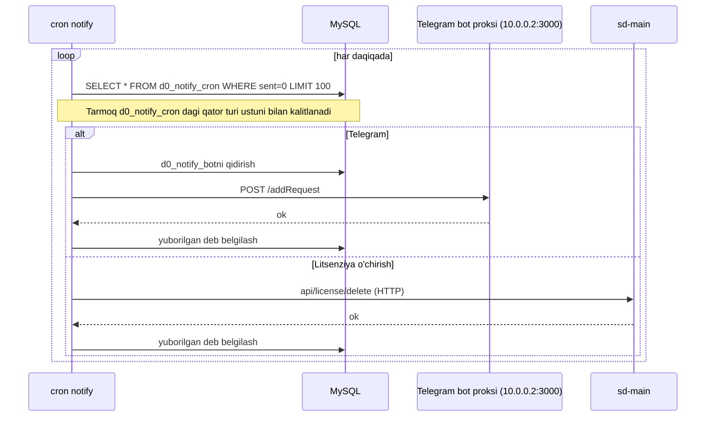

# Cron va settlement

`cron.php` — konsol kirish nuqtasi. Jadvallar
`protected/commands/cronjob.txt`da va host crontab da yashaydi.

## Jadval

| Buyruq | Qachon | Maqsad |
|--------|--------|--------|
| `notify` | har daqiqada | `d0_notify_cron` navbatini bo'shatish → Telegram + litsenziya-o'chirish amallari. Bot id har qator uchun `d0_notify_bot` dan hal qilinadi. |
| `visit` / `visitOptimized` | kunlik 02:00 | Diler tashriflar ma'lumotlari snimkasi |
| `stat` | kunlik 03:00 | Kunlik statistika agregatsiyasi |
| `settlement` | kunlik 01:00 | Distribyutor ↔ diler oylik qarz hisoblash |
| `botLicenseReminder` | kunlik 09:00 | Litsenziya muddati tugashiga yaqin dilerlarni xabardor qilish |
| `pradata` (HTTP) | 05:30 / 05:40 / 05:50 | Tashqi `salesdoc.io` instansiyalari curl orqali oldindan hisoblangan ma'lumotlarni oladi |
| `cleanner` | Shan 22:00 | Haftalik tozalash (obunalar va h.k.) |
| `reportBot send` / `countrysale` | har soatda | Ichki hisobot botlari |
| `notifyCleanup --days=7` | kunlik 08:00 | Yuborilgan notify qatorlarini qisqartirish |
| `log cleanup --days=7` | Yak 02:45 | `log/`ni qisqartirish |

Barcha buyruqlar `BaseCommand`ni kengaytiradi
(`protected/components/BaseCommand.php`).

## Settlement

`SettlementCommand` (kunlik 01:00) distribyutorlar va dilerlar o'rtasida oylik
qarz/kreditlarni hisoblaydi.

```mermaid
flowchart LR
  S(["01:00 cron"]) --> READ["Distributor + Diler bo'yicha guruhlangan o'tgan oy to'lovlarini olish"]
  READ --> CALC["Shartnomaga muvofiq ulush %ni hisoblash"]
  CALC --> DEB["Payment TYPE=distribute qo'shish (Distributor debet)"]
  DEB --> CRE["Payment TYPE=distribute qo'shish (Diler kredit)"]
  CRE --> LOG["LogDistrBalans aylanma balans qatori"]
  LOG --> NOTIF[("Telegram xulosasi ops uchun")]

  class S cron
  class READ,CALC,DEB,CRE,LOG action
  class NOTIF external
  classDef action   fill:#dbeafe,stroke:#1e40af,color:#000
  classDef approval fill:#fef3c7,stroke:#92400e,color:#000
  classDef success  fill:#dcfce7,stroke:#166534,color:#000
  classDef reject   fill:#fee2e2,stroke:#991b1b,color:#000
  classDef external fill:#f3f4f6,stroke:#374151,color:#000
  classDef cron     fill:#ede9fe,stroke:#6d28d9,color:#000
```



`Payment` qatorlari jufti distribyutorlar bo'ylab nolga teng bo'ladi, shuning uchun
joriy `BALANS` izchil qoladi — DB triggerlar matematikani boshqaradi.

## Bildirishnomalar cron



**Cron tenant gotcha:** sd-billing yagona tenant (bitta DB), shuning uchun cron
buyruqlari `sd-main` kabi tenantlar bo'ylab tarqalishi shart emas.

## Idempotentlik

- Notify qatorlarida `sent` flagi bor — faqat-bir-marta yetkazib berish.
- Settlement `(distributor, diler, month)` bilan kalitlangan, shuning uchun
  buyruqni qayta ishga tushirish (xuddi shu oy ichida) takrorlanmaslarni hosil qiladi.
- `pradata` ishlari faqat-tortish — qayta ishga tushirish xavfsiz.

## Qayta to'ldirish

Yo'qolgan kunlarni qayta to'ldirish uchun `dbservice` modul utilitalaridan
foydalaning. Misol:

```bash
docker compose exec web php cron.php settlement --year=2026 --month=4
```

(Haqiqiy `SettlementCommand` opsiyalariga qarab amal imzosini sozlang —
ishlab chiqarishda ishga tushirishdan oldin tasdiqlang.)

## Xatolarni boshqarish

`FileLogRoute` (web) / `CFileLogRoute` (console) xato darajasidagi loglarni
ushlaydi. Muvaffaqiyatsiz cron bajarish ta'sirlangan qatorlarni oldingi holatlarida
qoldiradi, shuning uchun keyingi daqiqaning belgisi toza qayta urinadi.
