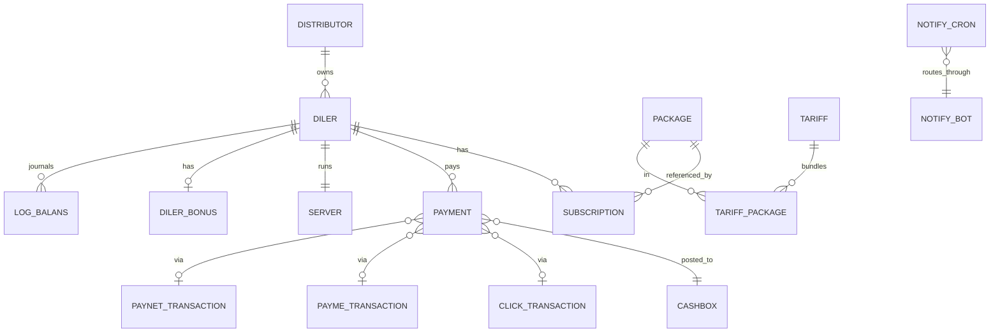

# Ma'lumotlar sxemasi ma'lumotnomasi

sd-billing'ning `d0_*` sxemasi uchun jadval-bajadval vakolatli ro'yxat.
Bu yerdagi har bir bo'lim mos keluvchi `protected/models/*.php`
(yoki `protected/modules/<m>/models/*.php`) faylidagi `@property`
doc-izohlarda asoslangan.

> **Shakl** ko'rinishini (Mermaid ERD) qidiryapsizmi? [Domen modeli](./domain-model.md)
> sahifasiga qarang.
>
> **Xatti-harakat** ko'rinishini (afterSave hooklar, balans matematikasi,
> litsenziyani yangilash) qidiryapsizmi? [Balans va pul matematikasi](./balance-and-money-math.md)
> sahifasiga qarang.
>
> **Migratsiya** ish oqimini qidiryapsizmi? [Lokal sozlash → Migratsiyalar](./local-setup.md#migrations)
> sahifasiga qarang.

## Konventsiyalar

- Jadvallar `d0_` prefiksdan foydalanadi; modellarda har doim
  `{{name}}` sifatida murojaat qiling, shunda Yii uni qo'llaydi.
- Ustun harf hajmi **davriga qarab aralash**:
  - Eski jadvallarda `UPPER_SNAKE_CASE`: `d0_diler`, `d0_payment`,
    `d0_subscription`, `d0_package`, `d0_user`,
    `d0_distributor`, `d0_currency`, `d0_log_balans`, `d0_cashbox`,
    `d0_consumption`, `d0_transfer`, `d0_click_transaction`,
    `d0_payme_transaction`.
  - Yangi jadvallarda `lower_snake_case`: `d0_notify_cron`,
    `d0_notify_bot`, `d0_access_user`, `d0_access_operation`,
    `d0_access_relation`, `d0_server`, `d0_paynet_transaction`,
    `d0_dealer_blacklist`, `d0_notification_sent`, `d0_tariff`.
- Yumshoq o'chirish `IS_DELETED` (yoki `is_deleted`) flagi orqali amalga
  oshiriladi, hech qachon qattiq o'chirish emas. Joinlar va hisobotlarda har doim
  unga filtr qo'ying.
- Audit ustunlari: `CREATED_BY`, `UPDATED_BY`, `CREATED_AT`,
  `UPDATED_AT` (yoki yangi jadvallarda kichik harf ekvivalentlari) —
  `ActiveRecordLogableBehavior` tomonidan yoziladi.

---

## 1. `d0_diler` — diler / mijoz yozuvi

Model: `Diler` (`protected/models/Diler.php`).
Tizimdagi eng ko'p tegiladigan jadval. Dilerga ta'sir qiluvchi har qanday narsa
bu yerdan o'qiydi yoki yozadi.

| Ustun | Tur | Eslatmalar |
|-------|-----|------------|
| `ID` | `int` PK | |
| `DISTR_ID` | `int` FK → `d0_distributor.ID` | nullable — diler distribyutorga ega bo'lmasligi mumkin |
| `COUNTRYSALE_ID` | `int` FK → `d0_countrysale.ID` | diler qaysi sd-cs ga yig'iladi |
| `BALANS` | `int` | joriy balans — [balans va pul matematikasi](./balance-and-money-math.md) sahifasiga qarang |
| `MIN_SUMMA` | `float` | paketlarni sotib olish uchun minimal to'ldirish |
| `MIN_LICENSE` | `int` | minimal litsenziya sotib olish narxi (suiiste'molga qarshi) |
| `NAME` | `string` | ko'rsatish nomi |
| `FIRM_NAME` | `string` | yuridik shaxs |
| `HOST` | `string` | sd-main subdomen (masalan, `acme`) |
| `DOMAIN` | `string` | sxema bilan to'liq URL |
| `COUNTRY_ID` | `int` FK | |
| `CITY_ID` | `int` FK | |
| `CURRENCY_ID` | `int` FK → `d0_currency.ID` | pul shu bilan belgilanadi |
| `GROUP_ID` | `int` FK | diler-guruh paketi |
| `TARIFF_ID` | `int` FK → `d0_tariff.id` | `Package` qatorlarini bog'laydi |
| `DIRECTION_ID` | `int` FK | |
| `CUSTOMER_TYPE_ID` | `int` FK | |
| `ACTIVE_TO` | `date` | olingan — max `Subscription.ACTIVE_TO` |
| `STATUS` | `int` | quyidagi enum |
| `USER_ID` | `int` FK → `d0_user.USER_ID` | diler tomonidagi asosiy aloqa |
| `SALE_ID` | `int` FK → `d0_user.USER_ID` | sotuv vakili |
| `INN` | `string` | soliq id |
| `CONTACT` | `string` | telefon / aloqa matni |
| `HAS_DISTRIBUTOR` | `int` (0/1) | `DISTR_ID IS NOT NULL` uchun yorliq |
| `IS_DEMO` | `int` (0/1) | demo tenant flag |
| `FREE_TO` | `date` | bepul-sinov tugashi |
| `ACCESS_BONUS` | `int` (0/1) | bonus paketlarga loyiq |
| `MONTHLY` | `int` | `15` = "barcha paketlar" rejimi |
| `MIGRATION_ID` | `int` | eski migratsiya tegi |
| `CREDIT_LIMIT` | `int` | `BALANS` qancha manfiy bo'lishi mumkin |
| `CREDIT_DATE` | `date` | overdraft oynasi tugashi |
| `AGREEMENT` | `string` | shartnoma havolasi |
| `COMMENT` | `string` | erkin matn |
| `COMPETITOR_ID` | `int` FK | |
| `UPDATED_BY` / `CREATED_BY` / `UPDATED_AT` / `CREATED_AT` | audit | |

### `Diler::STATUS` enum

| Konstanta | Qiymat | Ma'nosi |
|-----------|--------|---------|
| `STATUS_NO_ACTIVE` | `0` | onboarding / to'xtatilgan |
| `STATUS_ACTIVE` | `10` | jonli |
| `STATUS_DELETED` | `20` | yumshoq-o'chirilgan |
| `STATUS_ARCHIVE` | `30` | arxivlangan |

### Hook yon ta'sirlari

| Hook | Effekt |
|------|--------|
| `beforeSave` | `STATUS`ni majburlaydi, `OLD_HOST`ni saqlaydi shunda after-hook host o'zgarishlarini aniqlay oladi |
| `afterSave` | agar `HOST` o'zgargan bo'lsa → `updateServer()` + `sendRequest()` (diler sd-main ni provizyonlaydi/xabardor qiladi) |
| `changeBalans()` | faqat-qo'shish `LogBalans`, keyin `updateBalance()` SUM-qayta hisoblash ([balans matematikasi](./balance-and-money-math.md) ga qarang) |
| `deleteLicense()` | `NotifyCron(license_delete, DOMAIN/api/billing/license)`ni navbatga qo'yadi — dilerga sinxron urilmaydi |
| `resetActiveLicense()` | `Diler.ACTIVE_TO`ni eng so'nggi o'chirilmagan `Subscription`dan qayta hisoblaydi |

---

## 2. `d0_distributor`

Model: `Distributor` (`protected/models/Distributor.php`).
Dilerlar ustidagi ulgurji qatlam — mintaqa yoki shartnoma asosidagi hamkor.

| Ustun | Tur | Eslatmalar |
|-------|-----|------------|
| `ID` | `int` PK | |
| `NAME` | `string` | |
| `DIRECTION` | `string` | yo'nalish kodi |
| `NOT_DISTRIBUTED` | `int` (0/1) | "bu distribyutor ulush olmaydi" flagi |
| `CURRENCY_ID` | `int` FK | |
| `TYPE` | `int` | distribyutor turi |
| `CITY_ID` | `int` FK | |
| `COUNTRY_ID` | `int` FK | |
| `COUNTRYSALE_ID` | `int` FK | |
| `RESPONSIBLE` | `int` FK → `d0_user.USER_ID` | hisob menejeri |
| `INN` | `string` | soliq id |
| `AGREEMENT` | `string` | shartnoma |
| audit ustunlari | | |

### Hisoblangan / saqlanmaydigan maydonlar

Bular `getTranBalans()` tomonidan to'ldirilgan model darajasidagi virtual maydonlar:

| Maydon | Manba |
|--------|-------|
| `BALANS` | `SUM(DistrPayment.AMOUNT) WHERE distr=this` (har o'qishda qayta hisoblanadi) |
| `DEBT` | olingan |
| `PREPAYMENT` | olingan |

---

## 3. `d0_subscription`

Model: `Subscription` (`protected/models/Subscription.php`).
Diler uchun sotib olingan paket oynasi.

| Ustun | Tur | Eslatmalar |
|-------|-----|------------|
| `ID` | `int` PK | |
| `DILER_ID` | `int` FK → `d0_diler.ID` | |
| `DISTRIBUTOR_ID` | `int` FK → `d0_distributor.ID` | sotib olish vaqtida diler distrining snimkasi |
| `PACKAGE_ID` | `int` FK → `d0_package.ID` | |
| `SD_USER_ID` | `string` | diler tomonidagi foydalanuvchi havolasi (dilerning o'z sd-main `d0_user`iga FK) |
| `SD_USER_LOGIN` | `string` | diler-tomonidagi loginning oynasi |
| `COUNT` | `int` | sotib olingan o'rinlar |
| `START_FROM` | `date` | oyna boshlanishi |
| `ACTIVE_TO` | `date` | oyna tugashi (`START_FROM + Package.TYPE` kun) |
| `IS_DELETED` | `int` (0/1) | yumshoq o'chirish |
| `ADD_BONUS` | `int` (0/1) | bonus o'rin — hisoblanadi, lekin to'lov olinmaydi |
| audit ustunlari | | |

`Diler` agar har qanday o'chirilmagan `Subscription` qatorining `ACTIVE_TO ≥ bugun`
bo'lsa, "qoplangan" hisoblanadi.

---

## 4. `d0_package`

Model: `Package` (`protected/models/Package.php`).
Litsenziya katalogi.

| Ustun | Tur | Eslatmalar |
|-------|-----|------------|
| `ID` | `int` PK | |
| `CURRENCY_ID` | `int` FK | UZS / KZT / RUB / … |
| `SUBSCRIP_TYPE` | `string` | bu paket bilan boshqariladigan rol — quyidagi enumga qarang |
| `NAME` | `string` | |
| `AMOUNT` | `double` | `CURRENCY_ID` dagi narx |
| `PACKAGE_TYPE` | `int` | `paid` / `free` / `demo` (modelga qarang) |
| `CLIENT_TYPE` | `int` | `private` / `public` |
| `TYPE` | `int` | kunlardagi davomiyligi: `1`, `10`, `20`, `30`, `90`, `180`, `360` |
| audit ustunlari | | |

### `SUBSCRIP_TYPE` qiymatlari

Paket litsenziya beradigan rol / yuzani sanaydi. `Package` modelidan o'qing:

| Qiymat | Boshqaradi |
|--------|------------|
| `admin` | sd-main admin foydalanuvchisi |
| `agent` | dala agenti |
| `merchant` | merchandayzer |
| `seller` | peshtaxta sotuvchisi |
| `bot_report` | sd-main hisobot boti |
| `bot_order` | sd-main buyurtma boti |
| `smpro_user` | SmPro foydalanuvchisi |
| `smpro_bot` | SmPro boti |

O'zaro havola: dilerning `MONTHLY = 15` bo'lishi har-tip boshqaruvni qisqa-tutashtiradi
va `Diler.ACTIVE_TO` gacha barcha paketlarni beradi.

---

## 5. `d0_payment`

Model: `Payment` (`protected/models/Payment.php`).
Har bir pul harakati uchun bitta qator.

| Ustun | Tur | Eslatmalar |
|-------|-----|------------|
| `ID` | `int` PK | |
| `CASHBOX_ID` | `int` FK → `d0_cashbox.ID` | qaysi kassa qayd qilgan |
| `DILER_ID` | `int` FK → `d0_diler.ID` | bu qaysi dilerga ta'sir qiladi |
| `DISTRIBUTOR_ID` | `int` FK | "joriy distribyutor" snimkasi |
| `DISTR_ID` | `int` FK | "bu to'lov tarqatilgan distribyutor" — faqat `TYPE_DISTRIBUTE` qatorlarida o'rnatiladi |
| `DISTR_PAYMENT_ID` | `int` FK → `d0_distr_payment.id` | tarqatish to'lovlari uchun mos juftlik qatori |
| `CURRENCY_ID` | `int` FK | |
| `AMOUNT` | `double` (belgilangan) | belgi `BALANS` yo'nalishini boshqaradi (quyiga qarang) |
| `DISCOUNT` | `double` | `BALANS`ni hisoblashda `AMOUNT`ga qo'shiladi |
| `COMP` | `double` | komp hisob / komissiya |
| `TYPE` | `int` | quyidagi enum |
| `DATE` | `date` | biznes sanasi |
| `COMMENT` | `string` | |
| `IS_DELETED` | `int` (0/1) | `0 = DEFAULT_DELETED`, `1 = ACTIVE_DELETED` |
| `SUBSCRIPTION_ID` | `int` FK | `TYPE_LICENSE` muayyan obunaga bog'langanda o'rnatiladi |
| `PAYMENT_1C` | `string` | naqd bo'lmagan importlar uchun tashqi 1C havolasi |
| audit ustunlari | | |

### `Payment::TYPE` enum

| Konstanta | Qiymat | Yo'nalish | Manba |
|-----------|--------|-----------|-------|
| `TYPE_CASH` | `1` | kiruvchi | kassir UI |
| `TYPE_CASHLESS` | `2` | kiruvchi | boshqaruv paneli / 1C import |
| `TYPE_P2PCLICK` | `3` | kiruvchi | boshqaruv paneli P2P |
| `TYPE_LICENSE` | `10` | chiquvchi (iste'mol qilingan) | `LicenseController::actionBuyPackages` |
| `TYPE_DISTRIBUTE` | `11` | settlement (juftlangan) | `cron settlement` |
| `TYPE_PAYMEONLINE` | `12` | kiruvchi (Payme shlyuzi) | `api/payme` |
| `TYPE_CLICKONLINE` | `13` | kiruvchi (Click shlyuzi) | `api/click` |
| `TYPE_SERVICE` | `14` | qo'lda to'lov | boshqaruv paneli |
| `TYPE_PAYNETONLINE` | `15` | kiruvchi (Paynet shlyuzi) | `api/paynet` |
| `TYPE_MBANK` | `16` | kiruvchi (MBANK KG) | shlyuz-maxsus |

`AMOUNT + DISCOUNT` `Diler::updateBalance()` `BALANS`ni qayta hisoblash uchun
yig'adigan narsa.

### Hook yon ta'sirlari

`Payment::afterSave` `Diler::resetActiveLicense()` va `Diler::changeBalans($amount)`ni
chaqiradi (bu yerda `$amount` yangi/tahrirlangan/o'chirilgan holatga bog'liq).
[balans va pul matematikasi · afterSave orqali to'rtta kod yo'li](./balance-and-money-math.md#the-four-code-paths-through-aftersave) sahifasiga qarang.

---

## 6. Shlyuz tranzaksiya jadvallari

### `d0_click_transaction` — Click shlyuzi

Model: `ClickTransaction`.

| Ustun | Tur |
|-------|-----|
| `ID` | `int` PK |
| `TRANS_ID` | `int` Click tranzaksiya id |
| `PAYDOC_ID` | `int` Click pay-doc id |
| `AMOUNT` | `int` |
| `STATUS` | `int` enum: `ACTION_PREPARE=0`, `ACTION_COMPLETE=1`, `ACTION_CANCELLED=2` |
| `DILER_ID` | `int` FK |
| `HOST` | `string` manba host |
| `PAYMENT_ID` | `int` FK → `d0_payment.ID` (confirm da o'rnatiladi) |
| `CREATE_AT` / `UPDATE_AT` | timestamplar |

### `d0_payme_transaction` — Payme shlyuzi

Model: `PaymeTransaction`.

| Ustun | Tur |
|-------|-----|
| `ID` | `int` PK |
| `DILER_ID` | `int` FK |
| `HOST` | `string` |
| `STATUS` | `int` enum: `STATE_CREATED=1`, `STATE_COMPLETED=2`, `STATE_CANCELLED=-1`, `STATE_CANCELLED_AFTER_COMPLETE=-2` |
| `AMOUNT` | `int` |
| `TRANS_ID` | `string` Payme tranzaksiya id |
| `TRANS_CREATE_TIME` / `TRANS_PERFORM_TIME` / `TRANS_CANCEL_TIME` | Payme timestamplar |
| `PAYMENT_ID` | `int` FK |
| `REASON` | `int` Payme bekor qilish sabab kodi |

### `d0_paynet_transaction` — Paynet shlyuzi

Model: `PaynetTransaction`.

| Ustun | Tur |
|-------|-----|
| `id` | `int` PK |
| `transaction_id` | `string` Paynet id |
| `amount` | `double` |
| `host` | `string` |
| `timestamp` | `string` |
| `status` | `int` |
| `payment_id` | `int` FK |
| `created_at` / `updated_at` | timestamplar |

---

## 7. `d0_server` — diler sd-main provizyonlash

Model: `Server` (`protected/models/Server.php`).

| Ustun | Tur | Eslatmalar |
|-------|-----|------------|
| `ID` | `int` PK | |
| `diler_id` | `int` FK → `d0_diler.ID` | bir-bir |
| `domain` | `string` | to'liq URL |
| `db_user` / `db_name` / `db_password` | diler DB ma'lumotlari | |
| `db_server` | `string` | diler DB host |
| `web_server` | `string` | diler veb host |
| `web_branch` | `string` | diler qaysi sd-main filialida ishlaydi |
| `status` | `int` | `STATUS_NEW=0`, `STATUS_SENT=1`, `STATUS_OPENED=2` (provizyon hayot tsikli) |
| `status_code` | `int` | provizyonlash pingidan oxirgi HTTP holati |
| `response_body` | `string` | oxirgi javob tanasi |

Provizyonlash `Diler::sendRequest()` → `Server::createServer()` dan boshqariladi.
[Loyihalararo integratsiya · Yangi diler provizyonlash](../architecture/cross-project-integration.md#6-provisioning-a-new-dealer-end-to-end)
sahifasiga qarang.

---

## 8. `d0_user`

Model: `User` (`protected/models/User.php`).

| Ustun | Tur |
|-------|-----|
| `USER_ID` | `int` PK |
| `NAME` | `string` |
| `ROLE` | `int` (enumga qarang) |
| `LOGIN` | `string` UNIQUE |
| `PASSWORD` | `string` MD5 — [xavfsizlik landminalari](./security-landmines.md) sahifasiga qarang |
| `PHONE_NUMBER` | `string` |
| `CHAT_ID` | `int` Telegram chat id |
| `ACTIVE` | `int` (0/1) |
| `IS_ADMIN` | `int` (0/1) — barcha `Access::has()` tekshiruvlarini qisqa-tutashtiradi |
| `ACCESS_CASHBOX` | `int` (0/1) — barcha-kassalar cheklovini chetlab o'tadi |
| `TOKEN` | `string` — `HostController` Bearer auth + `App` desktop token tomonidan ishlatiladi |
| `LAST_AUTH` | `datetime` |

### `User::ROLE` enum

| Konstanta | Qiymat | Eslatmalar |
|-----------|--------|------------|
| `ROLE_ADMIN` | `3` | Access tekshiruvlarini qisqa-tutashtiradi |
| `ROLE_MANAGER` | `4` | |
| `ROLE_OPERATOR` | `5` | |
| `ROLE_API` | `6` | mashina hisoblari |
| `ROLE_SALE` | `7` | |
| `ROLE_MENTOR` | `8` | |
| `ROLE_KEY_ACCOUNT` | `9` | |
| `ROLE_PARTNER` | `10` | `PartnerAccessService` tomonidan cheklangan |

---

## 9. `d0_currency`

Model: `Currency`.

| Ustun | Tur |
|-------|-----|
| `ID` | `int` PK |
| `NAME` | `string` |
| `SHORT` | `string` (`UZS`, `KZT`, `RUB`, …) |
| `CODE` | `int` ISO raqamli |
| `RATE` | `int` asosiy stavka |
| audit ustunlari | |

`Diler.CURRENCY_ID` va `Package.CURRENCY_ID` sotib olish chaqiruvi muvaffaqiyatli
bo'lishi uchun mos kelishi kerak.

---

## 10. `d0_cashbox` (cashbox moduli)

Modellar `protected/modules/cashbox/models/`da:

### `Cashbox`

| Ustun | Tur |
|-------|-----|
| `ID` | `int` PK |
| `NAME` | `string` |
| `USER_ID` | `int` FK |
| `CODE` | `string` |
| `IS_DELETED` | `int` (0/1) |
| audit ustunlari | |

`Cashbox::CASHBOX_NONE = 0` "kassa yo'q" uchun sentinel.

### `Consumption` — kassada chiqib ketish / kirib kelish

| Ustun | Tur | Eslatmalar |
|-------|-----|------------|
| `ID` | `int` PK | |
| `CASHBOX_ID` | `int` FK | |
| `CONSUM_TYPE` | `int` | `TYPE_OUTCOME=1` yoki `TYPE_INCOME=2` |
| `FLOW_TYPE_ID` | `int` FK → `d0_flow_type.ID` | qaysi byudjet kategoriyasi |
| `COMING_TYPE_ID` | `int` FK → `d0_coming_type.ID` | daromad kategoriyasi |
| `PAYMENT_TYPE` | `int` | `Payment::TYPE` ga mos keladi |
| `CURRENCY_ID` | `int` FK | |
| `NAME` | `string` | |
| `AMOUNT` | `string` | onlik-satr sifatida saqlanadi |
| `ADDITION` | `string` | |
| `EQUIVALENT` | `string` | asosga aylantirilgan qiymat |
| `DATE` | `date` | |
| `USER_ID` | `int` FK | kim qayd qilgan |
| `IS_PL` | `int` (0/1) | P&L ga hisoblanadi |
| `COMMENT` | `string` | |
| `IS_DELETED` | `int` (0/1) | |
| `SYNC_ID` | `string` | tashqi sinxronlash kalitisi |
| audit ustunlari | |

### `FlowType`, `ComingType`

Byudjet/daromad kategoriyalashtirish uchun ma'lumotnoma jadvallari. Xuddi shu shakl:
`ID`, `NAME`, `CODE`, `IS_DELETED`, audit ustunlari.

### `Transfer` — kassalar o'rtasida pul harakati

| Ustun | Tur |
|-------|-----|
| `ID` | `int` PK |
| `FROM_CASHBOX_ID` / `TO_CASHBOX_ID` | int FK |
| `FROM_CURRENCY_ID` / `TO_CURRENCY_ID` | int FK |
| `FROM_PAYMENT_TYPE` / `TO_PAYMENT_TYPE` | int |
| `FROM_AMOUNT` / `TO_AMOUNT` | string (onlik) |
| `CURRENCY` | string |
| `ADDITION` | string |
| `DATE` | date |
| `COMMENT` | string |
| `IS_DELETED` | int |
| `FROM_COMP_ID` / `TO_COMP_ID` | int |
| `CREATED_BY` / `CREATED_AT` | audit |

---

## 11. `d0_log_balans` — balans jurnali

Model: `LogBalans`.

| Ustun | Tur | Eslatmalar |
|-------|-----|------------|
| `ID` | `int` PK | |
| `DILER_ID` | `int` FK | |
| `USER_ID` | `int` FK | o'zgarishni kim ishga tushirgan |
| `SUMMA` | `int` | belgilangan delta |
| `CREATED_AT` | datetime | |

Faqat-qo'shish. Har bir `Diler::changeBalans` chaqiruvi uchun bitta qator. "Diler
balansi X sanasida qanday edi" uchun bundan foydalaning — `Diler.BALANS` joriy
umumiy summa, bu jadval — jurnal.

`d0_log_distr_balans` — distribyutor analogi (`SettlementCommand` tomonidan yoziladi).

---

## 12. `d0_diler_bonus`

Model: `DilerBonus`. `Diler` bilan bir-bir.

| Ustun | Tur | Maqsad |
|-------|-----|--------|
| `ID` | `int` PK | |
| `DILER_ID` | `int` FK UNIQUE | |
| `AGENT_LIMIT`, `MERCHANT_LIMIT`, `DASTAVCHIK_LIMIT` | `int` har biri | har-rol bonus kvotalari |

`actionBonusPackages` tomonidan dilerning bonus taklifining hajmini aniqlash uchun ishlatiladi.

---

## 13. Bildirishnoma navbati jadvallari

### `d0_notify_cron`

Model: `NotifyCron`.

| Ustun | Tur | Eslatmalar |
|-------|-----|------------|
| `id` | int PK | |
| `chat_id` | string | Telegram chat (yoki Telegram bo'lmagan qatorlar uchun `0`) |
| `bot_id` | int FK → `d0_notify_bot.id` | nullable (= standart bot) |
| `text` | string | xabar tanasi YOKI maqsadli URL |
| `parse_mode` | string(16) | standart `HTML` |
| `type` | string(32) | `telegram` / `license_delete` / `visit_write` |
| `status` | int | `STATUS_DEFAULT=0` (kutilmoqda), `STATUS_RUN=1` (yetkazilgan) |
| `error_response` | string | oxirgi muvaffaqiyatsizlik sababi |
| `created_by` | int | navbatga qo'yuvchi |
| `created_at` | datetime | |

### `d0_notify_bot`

Model: `NotifyBot`.

| Ustun | Tur | Eslatmalar |
|-------|-----|------------|
| `id` | int PK | |
| `name` | string(50) UNIQUE | `default`, `billing`, … |
| `token` | string(255) | Telegram bot tokeni |
| `api_url` | string(255) | `Telegram::queue` ga uzatilgan bot proksi URL |
| `created_at` | datetime | |

Navbatni bo'shatish semantikasi va qayta urinish qoidalari uchun
[Bildirishnomalar](./notifications.md) sahifasiga qarang.

---

## 14. Kirishni nazorat qilish jadvallari

Modellar `protected/modules/access/models/` ostida.

### `d0_access_user` — har-foydalanuvchi ruxsat to'ri

| Ustun | Tur | Eslatmalar |
|-------|-----|------------|
| `user_id` | string PK qismi | |
| `operations` | string PK qismi | amal kalitisi |
| `access` | int | bit flaglar: `DELETE=8 SHOW=4 UPDATE=2 CREATE=1` |

### `d0_access_operation` — amal katalogi

| Ustun | Tur | Eslatmalar |
|-------|-----|------------|
| `operations` | string PK | noyob kalit |
| `name` | string | ko'rsatish nomi |
| `type` | string | guruhlash |
| `accessable` | string | vergul bilan ajratilgan bit-flag mask |

### `d0_access_relation` — amal ierarxiyasi

| Ustun | Tur | Eslatmalar |
|-------|-----|------------|
| `parent` | string FK → `d0_access_operation.operations` | |
| `child` | string FK → `d0_access_operation.operations` | |

`Access::has($op, $bit)` munosabat daraxti orqali hal qiladi. Adminlar
(`User.IS_ADMIN` yoki `ROLE_ADMIN`) ruxsat berishga qisqa-tutashadi.

---

## 15. `d0_tariff` / `d0_tariff_package`

Modellar `protected/modules/operation/models/`da.

### `Tariff`

| Ustun | Tur |
|-------|-----|
| `id` | int PK |
| `name` | string |
| `created_at` | datetime |

### `TariffPackage` — tarif ↔ paket join

Diler bitta SKU sifatida obuna bo'lishi mumkin bo'lgan `Package` qatorlarining
to'plamini tashkil qiladi. `Diler.TARIFF_ID` orqali tanlanadi.

---

## 16. Operation qo'shimchalari

### `d0_dealer_blacklist`

Model: `DealerBlacklist` (`modules/operation`).

| Ustun | Tur | Eslatmalar |
|-------|-----|------------|
| `id` | int PK | |
| `dealer_id` | int FK | |
| `reason` | string | `REASON_NOT_PAID_LICENSES = 'not_paid_licenses'`, `REASON_ANOTHER = 'another'` |
| `comment` | string | |
| `created_by` / `created_at` | audit | |
| `removed_by` / `removed_at` | qora ro'yxatdan chiqarish auditi | |

### `d0_notification_sent`

Model: `NotificationSent`.

| Ustun | Tur |
|-------|-----|
| `id` | int PK |
| `notification_id` | int FK |
| `dealer_id` | int FK |
| `response` | string |

`operation` bildirishnomasi berilgan dilerga yuborilganligini qayd qiladi
(ommaviy e'lonlar uchun idempotentlik).

---

## 17. `d0_distr_payment` / `d0_log_distr_balans` (settlement)

Faqat `SettlementCommand` tomonidan yoziladi. Ular diler tomonidagi
`Payment` / `LogBalans` shaklini aks ettiradi, lekin distribyutor bo'yicha guruhlangan.

[Cron va settlement](./cron-and-settlement.md) sahifasiga qarang.

---

## ERD (shakl ko'rinishi)

Mermaid ER diagrammasi [domain-model](./domain-model.md) sahifasida.
Eng ko'p teginiladigan jadvallarga (sotuv-vaqt asosi) e'tibor qaratgan
kichikroq versiya bu yerda takrorlanadi:

---

## Yangilash protsedurasi

Bu sahifa har bir modeldagi `@property` teglarida asoslangan. Sxema o'zgarishidan
keyin yangilash uchun:

1. Migratsiyani ishga tushirib, ustun `d0_<table>`da bo'lishini ta'minlang.
2. Yangi `@property` qatorini qo'shish uchun mos keluvchi model faylining
   doc-izohini tahrirlang.
3. Ushbu sahifaning ta'sirlangan jadval bo'limini yangilang.
4. Agar yangi jadval qo'shilgan bo'lsa, yangi raqamli bo'limni qo'shing.
5. Munosabat o'zgargan bo'lsa, [domen modeli ERD](./domain-model.md) Mermaid blokini yangilang.

> Hozirgacha ro'yxatga olinmagan jadvallar: `d0_log_distr_balans`, `d0_distr_payment`,
> `d0_distr_comp_detail`, `d0_comp_details`, `d0_dealer_inn`,
> `d0_dealer_origin`, `d0_dealer_contact`, `d0_diler_direction`,
> `d0_diler_group`, `d0_diler_package`, `d0_log_distr_balans`,
> `d0_user_country`, `d0_system_log`, `d0_active_record_log`,
> `d0_country_sale`, `d0_customer_type`. Ular xuddi shu konventsiyalarga amal qiladi;
> ularga teginayotganda bo'limlar qo'shing.

## Yana qarang

- [Domen modeli](./domain-model.md) — yuqori darajadagi ERD + ob'ekt rivoyatlari.
- [Balans va pul matematikasi](./balance-and-money-math.md) — `Payment.afterSave` → `Diler::changeBalans` oqimi.
- [Bildirishnomalar](./notifications.md) — `d0_notify_cron` navbati semantikasi.
- [Auth va kirish](./auth-and-access.md) — `d0_access_*` jadvallari.
- [Loyihalararo integratsiya](../architecture/cross-project-integration.md) — `Server` qatori sd-main provizyonlashni boshqaradi.
