# sd-billing domen modeli

```mermaid
erDiagram
  DISTRIBUTOR ||--o{ DILER : owns
  DILER ||--o{ SUBSCRIPTION : has
  DILER ||--o{ PAYMENT : pays
  DILER ||--|| SERVER : runs
  DILER ||--o| DILER_BONUS : has
  PACKAGE ||--o{ SUBSCRIPTION : referenced_by
  TARIFF ||--o{ TARIFF_PACKAGE : bundles
  PACKAGE ||--o{ TARIFF_PACKAGE : in
  PAYMENT }o--|| CASHBOX : posted_to
  PAYMENT }o--o| CLICK_TRANSACTION : via
  PAYMENT }o--o| PAYME_TRANSACTION : via
  PAYMENT }o--o| PAYNET_TRANSACTION : via
  USER }o--|| ROLE : assigned

  DISTRIBUTOR {
    string ID PK
    string NAME
    float BALANS
  }
  DILER {
    int DILER_ID PK
    string NAME
    string HOST
    int STATUS
    float BALANS
    float MIN_SUMMA
    float MIN_LICENSE
    float CREDIT_LIMIT
    date CREDIT_DATE
    date FREE_TO
    int MONTHLY
    bool IS_DEMO
  }
  SUBSCRIPTION {
    string ID PK
    int DILER_ID FK
    int PACKAGE_ID FK
    date START_FROM
    date ACTIVE_TO
    bool IS_DELETED
  }
  PACKAGE {
    int PACKAGE_ID PK
    string NAME
    string SUBSCRIP_TYPE
    int TYPE
    string PACKAGE_TYPE
    string CLIENT_TYPE
    float PRICE
  }
  TARIFF {
    int ID PK
    string NAME
  }
  TARIFF_PACKAGE {
    int ID PK
    int TARIFF_ID FK
    int PACKAGE_ID FK
  }
  PAYMENT {
    string ID PK
    int DILER_ID FK
    string TYPE
    float SUMMA
    datetime DATE
    int CASHBOX_ID FK
  }
  CASHBOX {
    int ID PK
    string NAME
    string CURRENCY
  }
  CLICK_TRANSACTION {
    string ID PK
    int PAYMENT_ID FK
    string SIGN
    string STATE
  }
  PAYME_TRANSACTION {
    string ID PK
    int PAYMENT_ID FK
    string STATE
  }
  PAYNET_TRANSACTION {
    string ID PK
    int PAYMENT_ID FK
    string STATE
  }
  SERVER {
    int ID PK
    int DILER_ID FK
    string HOST
    string DB_HOST
    string DB_USER
    string DB_PASS
    string STATUS
  }
  DILER_BONUS {
    int DILER_ID PK
    float QUOTA
  }
  USER {
    int USER_ID PK
    string LOGIN
    int ROLE
    bool IS_ADMIN
  }
  ROLE {
    int ID PK
    string NAME
  }
```

## Asosiy ob'ektlar

### `Distributor`

Dilerlar ustidagi ulgurji qatlam. Dilerlar mintaqasi uchun mas'ul.
Pul oqimlari: dilerlar distribyutorlarga to'laydi, distribyutorlar
settlement ulushini oladi.

- Jadval: `d0_distributor`

### `Diler` (diler)

Mijoz yozuvi. **Eng muhim ob'ekt** — deyarli har bir hisobot va buyruq
unda ishlaydi.

- Jadval: `d0_diler`
- Asosiy maydonlar:
  - `STATUS` ∈ `0 NO_ACTIVE / 10 ACTIVE / 20 DELETED / 30 ARCHIVE`
  - `BALANS` — joriy balans (musbat = kredit, manfiy = qarz)
  - `MIN_SUMMA`, `MIN_LICENSE` — sotib olish chegaralari
  - `CREDIT_LIMIT`, `CREDIT_DATE` — overdraft oynasi
  - `FREE_TO` — bepul sinov qoplaydigan oxirgi sana
  - `MONTHLY` — maxsus flag (`15 = barcha paketlar`)
  - `IS_DEMO` — demo tenant
  - `HOST` — dilerning haqiqiy SD-app server hostnomi
- Hooklar: `Diler::beforeSave` `STATUS`ni majburlaydi, `HOST` o'zgarganda
  `updateServer()` va `sendRequest()`ni chaqiradi.

### `Subscription`

Sana oynasi uchun diler uchun sotib olingan paket.

- Jadval: `d0_subscription`
- `IS_DELETED` orqali yumshoq-o'chirish.
- Sana oynasi: `[START_FROM, ACTIVE_TO]`.

### `Package`

Litsenziya / xizmat katalogi elementi.

- Jadval: `d0_package`
- `SUBSCRIP_TYPE` paket litsenziya beradigan rollarni sanaydi:
  `admin`, `agent`, `merchant`, `seller`, `bot_report`, `bot_order`,
  `smpro_user`, `smpro_bot`.
- `TYPE` — kunlardagi davomiyligi: `10 / 20 / 30 / 90 / 180 / 360` (va kunlik
  uchun `1`).
- `PACKAGE_TYPE` ∈ `paid / free / demo`.
- `CLIENT_TYPE` ∈ `private / public`.

### `Payment`

Har bir pul harakati uchun bitta qator.

- Jadval: `d0_payment`
- `TYPE` ∈ `cash, cashless, p2p, license, distribute, payme, click,
  service, paynet, mbank`.
- Ushbu jadvaldagi DB **triggerlar** joriy balanslarni saqlaydi (migratsiyaga
  qarang `m221114_070346_create_triggers_to_payment.php`).

### Shlyuz tranzaksiya jadvallari

Har bir to'lov shlyuzining o'z tranzaksiya jadvali bor:

| Jadval / model | Shlyuz | Eslatmalar |
|----------------|--------|------------|
| `d0_click_transaction` / `ClickTransaction` | Click | `ClickTransaction::checkSign` orqali sign tekshiriladi. Ikki bosqichli: prepare → confirm |
| `d0_payme_transaction` / `PaymeTransaction` | Payme | `api/helpers/PaymeHelper` tomonidan boshqariladi |
| `d0_paynet_transaction` / `PaynetTransaction` | Paynet | SOAP — `extensions/paynetuz/`, ma'lumotlar `_constants.php`da |

Barcha shlyuz urilishlari onlayn tipdagi `Payment` qatorlariga
(`TYPE_PAYMEONLINE / TYPE_CLICKONLINE / TYPE_PAYNETONLINE`) yo'naltiriladi,
bu dilerning `BALANS`ini oshiradi. Keyin `Diler::deleteLicense()` va
`Diler::refresh()` kutilayotgan obunalarni hisob-kitob qiladi.

### `Server`

Dilerning haqiqiy SD-app serveri (`sd-main` joylashuvi).

- Jadval: `d0_server`
- Holat oqimi: `NEW → SENT → OPENED`.
- `Diler.HOST` o'zgarishi `Diler::updateServer()`ni ishga tushiradi.

### `Tariff` / `TariffPackage`

Diler bitta SKU sifatida obuna bo'la oladigan paketlar to'plami.

### `User` (ichki xodimlar)

- Jadval: `d0_user`
- Rollar: `ADMIN(3), MANAGER(4), OPERATOR(5), API(6), SALE(7),
  MENTOR(8), KEY_ACCOUNT(9), PARTNER(10)` plyus `IS_ADMIN` super-flag.

## Konventsiyalar

To'liq ro'yxat uchun loyihaning `CLAUDE.md` ga qarang. Ajralib turuvchilar:

- Jadvallar `d0_` prefiksdan foydalanadi; modellarda `{{name}}` sifatida
  murojaat qiling, shunda Yii ning `tablePrefix` qo'llaniladi.
- Ustun harf hajmi **davriga qarab aralash**: eski jadvallar (`Diler`, `Payment`,
  `Subscription`, `Package`, `User`) **UPPER_SNAKE_CASE** dan foydalanadi; yangi
  jadvallar (`d0_notify_cron`, `d0_notify_bot`, `d0_access_user`,
  `d0_server`) **lower_snake_case** dan foydalanadi. Mavjud konventsiyalarga
  qarshi kurashmang.
- Ruscha / O'zbek-Lotin izohlar keng tarqalgan — saqlang.
