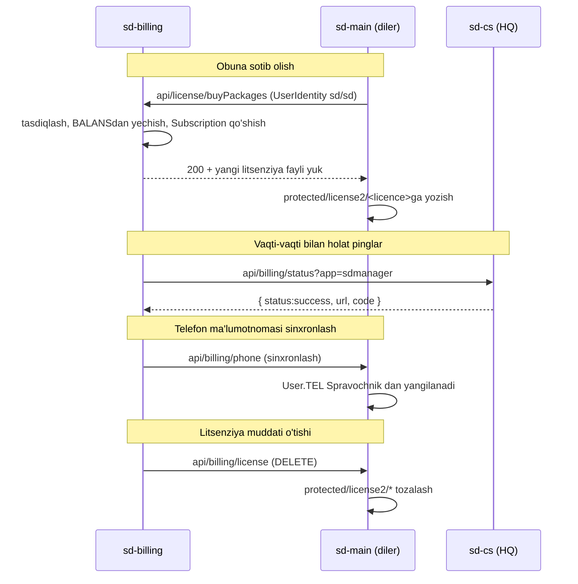

# sd-main va sd-cs bilan integratsiya

`sd-billing` har bir dilerning `sd-main` va har bir HQ ning `sd-cs` ning
yuqori oqimida joylashgan. Integratsiya yuzasi kichik va **bir tomonlama**:
sd-billing dilerlarga push qiladi; dilerlar faqat-o'qish litsenziya
tekshiruvlarini orqaga qaytaradi.

## sd-main tomonidan ochilgan endpointlar (sd-billing tomonidan chaqiriladi)

| Endpoint | Maqsad |
|----------|--------|
| `GET /api/billing/license` | Litsenziya-fayl yangilashni ishga tushirish (yangi tushishi uchun `protected/license2/*` ni tozalaydi). IP-cheklovi `185.22.234.226`. |
| `POST /api/billing/phone` | Spravochnik master dan agentlar va ekspeditorlar uchun telefon raqamlarini sinxronlash. |
| `/dashboard/billing` | sd-main ichidagi ichki billing UI; litsenziya ma'lumotlarini o'qiydi. |

## sd-cs tomonidan ochilgan endpointlar (sd-billing tomonidan chaqiriladi)

| Endpoint | Maqsad |
|----------|--------|
| `GET/POST /api/billing/status?app=sdmanager` | Tirik/qobiliyat tekshiruvi. Qaytaradi `{ status:"success", url, code, type:"countrysale" }`. |

## sd-billing tomonidan ochilgan endpointlar (sd-main tomonidan chaqiriladi)

Diler `sd-main` asosan loginda litsenziya ma'lumotlarini tortadi. Vakolatli
API `sd-billing/protected/modules/api/`da:

| Endpoint | Maqsad |
|----------|--------|
| `POST /api/license/buyPackages` | Paketlarni sotib olish / yangilash |
| `POST /api/license/exchange` | Maxsus "bir paketni boshqasiga almashtirish" |
| `GET /api/license/info` | Dilerning joriy huquqlari |
| `POST /api/host/heartbeat` | Diler tirik ekanligini xabar qiladi (ba'zi oqimlar) |

Ulardan bir nechtasi `new UserIdentity("sd","sd")` orqali kiradi — **auth
qattiqlashtirish trekining bir qismi sifatida tuzating**.

## Identifikatorlar

- **`Diler.HOST`** sd-billingda = dilerning `sd-main` hostnomi.
- **`Diler.DILER_ID`** = asosiy integratsiya kalitisi. Uni `sd-main`
  konfiguratsiyasiga va `sd-cs` ma'lumotnoma qatorlariga aks ettiring.
- **Litsenziya fayllari** `sd-main/protected/license2/<diler-id>.license`
  (yoki shunga o'xshash) da saqlanadi.

## Muvaffaqiyatsizlik rejimlari

| Stsenariy | Effekt |
|-----------|--------|
| Litsenziya pushi muvaffaqiyatsiz | Diler oldingi litsenziyani muddati tugaguncha saqlaydi. Imtiyoz davri konfiguratsiyasini qo'shing. |
| sd-billing → sd-cs ping muvaffaqiyatsiz | Billing dashbord HQ ni oflayn ko'rsatadi. Mijozga ko'rinadigan ta'sir yo'q. |
| Ommaviy litsenziya bekor qilish | Hamma joyda `license2/*`ni o'chirishga teng. Tashlamang; har-tenant muzlatishlarni afzal ko'ring. |

## Qattiqlashtirish ro'yxati

- IP allowlist ni o'zaro TLS yoki imzolangan JWT bilan almashtiring.
- Litsenziya fayllarini veb-rootdan tashqariga ko'chiring.
- `versiya + oxirgi qo'llanilgan litsenziya` qaytaruvchi `/api/billing/healthz`
  qo'shing.
- Har bir litsenziya o'zgarishini auditga yozing (sd-main dagi `IntegrationLog`
  patternga qarang).
- `UserIdentity("sd","sd")` mashina loginlarini API tokenlar bilan almashtiring.

## Yana qarang

- [sd-main billing-integratsiya yuzasi (eski qayta yo'naltirish)](/docs/billing/overview)
- [Obuna oqimi](./subscription-flow.md)
- [Cron va settlement](./cron-and-settlement.md)
- [Xavfsizlik landminalari](./security-landmines.md)
