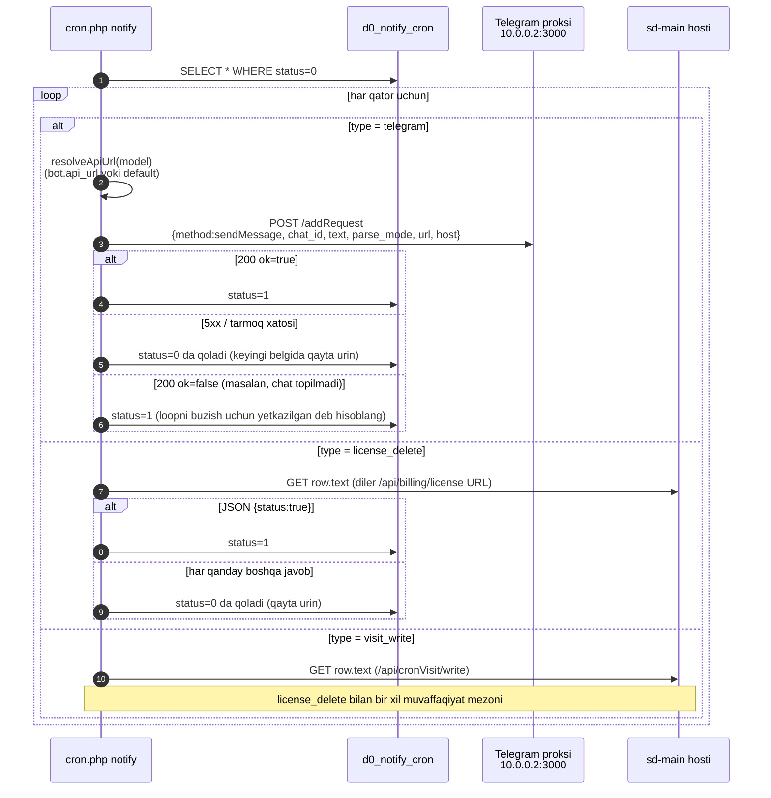

# Bildirishnomalar (Telegram + SMS)

Ikkita yetkazib berish kanali bor — **Telegram** (asosiysi) va
**SMS** — va Telegram xabarlari ham, "buni HTTP chaqiruvini bajaring"
ishlari ham harakatlanadigan bitta umumiy navbat jadvali bor.

## 1. Kanal xulosasi

| Kanal | Kod | Transport | Nima uchun |
|-------|-----|-----------|------------|
| Telegram (navbatga olingan) | `Telegram::queue` | HTTP `POST` bot proksiga `http://10.0.0.2:3000/addRequest` | Deyarli barcha dilerga yo'naltirilgan bildirishnomalar |
| Telegram (sinxron) | `Telegram::sendNow` | HTTP `POST` `http://10.0.0.2:3000/sendNow` ga | So'rov ichida javob talab qiladigan sahifalar/kritik ogohlantirishlar |
| SMS (UZ) | `Sms::send` / `Sms::multy` | HTTPS `notify.eskiz.uz` ga | UZ dilerlari va hamkorlar |
| SMS (KZ) | `Sms::sendKz` | HTTPS `api.mobizon.kz` ga | KZ dilerlari va hamkorlar |

Telegram yo'li to'g'ridan-to'g'ri `api.telegram.org`ga emas, balki
`10.0.0.2:3000` da **ichki bot proksi** orqali boradi. Proksi rate-limit
boshqaruvi va bot-token saqlashni sd-billing dan izolyatsiya qiladi.

## 2. Umumiy navbat — `d0_notify_cron`

`NotifyCron` (`protected/models/NotifyCron.php`) navbat modeli va
**umumiy kechiktirilgan-HTTP navbati sifatida ham xizmat qiladi**.
`type` ustuni farqlaydi:

| `type` konstanta | Qiymat | Qator nimani anglatadi |
|------------------|--------|------------------------|
| `NotifyCron::TYPE_TELEGRAM` | `telegram` | `text` xabar; `chat_id` maqsad; `bot_id` qaysi botni tanlaydi (`d0_notify_bot`) |
| `NotifyCron::TYPE_LICENSE_DELETE` | `license_delete` | `text` GET qilinadigan **URL**ni saqlaydi (masalan, `https://dealer.salesdoc.io/api/billing/license`); JSON `{status: true}`ni qaytarishi kutiladi |
| `NotifyCron::TYPE_VISIT_WRITE` | `visit_write` | Yuqoridagi kabi, lekin diler hostidagi `/api/cronVisit/write` uchun |

| Ustun | Maqsad |
|-------|--------|
| `id` | PK |
| `chat_id` | Telegram chat id (yoki Telegram-bo'lmagan qatorlar uchun `0`) |
| `bot_id` | FK → `d0_notify_bot` (null = eski standart) |
| `text` | Xabar tanasi **yoki** maqsadli URL |
| `parse_mode` | Telegram parse rejimi (`HTML` standart) |
| `type` | yuqoridagi qiymatlardan biri |
| `status` | `0 = STATUS_DEFAULT` (kutilmoqda), `1 = STATUS_RUN` (yetkazilgan) |
| `error_response` | oxirgi muvaffaqiyatsizlik sababi (string) — debug uchun saqlanadi |
| `created_by` | navbatga qo'yish vaqtidagi foydalanuvchi id |
| `created_at` | timestamp |

Muvaffaqiyatsizlikni boshqarish: yetkazib berishda muvaffaqiyatsiz bo'lgan qator
`status = 0` da qoladi va keyingi daqiqaning croni uni qayta urinib ko'radi.
Telegram tomonidagi **doimiy** xatolar (masalan, `chat not found`) cheksiz
loop dan qochish uchun yetkazilgan deb hisoblanadi — `NotifyCommand::sendTelegram`
ning `ok=false` tarmog'iga qarang.

## 3. Botlar — `d0_notify_bot`

Bir nechta Telegram botlari bir xil navbatdan yetkazib berishi mumkin.
`d0_notify_bot` dagi qatorlar:

| Ustun | Maqsad |
|-------|--------|
| `id` | PK |
| `name` | `default`, `billing` va h.k. — `NotifyBot::findByName` tomonidan ishlatiladigan satr |
| `token` | Telegram bot tokeni |
| `api_url` | `Telegram::queue` ga uzatiladigan bot proksi asosiy URL |

Konstantalar:

```php
NotifyBot::NAME_DEFAULT = 'default';
NotifyBot::NAME_BILLING = 'billing';
```

`NotifyCommand::resolveApiUrl` dagi hal qilish mantig'i:

1. Agar qatorda `bot_id` bo'lsa, o'sha botning `api_url` ni ishlating.
2. Aks holda `default` deb nomlangan botga qaytib boring.
3. Agar ikkalasi ham mavjud bo'lmasa, qator
   `No api_url available (bot not configured)` xato bilan doimiy ravishda
   muvaffaqiyatsizlikka uchraydi.

## 4. Navbatga qo'yish API

`NotifyCron`da uchta statik fabrika metodlari:

```php
// Telegram xabari
NotifyCron::create(
    $chat_id,                        // int
    $text,                           // string
    $bot_id = null,                  // NotifyBot dan int yoki null
    $parse_mode = 'HTML',            // Telegram parse rejimi
    $type = NotifyCron::TYPE_TELEGRAM
);

// Kechiktirilgan HTTP GET — diler litsenziya keshini tozalash kerak bo'lganda chaqiriladi
NotifyCron::createLicenseDelete($url);   // diler /api/billing/license ga POST qiladi

// Kechiktirilgan HTTP GET — kunlik tashriflarni urug'lash uchun chaqiriladi
NotifyCron::createVisitWrite($url);
```

Telegram mavjudligida **bloklanmasligi kerak** bo'lgan so'rovdan
`Telegram::queue` ni to'g'ridan-to'g'ri chaqirmang — `NotifyCron::create`
orqali navbatga qo'ying va cron bo'shatishni qo'lib turishiga ruxsat bering.

## 5. Navbatni bo'shatish — `cron.php notify`

`NotifyCommand` har daqiqada ishlaydi
([cron-and-settlement](./cron-and-settlement.md) ga qarang).



Asosiy xatti-harakatlar:

- **Bitta kutilayotgan qator → bitta HTTP chaqiruvi** har cron belgisida.
  Batching yo'q; o'tkazuvchanlik belgilar chastotasi × parallellik bilan chegaralangan.
- **Kamida-bir-marta** yetkazib berish — proksi va `sd-main` endpointlari
  **idempotent** bo'lishi kerak. License-delete allaqachon shunday (delete-then-recreate);
  visit-write ham diler/kun bo'yicha idempotent bo'lishi kerak.
- License-delete / visit-write GETlar uchun ulanish vaqti 20 s, jami vaqt
  60 s (`NotifyCommand::sendUrlGetExpectingStatusOk`).
- Telegram proksi muvaffaqiyatsizliklari (tarmoq/5xx) **vaqtinchalik** → qator
  `status=0` da qoladi va qayta urinadi. Telegram **mantiqiy** muvaffaqiyatsizliklari
  (`ok=false`) **doimiy** → qator bajarilgan deb belgilanadi.

## 6. Telegram bot proksi

`Telegram` komponenti (`protected/components/Telegram.php`):

```php
const QUEUE_URL        = 'http://10.0.0.2:3000/addRequest';   // async
const SEND_NOW_URL     = 'http://10.0.0.2:3000/sendNow';      // sync

const CONNECT_TIMEOUT  = 3;     // soniya
const REQUEST_TIMEOUT  = 8;     // soniya  (queue path)
const SEND_NOW_TIMEOUT = 35;    // soniya  (sendNow Telegram javobini kutadi)
const MAX_RETRIES      = 2;     // faqat curl errno 28 (timeout) da qayta urinadi

const NOTIFY_CHAT_ID   = 122420625;   // ops ogohlantirish kanali
```

| Metod | Qachon ishlatish |
|-------|-------------------|
| `Telegram::queue($method, $params, $apiUrl, $stop=false, $oneAttempt=false)` | Standart. Proksi ishni qabul qilsa darhol qaytaradi. Yondirib-unutish uchun ishlating. |
| `Telegram::sendNow($method, $params, $apiUrl, $stop=false, $oneAttempt=false)` | Faqat siz Telegram javobini bir xil so'rovda kerak bo'lganda ishlating (masalan, foydalanuvchiga "message_id" ni qaytarish). Eng yomon kechikishingizga 35 s qo'shadi. |

Ikkala chaqiruv joyi istisnolarni yutadi va
`log/telegram-queue-error-<ts>.txt` /
`log/telegram-sendnow-error-<ts>.txt`ga yozadi. Ushbu fayllarni
debug-only sifatida ko'ring — `Logger::writeLog2` orqali tuzilgan log
sizning so'rashingiz kerak bo'lgan narsa.

## 7. SMS — Eskiz (UZ) va Mobizon (KZ)

`Sms` komponenti (`protected/components/Sms.php`).

### 7.1 Eskiz — UZ

| Xususiyat | Qiymat |
|-----------|--------|
| Asosiy URL | `https://notify.eskiz.uz` |
| Auth | `POST /api/auth/login` 30 kunlik tokenni qaytaradi, `upload/sms_token.txt`ga davomiy saqlanadi |
| Yangilash | `Sms::deleteToken()` kunlik 08:00 da ishga tushadi (cron) — keyingi chaqiruv qayta-auth qiladi |
| Bittasini yuborish | `Sms::send($phone, $text)` → `POST /api/message/sms/send` |
| Bach yuborish | `Sms::multy($messages, $host = null)` → `POST /api/message/sms/send-batch` |
| Yuboruvchi | qattiq kodlangan `'4546'` (hali nikneym ro'yxatga olinmagan) |
| Shablonlar | `createTemplate()`, `templateList()` |
| Callback | Agar `multy` ga `$host` o'tkazilsa, callbacklar `https://billing.salesdoc.io/api/sms/callback?host=…` (`SmsController::actionCallback`) ga tushadi |

> ⚠ `EMAIL` va `PASSWORD` `Sms.php`da **qattiq kodlangan konstantalar**.
> [Xavfsizlik landminalari](./security-landmines.md) da kuzatiladi;
> sirlar ommaviy oshkor bo'lganda almashtiring.

### 7.2 Mobizon — KZ

| Xususiyat | Qiymat |
|-----------|--------|
| URL | `https://api.mobizon.kz/service/Message/SendSmsMessage` |
| Auth | URL dagi API kalit (`apiKey=…`) |
| Metod | `Sms::sendKz($phone, $text)` |

> ⚠ `apiKey` URL da qattiq kodlangan — xuddi shu landmina.

### 7.3 Hisoblash + til aniqlash

```php
Sms::isRussian($text)                 // Kirilga mos keladi
Sms::countSms($text)                  // 70 belgi/sms (Kirill), 160 belgi/sms (ASCII)
```

Dilerni SMS birliklari uchun hisoblashdan oldin `countSms`ni ishlating.

## 8. Aniq navbatga qo'yish joylari

Bildirishnomalar kod bazasida qayerda hosil bo'ladi:

| Chaqiruvchi | Tur | Maqsad |
|-------------|-----|--------|
| `Diler::deleteLicense` | `license_delete` | Litsenziya-keshini bekor qilishni diler sd-mainga push qilish |
| `Diler::resetVisits` (`createVisitWrite` orqali) | `visit_write` | Dilerda kunlik tashrif snimkasini ishga tushirish |
| `BotLicenseReminderCommand` | `telegram` | Diler Telegramiga 7/3/1-kun muddati o'tish eslatmalari |
| `CleannerCommand` | `telegram` | Haftalik tozalash xulosasi ops uchun |
| `VisitCommand`, `VisitHealthCommand` | `telegram` | Tashrif-snimka ishi xulosalari |
| `ReportBotCommand` | `telegram` | Soatlik ichki hisobot bot chiqishi |
| `FileLogRoute` (PHP xato yo'li) | `telegram` | Fatal xato → ops chati |
| `ActiveRecordLogableBehavior` | `telegram` | Audit izi — `-4241387119` chatiga yuboradi |

## 9. SMS API yuzasi (sd-billing ichida)

`api/sms` moduli (`SmsController`):

| Amal | Metod | Maqsad |
|------|-------|--------|
| `actionPackages` | `POST` | Diler sotib oladigan SMS paketlarini ro'yxatlash |
| `actionBuySmsPackage` | `POST` | SMS paketi uchun `BALANS`dan yechish |
| `actionBoughtSmsPackages` | `POST` | Tarix |
| `actionCreateTemplate` | `POST` | Eskiz da shablonni ro'yxatga olish |
| `actionCheckingTemplates` | `POST` | Mahalliy va Eskiz shablon ro'yxatlarini o'zaro tekshirish |
| `actionOne` | `POST` | Bitta SMS yuborish |
| `actionSend` | `POST` | Ommaviy yuborish (`Sms::multy` ishlatadi) |
| `actionSendingForward` | `POST` | Navbatdagi yuborishlarni yo'naltirish |
| `actionCallback` | `POST` | Eskiz yetkazib berish callbacki (DLR) |

Auth: xuddi `LicenseController::TOKEN`-uslubi naqshi; `Sms::isRussian` va
`countSms` ichki ravishda to'g'ri birliklarda hisoblash uchun ishlatiladi.

## 10. Muvaffaqiyatsizlik rejimlari va runbook

| Belgi | Ehtimoliy sabab | Birinchi tekshiruv | Amal |
|-------|-----------------|---------------------|------|
| Diler "Telegram ogohlantirishlarni ko'rmayapman" deb shikoyat qiladi | Bot proksi o'chirilgan yoki bot qatoridagi `api_url` noto'g'ri | `web` konteyneridan `curl -v http://10.0.0.2:3000/sendNow` | Proksini qayta ishga tushiring; `d0_notify_bot.api_url`ni tekshiring |
| Navbat uzunligi cheksiz o'sadi | Cron ishlamayapti yoki har qator muvaffaqiyatsizlikka uchraydi | `SELECT type, COUNT(*) FROM d0_notify_cron WHERE status=0 GROUP BY type;` | `log/notify-command-errors-*` ni kuzating, sababini topish uchun |
| Diler `sd-main` eskirgan litsenziyani saqlaydi | `license_delete` qatorlari bo'shamayapti yoki diler hosti yetib bo'lmaydi | `SELECT * FROM d0_notify_cron WHERE type='license_delete' AND status=0` | URLni billing hostidan curl qiling; diler nginx ishlayotganini tasdiqlang |
| SMS auth davom etadi muvaffaqiyatsizlikka uchraydi | Eskiz tokeni muddati o'tgan, fayl yozilmaydi, ma'lumotlar almashtirildi | `ls -la upload/sms_token.txt` va Eskiz boshqaruv paneli | `php cron.php sms deleteToken` (yoki shunchaki faylni `rm` qiling) |
| Doimiy Telegram xatolari loglarni to'ldiradi | Eskirgan `chat_id` (foydalanuvchi botni bloklagan) | qatordagi `error_response` ustuni | Qatorni yetkazilgan deb belgilang; manba ma'lumotlardan tegishli `chat_id`ni tozalang |
| Ommaviy ogohlantirish noto'g'ri ishga tushdi | Chaqiruvchidagi bug (masalan, noto'g'ri shablon o'rnini bosish) | Chaqiruvchiga oxirgi commitlar | Cronni to'xtating (`crontab -l | sed -i …`), navbatni qo'lda bo'shating, tuzating |

## 11. Qattiqlashtirish ro'yxati

- [ ] Eskiz / Mobizon ma'lumotlarini atrof-muhit o'zgaruvchilariga ko'chiring.
- [ ] Qayta urinish chegarasiga uradigan qatorlar uchun o'lik xat jadvalini qo'shing
      (hozir ular mantiqiy Telegram muvaffaqiyatsizligiga urilmaguncha abadiy qayta urinadi).
- [ ] Issiq qayta urinishlar haqida ogohlantirish berishimiz uchun har-qator urinish hisobini kuzating.
- [ ] Har belgi uchun navbat bo'shatishni cheklang (masalan, `LIMIT 500`),
      shunda backlog bitta cron belgisini keyingisini bosib o'tishga olib kelmaydi.
- [ ] Bot-proksi `POST` tanasini imzolang, shunda Eskiz callbacklari soxtalashtiriladi.

## Yana qarang

- [Cron va settlement](./cron-and-settlement.md) — `notify` va do'stlari jadvali.
- [Balans va pul matematikasi](./balance-and-money-math.md) — `Diler::deleteLicense` pul oqimida.
- [Loyihalararo integratsiya](../architecture/cross-project-integration.md) — `license_delete` sd-billing → sd-main siming.
- [Xavfsizlik landminalari](./security-landmines.md) — qattiq kodlangan SMS/Telegram sirlari.
