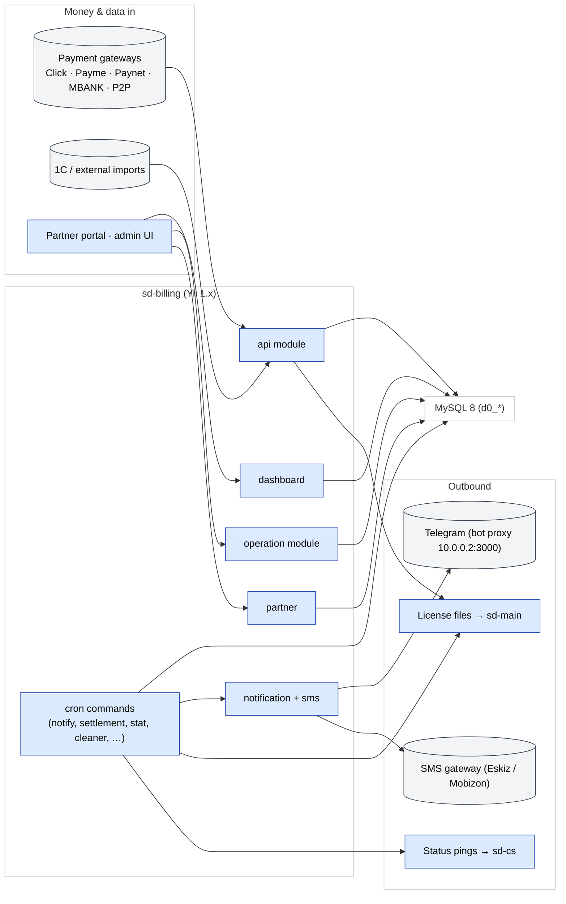

# sd-billing — obunalar, litsenziyalar, to'lovlar

**sd-billing** — bu har bir SalesDoctor dileri (har bir `sd-main`) va har bir
HQ (har bir `sd-cs`) ga hisob-kitob qiluvchi **platforma vendori** ilovasi.

U quyidagilarga egalik qiladi:

- **Obunalar** — qaysi diler qaysi paketlardan qancha vaqt foydalanishi
  mumkin.
- **Litsenziyalar** — `sd-main` xususiyatlarni gating qilish uchun loginda
  o'qiydigan imzolangan token.
- **To'lovlar** — gateway lardan (Click, Payme, Paynet, MBANK, P2P) va
  oflayn (naqd, P2P) keladigan pul.
- **Settlement** — distribyutor ↔ diler balanslarining kunlik
  hisob-kitobi.
- **Bildirishnomalar** — dilerning litsenziyasi tugashiga oz qolganda yoki
  pul tushganda Telegram + SMS.

## Tech stack

| Qatlam | Tech |
|-------|------|
| Framework | **Yii 1.1.15** (`framework/` ostida vendor qilingan) |
| Til | PHP (Docker da php-fpm 7.x) |
| Ma'lumotlar bazasi | **MySQL 8**, charset `utf8mb4`, jadval prefiksi `d0_` |
| Kesh / sessiyalar | DB asosida (Redis komponenti yo'q) |
| Cron | OS cron `cron.php` ni boshqaradi (`protected/commands/cronjob.txt` ga qarang) |
| Auth | Sessiya + cookie (`WebUser` + `UserIdentity`) |
| Bildirishnomalar | `http://10.0.0.2:3000` dagi Telegram bot proksisi |
| SMS | **Eskiz** (UZ), **Mobizon** (KZ) |
| To'lovlar | Payme, Click, Paynet, P2P, MBANK, plus 1C integratsiyasi |

## Modullar

`protected/modules/` ostida 13 ta Yii moduli:

| Modul | Maqsadi |
|--------|---------|
| `api` | Kiruvchi integratsiyalar (Click, Payme, Paynet, 1C, License, SMS, Host, Quest, Maintenance) |
| `dashboard` | Ichki admin UI — dilerlar, distribyutorlar, to'lovlar, obunalar, grafiklar |
| `operation` | Domen CRUD — paketlar, obunalar, to'lovlar, tariflar, qora ro'yxat, bildirishnomalar |
| `partner` | Sherikning o'z-o'ziga xizmat ko'rsatish portali (`PartnerAccessService` orqali cheklangan) |
| `cashbox` | Kassalar, oqim turlari, ko'chirishlar, sarflash |
| `report` | Hisobot ekranlari |
| `setting` | Ilova sozlamalari + tizim jurnali ko'ruvchi |
| `notification` | Ilova ichidagi bildirishnomalar |
| `sms` | SMS shablonlari + jo'natish |
| `bonus` | Bonus / chegirma mantig'i (chorak va h.k.) |
| `access` | Foydalanuvchi bo'yicha ruxsat panjarasi |
| `directory` | Ma'lumotnoma ma'lumotlari |
| `dbservice` | DB texnik xizmat ko'rsatish utilitalari |

## Repozitoriy tuzilishi

```
sd-billing/
├── index.php / cron.php        Web + console entry
├── _index.php / _constants.php Sample / template entries
├── docker/, docker-compose.yml Local + prod-like env
├── doc/                        Ad-hoc notes (security, integrations,
│                               testing plan)
├── log/, upload/, runtime/     Runtime artefacts (gitignored)
├── framework/                  Vendored Yii 1.1.15 (do not edit)
├── vendors/                    Pinned vendored libs
└── protected/                  ALL application code
    ├── config/
    │   ├── main.php            Web config
    │   ├── console.php         Cron config
    │   ├── db.php              MySQL connection (env-driven)
    │   └── auth.php            PhpAuthManager rules
    ├── components/             Cross-cutting services (Curl, Telegram,
    │                           Access, …)
    ├── helpers/                ArrayHelper, DateHelper, QueryBuilder,
    │                           Validator
    ├── behaviors/              AjaxCrudBehavior,
    │                           ActiveRecordLogableBehavior
    ├── actions/                Reusable actions (ApiAction, …)
    ├── controllers/            SiteController (login / logout / error)
    ├── models/                 Top-level AR models
    │                           (Diler, Payment, Subscription, …)
    ├── modules/                See module table above
    ├── commands/               Cron / CLI commands
    ├── migrations/             m*.php (yiic migrate)
    ├── extensions/             paynetuz, …
    └── views/                  Site views
```

## Arxitektura diagrammasi



## Yana qarang

- [Domen modeli](./domain-model.md)
- [Modullar](./modules.md)
- [To'lov gateway lari](./payment-gateways.md)
- [Obuna va litsenziyalash oqimi](./subscription-flow.md)
- [Cron va settlement](./cron-and-settlement.md)
- [Auth va kirish](./auth-and-access.md)
- [Lokal o'rnatish](./local-setup.md)
- [Xavfsizlik xatarlari](./security-landmines.md)
- [sd-main va sd-cs bilan integratsiya](./integration.md)
