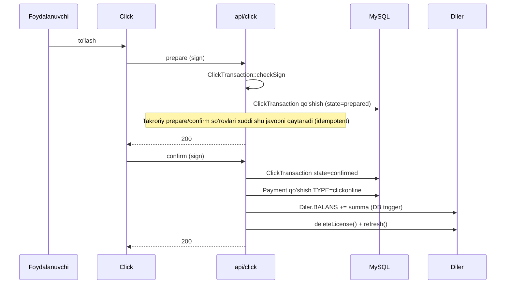
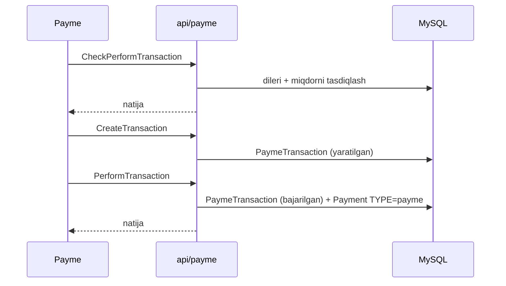

# To'lov shlyuzlari

sd-billing beshta onlayn + bir nechta oflayn kanallardan pul qabul qiladi.
Har bir muvaffaqiyatli kiruvchi to'lov oxir-oqibat to'g'ri `TYPE`dagi
`Payment` qatorini yozadi, `Diler.BALANS`ni oshiradi va kutilayotgan
obunalarni hisob-kitob qilish uchun `Diler::deleteLicense()` /
`Diler::refresh()`ni ishga tushiradi.

## Onlayn

| Shlyuz | `Payment.TYPE` | Kontroller | Eslatmalar |
|--------|----------------|------------|------------|
| **Click** | `TYPE_CLICKONLINE` | `api/click` | HMAC imzosi bilan ikki bosqichli prepare/confirm (`ClickTransaction::checkSign`) |
| **Payme** | `TYPE_PAYMEONLINE` | `api/payme` | JSON-RPC; `PaymeHelper`da tasdiqlangan HMAC auth sarlavhasi |
| **Paynet** | `TYPE_PAYNETONLINE` | `api/paynet` | `extensions/paynetuz/` orqali SOAP; `_constants.php`da ma'lumotlar shabloni |
| **MBANK** (KG) | `mbank` | shlyuz-maxsus | Bugun stub-darajasida — texnik xizmat bilan qayta tasdiqlang |
| **P2P** | `p2p` | qo'lda kiritish | Operator kelgan bank o'tkazmasini tasdiqlaydi |

## Oflayn

| Manba | `Payment.TYPE` | Tomonidan ushlangan |
|-------|----------------|---------------------|
| Naqd | `cash` | `cashbox` moduli |
| Naqd bo'lmagan / o'tkazma | `cashless` | `cashbox` |
| Litsenziya hisob-kitob | `license` | Kreditlarni iste'mol qiladigan `Diler::refresh()` |
| Distribute / settlement | `distribute` | `cron settlement` ([Cron](./cron-and-settlement.md) ga qarang) |
| Xizmat to'lovi | `service` | qo'lda |

## Kanonik `Payment.TYPE` enum

To'liq enum `Payment` modelida sinf konstantalari sifatida aniqlangan
(sd-billing dagi `protected/models/Payment.php`). Yuqoridagi satr yorliqlari
butun kodlarga moslanadi; yangi kod yalang'och butun sonlarni yoki satrlarni
emas, balki konstantalarni ISHLATSHI KERAK:

| Konstanta | Satr yorlig'i | Yo'nalish |
|-----------|---------------|-----------|
| `Payment::TYPE_CASH` | `cash` | kiruvchi (oflayn) |
| `Payment::TYPE_CASHLESS` | `cashless` | kiruvchi (oflayn) |
| `Payment::TYPE_P2P` | `p2p` | kiruvchi (oflayn) |
| `Payment::TYPE_LICENSE` | `license` | chiquvchi (iste'mol qilingan) |
| `Payment::TYPE_DISTRIBUTE` | `distribute` | settlement |
| `Payment::TYPE_SERVICE` | `service` | qo'lda to'lov |
| `Payment::TYPE_PAYMEONLINE` | `payme` | kiruvchi (shlyuz) |
| `Payment::TYPE_CLICKONLINE` | `click` | kiruvchi (shlyuz) |
| `Payment::TYPE_PAYNETONLINE` | `paynet` | kiruvchi (shlyuz) |
| `Payment::TYPE_MBANK` | `mbank` | kiruvchi (shlyuz, KG) |

Raqamli butun qiymatlar bu yerda atayin takrorlanmaydi, shunda bu hujjat
modeldan siljimaydi — vakolatli raqamlar uchun `Payment.php`dagi konstanta
deklaratsiyalarini o'qing.

## Click oqimi (kanonik)

## Payme oqimi

## Paynet oqimi

SOAP asosidagi. Shlyuz provayderi `paynetuz` kengaytmasi tomonidan
ochilgan SOAP endpointiga uradi; kontroller so'rovni `PaynetTransaction`
va mos keluvchi `Payment` qatoriga aylantiradi.

## Idempotentlik

Har bir shlyuzning tranzaksiya jadvali idempotentlik kalitisidir.
Xuddi shu `prepare` (Click) yoki `CreateTransaction` (Payme) ni ikki marta
qabul qilish boshqa `Payment` qo'shmasdan xuddi shu javobni qaytaradi.

## Muvaffaqiyatsizlik rejimlari

| Stsenariy | Xatti-harakat |
|-----------|---------------|
| Yomon sign | 4xx, `Payment` yaratilmaydi |
| Diler nofaol | 4xx, tranzaksiya `prepared` da qoladi |
| Takroriy id | Birinchi chaqiruv bilan bir xil javob |
| `PerformTransaction` o'rtasida tarmoq xatosi | Shlyuz qayta urinadi; idempotentlik saqlanadi |

## Loglash

`Logger::writeLog2($data, $is_req, $path)` har-kun har-amal JSON fayllarni
`log/<controller>/<YYYY-MM-DD>/` ostida yozadi. **Loglashdan oldin
kirishlarni tozalang** — hech qachon karta tafsilotlarini yoki to'liq to'lov
payloadlarini logga yozmang.

## Qo'lda to'lov kiritish

Kassirlar / operatorlar boshqaruv panelining `operation` moduli orqali
to'lovlar qo'shadi. To'g'ridan-to'g'ri `Payment::create([...])` ni ishlatadi —
xuddi shu DB triggerlar yonadi.
