# Obuna va litsenziyalash

Diler ro'yxatdan o'tishidan tortib, ularning `sd-main`i xususiyatlarni
qulflashgacha bo'lgan to'liq oqim.

```mermaid
flowchart LR
  S(["Diler ro'yxatdan o'tadi"]) --> P["To'lash (onlayn yoki oflayn)"]
  P --> B["Diler.BALANS += summa"]
  B --> BUY["api/license/buyPackages"]
  BUY --> CHK{"Tasdiqlash o'tdi?"}
  CHK -- "yo'q" --> ERR(["Rad etish"])
  CHK -- "ha" --> SUB["Subscription qatorlari<br/>[START_FROM, ACTIVE_TO]"]
  SUB --> NEG["Payment TYPE=license (manfiy)"]
  NEG --> SET["Diler.refresh() — BALANS, FREE_TO, MONTHLYni qayta hisoblash"]
  SET --> SRV["Diler.HOST → Server.STATUS=SENT → OPENED"]
  SRV --> NOTIF(["Telegram + SMS dilerga"])

  class S action
  class P,B,BUY,SUB,NEG,SET,SRV action
  class CHK approval
  class ERR reject
  class NOTIF success
  classDef action   fill:#dbeafe,stroke:#1e40af,color:#000
  classDef approval fill:#fef3c7,stroke:#92400e,color:#000
  classDef success  fill:#dcfce7,stroke:#166534,color:#000
  classDef reject   fill:#fee2e2,stroke:#991b1b,color:#000
  classDef external fill:#f3f4f6,stroke:#374151,color:#000
  classDef cron     fill:#ede9fe,stroke:#6d28d9,color:#000
```

`Tasdiqlash` bosqichi quyidagi mustaqil tekshiruvlardan birortasi rad etganda rad etadi:

| Tekshiruv | Qachon rad etiladi |
|-----------|---------------------|
| Balans | `Diler.BALANS` < `Package.PRICE` (so'ralgan paketlar bo'yicha jami) |
| Minimal chegaralar | `MIN_SUMMA` yoki `MIN_LICENSE` suiiste'molga qarshi chegarasi qondirilmagan |
| Valyuta moslashish | Qo'yilgan valyuta ≠ `Diler.CURRENCY_ID` |

## Paketlarni sotib olish

`POST /api/license/buyPackages` — diler `sd-main` (qattiq foydalanuvchi
sessiyasi `new UserIdentity("sd","sd")` orqali) tomonidan chaqiriladi.

`LicenseController::actionBuyPackages` da bajarilgan tasdiqlash:

1. Diler mavjud + faol.
2. Qo'yilgan valyuta `Diler.CURRENCY_ID` ga mos keladi.
3. Har bir so'ralgan paket bu dilerning `Diler.COUNTRY_ID` ga sotilishi mumkin.
4. `Diler.BALANS` ≥ jami.
5. `MIN_SUMMA` / `MIN_LICENSE` chegaralari qondirilgan (suiiste'molga qarshi).

Muvaffaqiyatda:

- Har tanlangan paket uchun `Subscription` qatorlarini qo'shish, `START_FROM = bugun`,
  `ACTIVE_TO = bugun + Package.TYPE` kun bilan sanalash.
- `TYPE = license` va **manfiy** `SUMMA` bilan bitta `Payment` qatorini qo'shing
  (shunda triggerlar narx miqdoriga `BALANS`ni kamaytiradi).
- Diler balansi, `FREE_TO` va `MONTHLY` xulosasini qayta hisoblash uchun
  `Diler::refresh()` ni chaqiring.
- Diler `sd-main` yangi litsenziyani olishi uchun `Server.STATUS` ga teging.

## Bepul sinov

`Diler.IS_DEMO` va `Diler.FREE_TO` sana-chegaralangan bepul oyna beradi.
Sinov faol bo'lganda, `hasSystemActive(systemId)` (loginda `sd-main` tomonidan
chaqiriladi) obunalarsiz ham `true`ni qaytaradi.

## Yangilash

Yangilash xuddi shu paketlar bilan boshqa **buy** chaqiruvi. Yangi
`Subscription` qatorlari dilerning qoplamasini **eng so'nggi faol obunaning
oxiridan** kengaytiradi (bugundan emas), shuning uchun foydalanuvchilar
kunlarini yo'qotmaydi.

## Muddati o'tishi

Kunlik cron `botLicenseReminder` muddati o'tishiga yaqin dilerlarni ogohlantiradi:

- `ACTIVE_TO` dan 7, 3, 1 kun oldin — Telegram + SMS bildirishnomasi.
- Muddati o'tganidan keyin — `Diler::refresh()` litsenziya faylini almashtiradi
  (`sd-main` tomonidan iste'mol qilinadi).

## Bonus paketlar

`Subscription` qatorlari `is_bonus = true` deb belgilanishi mumkin (bepul o'rin
grantlari). Ular litsenziya tekshiruvlariga hisoblanadi, lekin `BALANS`ga
qarshi to'lov olinmaydi.

## Barcha-paketlar rejimi (`MONTHLY=15`)

Agar `Diler.MONTHLY = 15` bo'lsa, diler "barcha paketlar" rejasida.
Litsenziya fayli har-paket `SUBSCRIP_TYPE` o'rniga global muddat o'tishi bilan
boshqariladi.
