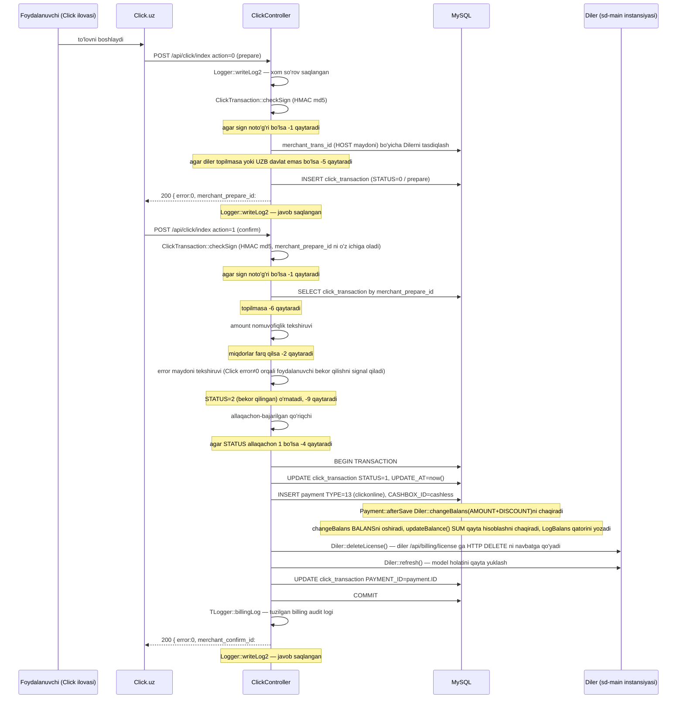

# api · Click shlyuzi

## Maqsad

Click.uz shlyuzidan ikki bosqichli to'lov bildirishnomalarini qabul qiladi va
tasdiqlangan to'lovni `TYPE_CLICKONLINE` (13) tipidagi `Payment` qatoriga
aylantiradi, bu diler uchun balans qayta hisoblash va obunani hisob-kitob
qilishni ishga tushiradi. Boshqaruvchi - bu kiruvchi so'rov tanasidagi `action`
maydoniga yo'naltiradigan bitta Yii kontroller amali — u ikki bosqich uchun
alohida URL endpointlarini ochmaydi.

## Kim ishlatadi

Bu endpoint faqat Click.uz to'lov tizimi tomonidan chaqiriladi — sd-billing UI
yoki inson operatori tomonidan emas. sd-billing kirish modulidan RBAC roli
talab qilinmaydi, chunki auth butunlay HMAC-imzo asosida. Kontroller har qanday
model ishidan oldin qattiq `click` tizim foydalanuvchisi (`User.LOGIN = 'click'`)
sifatida ichki kirishni amalga oshiradi.

`Access::check()` chaqiruvi qilinmaydi; `checkSign` da imzo muvaffaqiyatsizligi
har qanday DB yozuvidan oldin `-1` xato qaytaradi va qayta ishlashni to'xtatadi.

## Qayerda yashaydi

| Artefakt | Yo'l |
|----------|------|
| Kontroller | `protected/modules/api/controllers/ClickController.php` |
| Tranzaksiya modeli | `protected/models/ClickTransaction.php` |
| To'lov modeli | `protected/models/Payment.php` |
| Diler modeli | `protected/models/Diler.php` |
| Cashbox modeli | `protected/modules/cashbox/models/Cashbox.php` |
| So'rov/javob loglovchi | `protected/modules/api/components/TLogger.php`, `protected/components/Logger.php` |
| Kiruvchi URL | `POST /api/click/index` (modul `api`, kontroller `click`, amal `index`) |

URL Yii ning umumiy `<controller>/<action>` yo'l qoidasi orqali hal qilinadi;
Click uchun maxsus marshrut qoidasi ro'yxatga olinmagan.

## Ish oqimi

1–6 (prepare) va 7–18 (confirm) bosqichlari har biri `Logger::writeLog2`
chaqirig'i bilan boshlanib tugaydi, xom so'rov va xom javob ikkalasini ham
`log/click/YYYY-MM-DD/` ostidagi JSON fayllar sifatida yozadi.

## Qoidalar

- `checkSign` so'rovdagi `service_id` qattiq kodlangan konstanta
  `ClickTransaction::$service_id` (15603) ga mos kelishini tasdiqlaydi;
  mos kelmaydigan yoki yo'qolgan `service_id` bilan so'rovlar har qanday DB
  o'qishidan oldin darhol `-1` xato qaytaradi.
- HMAC satr `md5(click_trans_id + service_id + secret_key +
  merchant_trans_id + merchant_prepare_id + amount + action + sign_time)`;
  prepare bosqichida `merchant_prepare_id` `null` (haqiqiy PHP null, bo'sh
  satr emas).
- `merchant_trans_id` `Diler.ID`ga emas, balki `Diler.HOST` (diler subdomeni)
  ga moslanadi; har chaqiruv uchun `HOST` atributi bo'yicha qidiruv amalga oshiriladi.
- `country.CODE != 'UZB'` bilan dilerlar prepare bosqichida `-5` xato bilan
  rad etiladi; Click.uz faqat-UZ va KZ/KG dilerlari Paynet yoki MBANK ni
  ishlatishi kerak.
- Confirm boshqaruvchi Click so'rov tanasidagi `error` maydonini o'qiydi;
  nolga teng bo'lmagan `error` qiymati Click ning o'zi foydalanuvchi tomonidagi
  muvaffaqiyatsizlikni signal qilayotganini anglatadi. Boshqaruvchi DB tranzaksiyasi
  ichida `STATUS = 2` (bekor qilingan) ni o'rnatadi va `-9` ni qaytaradi, `-8` emas.
- Miqdor o'zgarmasligi: confirm chaqiruvining `amount` maydoni prepare
  davomida o'rnatilgan `ClickTransaction.AMOUNT` ga aniq mos kelishi kerak;
  har qanday og'ish tranzaksiya holatiga tegmasdan `-2` qaytaradi.
- Idempotentlik: allaqachon `STATUS = 1` (bajarilgan) tranzaksiya uchun keladigan
  confirm so'rovi `-4` (Allaqachon to'langan) ni takroriy `Payment` qatorini
  qo'shmasdan qaytaradi.
- Allaqachon `STATUS = 2` (bekor qilingan) bo'lgan tranzaksiya har qanday
  keyingi confirm urinishida ham `-9` qaytaradi; qo'riqchi allaqachon-bajarilgan
  tekshiruvdan oldin yonadi.
- `Payment::create(...)` `CASHBOX_ID` ni `Cashbox::getIDByCode("cashless")` ga
  o'rnatadi — ya'ni naqd kassasi emas, naqd-bo'lmagan kassasi.
- `Payment::afterSave` PHP da `Diler::changeBalans(AMOUNT + DISCOUNT)` ni ishlatadi
  (xotiradagi inkrement keyin `save(false)`), keyin `updateBalance()` ni chaqiradi
  bu xuddi shu soniya ichida keladigan parallel so'rovlardan himoya qilish
  uchun `SUM`-asosli SQL qayta hisoblashni beradi.
- `Diler::deleteLicense()` to'g'ridan-to'g'ri hech narsani o'chirmaydi; u
  `NotifyCron::createLicenseDelete` orqali diler sd-main instansiyasiga
  `<domain>/api/billing/license` da HTTP so'rovini navbatga qo'yadi. Agar domen
  bo'sh bo'lsa, metod flesh xatoni o'rnatgandan keyin jim qaytadi.
- DB tranzaksiyasi faqat `click_transaction` yangilanishini, `Payment`
  qo'shilishini va ikkinchi `click_transaction` saqlanishini (`PAYMENT_ID` ni
  qo'shish) o'rab oladi; `deleteLicense` / `refresh` chaqiruvlari try bloki
  ichida sodir bo'ladi, lekin tranzaksiya bo'lmagan HTTP operatsiyalardir.
- Confirm tranzaksiyasi davomida har qanday istisno bo'lganda, boshqaruvchi
  orqaga qaytaradi va `-8` (clickdan kelgan so'rovdagi xato) ni qaytaradi.

## Ma'lumotlar manbalari

| Jadval | Nima uchun o'qiladi/yoziladi |
|--------|-------------------------------|
| `click_transaction` | Idempotentlik yozuvi; prepare da yaratilgan, confirm da yangilangan; `STATUS` qiymatlari: 0 prepare, 1 bajarilgan, 2 bekor qilingan |
| `payment` | Muvaffaqiyatli confirm da qo'shiladi; `TYPE = 13` (`TYPE_CLICKONLINE`); `afterSave` orqali balans yangilashni ishga tushiradi |
| `diler` | `HOST` bo'yicha qidiriladi; `BALANS` `changeBalans` + `updateBalance` orqali yangilanadi |
| `log_balans` | `changeBalans` ichida yozilgan faqat-qo'shish balans-o'zgarishi audit qatori |
| `cashbox` | Yangi `Payment` uchun `CASHBOX_ID`ni hal qilish uchun `CODE = 'cashless'` bo'yicha bir marta so'raladi |
| `user` | Yii sessiyasi uchun `LOGIN = 'click'` tizim foydalanuvchisini autentifikatsiya qilish uchun bir marta so'raladi |

Barcha jadvallar bitta sd-billing MySQL ma'lumotlar bazasida. Ikkinchi
boshqaruv-tekisligi ma'lumotlar bazasi yo'q; sd-cs hujjatlarida tasvirlangan
`cs_*` / `d0_*` bo'linish bu yerda qo'llanilmaydi.

## Gotchalar

- **Ikkala bosqich xuddi shu URL va amalga uradi.** Payme (nomli JSON-RPC
  metodlaridan foydalanadi) yoki Paynet (SOAP operatsiyalari) dan farqli
  o'laroq, Click `POST /api/click/index` ga oddiy POST maydoni sifatida
  `action=0` (prepare) yoki `action=1` (confirm) ni yuboradi. Ramka
  darajasida marshrut farqlanishi yo'q.

- **`merchant_prepare_id` mahalliy PK, Click ID emas.** Prepare javobi
  sd-billing `click_transaction.ID` ni `merchant_prepare_id` sifatida qaytaradi.
  Keyin Click bu qiymatni confirm so'rovida qaytarib jo'natadi, bu boshqaruvchi
  tranzaksiyani qanday qidirishidir. `click_trans_id` (Click ning o'z butun
  soni) va `merchant_prepare_id` (sd-billing PK) o'rtasidagi chalkashlik
  debugging xatolarning eng keng tarqalgan manbai.

- **DB tranzaksiyasi to'liq confirm yo'lini qoplamaydi.** `deleteLicense`
  va `refresh` `try` bloki ichida chaqiriladi, lekin DB committan keyin
  hali sodir bo'lmagan — agar `deleteLicense` tashlasa, orqaga qaytarish
  yonadi va `Payment` qatori hech qachon yozilmaydi. Aksincha, agar oxirgi
  `$model->save()` (PAYMENT_ID ni qaytarib yozish) `Payment::create`
  allaqachon ishlaganidan keyin muvaffaqiyatsizlikka uchrasa, tranzaksiya
  orqaga qaytadi, lekin `Payment::afterSave` PHP orqali xotirada `Diler.BALANS`ni
  allaqachon oshirgan (garchi SQL-asosli `updateBalance` to'g'ri SUM ni
  o'rnatgan bo'lsa ham). Amalda bu xavfsiz, chunki orqaga qaytarish
  `PAYMENT_ID` havolasini oldini oladi, lekin `payment` qatorining o'zi
  `click_transaction` saqlash muvaffaqiyatsizlikka uchragan bo'lsa, omon qoladi.
  Agar diler bog'langan tranzaksiyasiz balans krediti ko'rsatsa, `TLogger`
  billing logllari bilan tekshiring.

- **`Logger::writeLog2` `log/click/` ostida har-kun-papka ishlatadi.** Har
  so'rov ikkita fayl yaratadi (bittasi `req.txt`, bittasi `res.txt`),
  soniya-aniqligi timestampi bilan nomlangan. Yuqori-trafik kunlarida
  bir soniyada bir nechta fayl mumkin; to'qnashuv amalda kam, lekin imkonsiz emas.
  Log fayllar oddiy JSON, satr-bilan-ajratilgan emas — muayyan to'lovni
  kuzatish uchun `click_trans_id` bo'yicha grep qiling.

## Yana qarang

- [To'lov shlyuzlari](../payment-gateways.md) — kanonik oqim diagrammasi, to'liq
  `Payment.TYPE` enum, Payme va Paynet patternlari, idempotentlik va muvaffaqiyatsizlik-rejimi
  jadvali.
- [Balans va pul matematikasi](../balance-and-money-math.md) — `changeBalans`,
  `updateBalance` va `Payment::afterSave` `Diler.BALANS`ni saqlash uchun qanday
  o'zaro ta'sir qiladi.
- [Modullar](../modules.md) — `api` modul umumiy ko'rinishi; shlyuz kontrollerlar
  bo'yicha auth patternlari.
- Manba: `protected/modules/api/controllers/ClickController.php`
