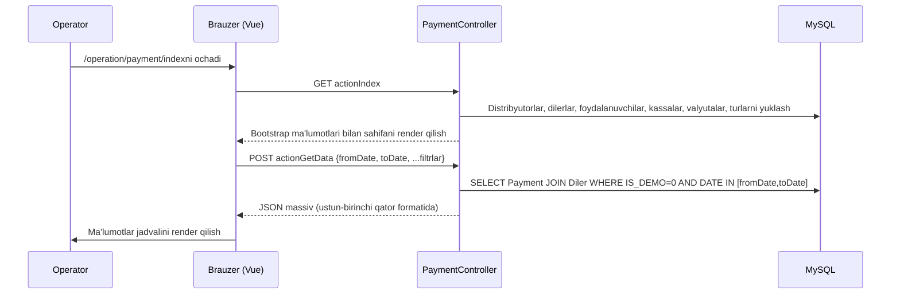

# operation · To'lov yozish

## 1. Maqsad

To'lov yozish xususiyati sd-billing ichida diler balansiga yetib keladigan
barcha pul uchun ma'muriy ledger kirish nuqtasi. U operatorlarga, menejerlarga
va asosiy-hisob xodimlariga to'lov qatorlarini ro'yxatlash, qo'shish, tahrirlash
va yumshoq-o'chirish va to'lov ro'yxatga olinganidan keyin litsenziyalarni
qayta-faollashtirad igan quyi oqim obuna-hisob-kitob zanjirini ishga tushirish
uchun bitta ko'rinish beradi.

---

## 2. Kim ishlatadi

| Rol | Kirish kalitisi | Imkoniyat |
|-----|-----------------|-----------|
| Admin (`IS_ADMIN = 1`) | `operation.dealer.payment` SHOW | Barcha kassalar bilan to'liq ro'yxat |
| Manager (ROLE = 4) | `operation.dealer.payment` SHOW | O'z davlat IDlariga ko'lamlangan |
| Operator (ROLE = 5) | `operation.dealer.payment` SHOW/CREATE/UPDATE/DELETE | O'z kassasiga ko'lamlangan |
| Asosiy-hisob (ROLE = 9) | `operation.dealer.payment` SHOW | O'z davlat IDlariga ko'lamlangan |
| Sale (ROLE = 7) | `operation.dealer.payment` SHOW | O'z davlat IDlariga ko'lamlangan |

`Access::check('operation.dealer.payment', Access::SHOW/CREATE/UPDATE/DELETE)`
orqali tekshiriladigan kirish konstantalari.

Yaratish, yangilash va o'chirish ruxsatlari faqat amal qiluvchi foydalanuvchi
kamida bitta kassaga (`count($ownCashboxes) > 0`) ega bo'lganda beriladi.
`ACCESS_CASHBOX = 1` foydalanuvchilari barcha kassalarni o'qiy va ularda amal
qila oladi; boshqalar `Cashbox.USER_ID = User.USER_ID` bo'lgan kassalar bilan cheklangan.

---

## 3. Qayerda yashaydi

| Element | Yo'l |
|---------|------|
| Kontroller | `protected/modules/operation/controllers/PaymentController.php` |
| Payment modeli | `protected/models/Payment.php` |
| Diler modeli (balans metodlari) | `protected/models/Diler.php` |
| Indeks ko'rinishi | `protected/modules/operation/views/payment/index.php` (`actionIndex` tomonidan render qilinadi) |
| URL | `/operation/payment/index` |

Ochilgan amallar:

| Amal | Metod | Kirish konstantasi |
|------|-------|---------------------|
| `actionIndex` | GET | SHOW |
| `actionGetData` | POST | SHOW |
| `actionCreateOrUpdate` | POST | CREATE yoki UPDATE (har-yozuv asosida hal qilinadi) |
| `actionDelete` | POST | DELETE |

---

## 4. Ish oqimi

### 4a. To'lovlarni ro'yxatlash

Standart sana diapazoni joriy taqvim oyining birinchi-to-oxirgi kuni.
Admin bo'lmagan foydalanuvchilar davlat-ko'lamlangan: `getUserCountryIds()`
amal qiluvchi foydalanuvchining davlat IDlarini qaytaradi; adminlar bo'sh
massiv oladi va `COUNTRY_ID IN (...)` filtri butunlay o'tkazib yuboriladi.

### 4b. To'lov yaratish (qo'lda / admin yo'l)

1. Operator UI da **To'lov qo'shish** ni bosadi.
2. Brauzer maydonlar bilan `actionCreateOrUpdate`ga POST qiladi: `dealer`,
   `currency`, `cashbox`, `type`, `amount`, `date`, `comment` va `id = null`.
3. Kontroller kassa egaligini, dileri mavjudligini, valyuta mavjudligini,
   kassa mavjudligini, diler bilan valyuta moslashishini (`Diler.CURRENCY_ID`),
   `Payment::getPaymentTypes()` ichida tur a'zoligini va sana formatini tasdiqlaydi.
4. Kontroller DB tranzaksiyasini ochadi, `new Payment()` ni yaratadi,
   `AMOUNT = abs(floatval($postData["amount"]))`, `DISCOUNT = 0` ni o'rnatadi
   va saqlaydi.
5. `Payment::beforeSave` `CREATED_BY` ni belgilaydi va dilerning faol
   distribyutoridan `DISTRIBUTOR_ID` ni hal qiladi.
6. `Payment::afterSave` `Diler::changeBalans(AMOUNT + DISCOUNT)`ni chaqiradi,
   bu `Diler.BALANS`ni oshiradi, `LogBalans` qatorini qo'shadi va keyin
   `d0_payment` ga qarshi vakolatli `Diler::updateBalance()` SUM qayta hisoblashni
   bajaradi. Keyin `Diler::resetActiveLicense()` `ACTIVE_TO`ni yangilaydi.
7. `save()` muvaffaqiyatli bo'lib tranzaksiya bajarilgandan keyin,
   `Diler::deleteLicense()` darhol obuna hisob-kitobi uchun diler SD-app
   hostiga (`/api/billing/license`) `NotifyCron` litsenziya-o'chirish so'rovini
   navbatga qo'yadi.
8. Brauzer `{"success": true}`ni qabul qiladi va jadvalni yangilaydi.

### 4c. To'lovni tahrirlash

Xuddi shu endpoint (`actionCreateOrUpdate`) null bo'lmagan `id` bilan.
Kontroller mavjud `Payment` yozuvini yuklaydi (`findByPk`), UPDATE kirishini
tekshiradi, yangi maydon qiymatlarini o'rnatadi va saqlaydi. `afterSave`
yangi-bo'lmagan, o'chirilmagan yozuvni aniqlaydi va `changeBalans(NEW_AMOUNT
- OLD_AMOUNT)` ni chaqiradi. Agar dilerning distribyutori bo'lsa va bog'langan
`DistrPayment` mavjud bo'lsa, uning `AMOUNT`i xuddi shu o'tishda yamoqlanadi.

### 4d. To'lovni yumshoq-o'chirish

1. Brauzer `actionDelete`ga `{id}` bilan POST qiladi.
2. Kontroller `Payment::deletePayment()`ni chaqiradi, bu `IS_DELETED = 1` ni
   o'rnatadi va `save(false)`ni chaqiradi (tasdiqlash qoidalarini chetlab o'tib).
3. `afterSave` `IS_DELETED = ACTIVE_DELETED`ni aniqlaydi, `Diler.BALANS`dan
   `-(AMOUNT + DISCOUNT)`ni ayiradi, har qanday `CompDetails` bog'lanishini
   teskariga aylantirish uchun `uncomputeDebt()`ni chaqiradi va, agar
   dilerning bog'langan `DistrPayment` bilan distribyutori bo'lsa, teskariga
   aylantirishni aks ettirish uchun `DistrPayment::deletePayment()`ni chaqiradi.

---

## 5. Qoidalar

- Qo'lda yaratilgan to'lovlar uchun `Payment.TYPE` `Payment::getPaymentTypes()`
  qaytaradigan turlar bilan cheklangan, bu `Payment::getTypes()` minus
  `TYPE_LICENSE (10)`, `TYPE_DISTRIBUTE (11)` va `TYPE_SERVICE (14)`. Qo'lda
  operatorlar litsenziya-iste'mol, settlement yoki xizmat-to'lovi qatorlarini
  yarata olmaydi.
- `amount` maydoni har doim `abs(floatval($postData["amount"]))` sifatida
  saqlanadi — kontroller `AMOUNT`ni yozishdan oldin manfiy kirishni musbatga
  majburlaydi. `DISCOUNT` qo'lda yaratilgan to'lovlarda har doim `0`.
- `Diler.BALANS` **faqat PHPda** saqlanadi: `Diler::changeBalans()` xotiradagi
  qiymatni sozlaydi, `save(false)`ni yozadi, `LogBalans` qatorini qayd qiladi,
  keyin xavfsizlik to'ri sifatida to'liq `SUM(AMOUNT + DISCOUNT)` qayta
  hisoblashni bajaradigan `Diler::updateBalance()`ni chaqiradi. DB trigger
  migratsiyasi `m221114_070346_create_triggers_to_payment.php` mavjud, lekin
  uning `$this->execute($sql)` izohga olingan va **faol emas**.
- Valyuta dilerning o'z `Diler.CURRENCY_ID` ga mos kelishi kerak; nomuvofiqliklar
  har qanday DB yozuvidan oldin HTTP 200 + `{"success": false}` bilan rad etiladi.
- Demo dilerlari (`Diler.IS_DEMO = 1`) to'lov ro'yxatidan chiqarib tashlangan:
  `actionGetData` so'rovida qattiq `WHERE dil.IS_DEMO = 0` sharti bor.
- Ro'yxatdagi qator tahrirlanishi har-qator SQL ifodasi bilan boshqariladi:
  `TYPE NOT IN (10, 11)` (litsenziya-iste'mol yoki tarqatish qatorlarini
  tahrirlash yo'q) **va** kassa amal qiluvchi foydalanuvchiga tegishli
  (`Cashbox.USER_ID = :userId`) yoki foydalanuvchida `ACCESS_CASHBOX = 1` bor.
  O'chiriluvchanlik tur cheklovini tushiradi — kassa egaligi tekshiruvi o'tsa
  har qanday tur o'chirilishi mumkin.
- `getUserCountryIds()` adminlar uchun `[]`ni qaytaradi (`Yii::app()->user->isAdmin()`),
  bu holatda `COUNTRY_ID IN (...)` bandi tashlanadi va barcha dilerlar ko'rinadi.
  Admin bo'lmaganlar uchun `User::getCountryIds()`ni qaytaradi va so'rov mos
  ravishda ko'lamlangan.
- `Diler::deleteLicense()` `NotifyCron` qatorini (turi: license-delete) dilerning
  `DOMAIN + '/api/billing/license'` ga ishora qiluvchi navbatga qo'yadi.
  Haqiqiy HTTP chaqiruvi `notify` cron ishi (har daqiqada) tomonidan amalga
  oshiriladi — u so'rov tsiklida sinxron **emas**.
- `Payment::afterSave` `$this->disabledAfterSave === true` bo'lganda o'tkazib
  yuboriladi; bu flag rekursiyani oldini olish uchun `COMP` maydonlarini yamoqlashda
  ichki ravishda ishlatiladigan `saveWithoutAfterSave()` tomonidan o'rnatiladi.

---

## 6. Ma'lumotlar manbalari

| Jadval | DB / ulanish | Nima uchun o'qiladi |
|--------|--------------|---------------------|
| `d0_payment` | sd-billing standart DB | Asosiy ledger — ro'yxatlangan, yaratilgan, yangilangan, yumshoq-o'chirilgan |
| `d0_diler` | sd-billing standart DB | Diler qidirish, valyuta moslashish, balans yangilash, `deleteLicense` chaqiruvi |
| `d0_distributor` | sd-billing standart DB | Indeksda distribyutor filtrini to'ldirish; `beforeSave` `DISTRIBUTOR_ID`ni hal qiladi |
| `d0_cashbox` | sd-billing standart DB | Har qator uchun kassa egaligi tekshiruvi; kirishni boshqarish uchun foydalanuvchining o'z kassalari |
| `d0_currency` | sd-billing standart DB | Valyuta dropdown; diler bilan valyuta moslashishni tasdiqlaydi |
| `d0_user` | sd-billing standart DB | Foydalanuvchi dropdown (ROLE ≠ 6 = API bo'lmagan, ACTIVE = 1); davlat-ko'lam qidiruvi |
| `d0_log_balans` | sd-billing standart DB | Har bir balans o'zgarishida `Diler::changeBalans` tomonidan yoziladi (audit izi) |
| `d0_comp_details` | sd-billing standart DB | Qarz qatoriga qarshi to'lovni teskariga aylantirishda `uncomputeDebt()` tomonidan o'qilgan/o'chirilgan |
| `d0_distr_payment` | sd-billing standart DB | Diler distribyutorga ega bo'lganda va bog'langan `DistrPayment` bo'lganda aks ettirilgan yangilanish/o'chirish |
| `d0_notify_cron` | sd-billing standart DB | Async litsenziya-hisob-kitob chaqiruvini navbatga qo'yish uchun `Diler::deleteLicense()` tomonidan yoziladi |

Barcha jadvallar `d0_` prefiksdan foydalanadi. `{{tableName}}` Yii joylashtiruvchisi
DB konfiguratsiyasidagi `tablePrefix` orqali hal qilinadi — modellar jadvalga
`{{payment}}`, `{{diler}}` va h.k. sifatida murojaat qiladi.

---

## 7. Gotchalar

**`deleteLicense()` asinxron.** To'lovni saqlagandan keyin kontroller
`$dealer->deleteLicense()`ni chaqiradi, bu `d0_notify_cron` qatorini yozadi,
HTTP chaqiruvini emas. Diler SD-app ga haqiqiy litsenziya pushi `notify`
cron yongan bir daqiqadan keyin sodir bo'ladi. Agar cron o'chirilgan bo'lsa,
to'lov qatori va balans allaqachon yangilangan bo'lsa ham, obunalar hisob-kitob
qilinmagan holda qoladi.

**`ACCESS_CASHBOX` flag barcha kassa egaligi filtrlarini chetlab o'tadi.**
`User.ACCESS_CASHBOX = 1` bo'lgan foydalanuvchi to'lov qaysi kassaga tegishli
bo'lishidan qat'i nazar har bir to'lov qatorini ham tahrirlanuvchi, ham
o'chiriluvchi sifatida ko'radi. Bu rol tekshiruvi emas — bu `IS_ADMIN`dan
farqli `d0_user` jadvalidagi ustun-darajasidagi flag.

**`TYPE IN (10, 11)` qatorlari uchun tahrirlash foydalanuvchi kim bo'lishidan
qat'i nazar bloklangan.** `TYPE_LICENSE (10)` yoki `TYPE_DISTRIBUTE (11)`
bo'lgan to'lovlar `actionGetData` SQL ifodasi tomonidan tahrirlanmaydigan deb
belgilangan. Ular kassa egaligi o'tsa, baribir yumshoq-o'chirilishi mumkin.
Bu shlyuz tomonidan yaratilgan litsenziya-iste'mol qatorlari kassa egasi
tomonidan o'chirilishi mumkin, lekin tahrirlanmaydi.

**`DISCOUNT` qo'lda yaratishda har doim 0; tarixiy qatorlar farq qilishi mumkin.**
Kontroller har doim `$model->DISCOUNT = 0` ni yozadi. Biroq, eski to'lov
qatorlari (settlement, shlyuz yoki eski importlar tomonidan yaratilgan) nolga
teng bo'lmagan `DISCOUNT` qiymatlarini olib yurishi mumkin. Balans so'rovlari
`AMOUNT + DISCOUNT` ni ishlatishi kerak, faqat `AMOUNT` emas — `actionGetData`
to'g'ri qilganidek `(pay.AMOUNT + pay.DISCOUNT) AS amount`.

---

## 8. Yana qarang

- [To'lov shlyuzlari](../payment-gateways.md) — `api/*` kontrollerlar orqali
  `Payment` qatorlarini ham hosil qiladigan Click/Payme/Paynet oqimlari.
- [Domen modeli](../domain-model.md) — `Payment`, `Diler`, `Cashbox` va
  shlyuz tranzaksiya jadval sxemalari.
- [Cron va settlement](../cron-and-settlement.md) — `TYPE_DISTRIBUTE (11)`
  qatorlarini yaratadigan `SettlementCommand` va `d0_notify_cron` navbatini
  qayta ishlaydigan `notify` cron (bu xususiyat tomonidan navbatga qo'yilgan
  litsenziya-o'chirish kirishlarini ham o'z ichiga oladi).
- [Balans va pul matematikasi](../balance-and-money-math.md) — nima uchun
  `Diler.BALANS` PHP-saqlanadi, o'chirilgan trigger migratsiyasi va
  `updateBalance()` SUM qayta hisoblash xavfsizlik to'ri.
- Manba: `protected/modules/operation/controllers/PaymentController.php`
