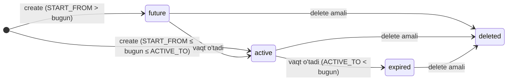

# operation · Obuna hayot tsikli

## 1. Maqsad

Obuna hayot tsikli xususiyati billing xodimlariga `sd-main` ichida diler
qaysi paketlarni ishlatishi mumkinligini aniqlaydigan vaqt-chegaralangan
litsenziya qatorlarini (`d0_subscription`) yaratish, sozlash, qayta tayinlash
va yumshoq-o'chirish imkonini beradi. Har bir yozuv operatsiyasi darhol
`sd-main` serveridagi dilerning keshlangan litsenziya faylini bekor qiladi,
shuning uchun o'zgarish keyingi loginda kuchga kiradi.

## 2. Kim ishlatadi

| Rol | Kirish kalitisi | Ruxsat berilgan operatsiyalar |
|-----|-----------------|--------------------------------|
| Admin (`IS_ADMIN = true`) | `operation.dealer.subscription` | Barcha to'rt operatsiya |
| Manager, Operator, Asosiy-hisob (rol 4/5/9) | `operation.dealer.subscription` | Ularning bitmask grantiga bog'liq |

Ruxsat `Access::check('operation.dealer.subscription', $type)` orqali tekshiriladi,
bu yerda `$type` bitmask konstantalardan biri:

| Konstanta | Qiymat | Talab qilinadi |
|-----------|--------|-----------------|
| `Access::SHOW` | 4 | `list`, `info` |
| `Access::CREATE` | 1 | `create` |
| `Access::UPDATE` | 2 | `update`, `exchange`, `calculate-bonus` |
| `Access::DELETE` | 8 | `delete` |

`info` endpointi `authorize()` o'rniga `$this->authenticate()`ni chaqiradi,
shuning uchun har qanday autentifikatsiyalangan sessiya paket-tur metaltini
o'qiy oladi.

## 3. Qayerda yashaydi

| Element | Yo'l |
|---------|------|
| Kontroller | `protected/modules/operation/controllers/SubscriptionController.php` |
| Amal sinflari | `protected/modules/operation/actions/subscription/` |
| Subscription modeli | `protected/models/Subscription.php` |
| Package modeli | `protected/models/Package.php` |
| Diler modeli (litsenziya hooklari) | `protected/models/Diler.php` |
| Notify-cron modeli | `protected/models/NotifyCron.php` |
| Bot-eslatma cron buyrug'i | `protected/commands/BotLicenseReminderCommand.php` |
| Cron ishga tushiruvchi | `cron.php` (loyiha root) |

URL pattern (Yii `operation` modul yo'nalishlari):

```
POST   /operation/subscription/list
GET    /operation/subscription/info
POST   /operation/subscription/create
DELETE /operation/subscription/delete
POST   /operation/subscription/update
PATCH  /operation/subscription/exchange
PUT    /operation/subscription/exchange
POST   /operation/subscription/calculate-bonus
```

## 4. Ish oqimi

Obuna qatorining holati ikkita maydon tomonidan qamrab olinadi:

- `IS_DELETED` ∈ `0` (faol) / `1` (yumshoq-o'chirilgan)
- Bugunga nisbatan sana oynasi `[START_FROM, ACTIVE_TO]`



Alohida `cancelled` yoki `suspended` holat ustuni yo'q — model faqat jonli
(`IS_DELETED = 0`) ni yumshoq-o'chirilgan (`IS_DELETED = 1`) dan farqlaydi.
"Expired" — bu olingan faqat-o'qish holat: `ACTIVE_TO < bugun AND IS_DELETED = 0`.

### Yaratish oqimi (`POST /operation/subscription/create`)

1. Chaqiruvchi `dealer_id`, `package_id`, `quantity`, `months[]` (`Y-m`
   satrlar massivi) va ixtiyoriy `end_of_month` flagini POST qiladi.
2. `SubscriptionCreateAction` diler mavjudligini, paket mavjudligini va
   tan olingan `SUBSCRIP_TYPE`ga ega ekanligini, valyutalar mos kelishini
   (`Diler.CURRENCY_ID == Package.CURRENCY_ID`), miqdor ≥ 1 ekanligini (va
   `admin` va `bot_order` turlari uchun = 1) va har oy satri `Y-m` formatiga
   mos kelishini tasdiqlaydi.
3. `bot_report` paketlari uchun, agar o'sha diler uchun `DilerPackage`
   override mavjud bo'lmasa, miqdor `Package::getBotPackages()` orqali
   qatlamlangan jadvaldan qidiriladi, bu holda paketning tekis `AMOUNT` ishlatiladi.
4. Bitta DB tranzaksiyasi ichida har so'ralgan oy uchun bitta `Subscription`
   qatori qo'shiladi. `START_FROM` / `ACTIVE_TO`
   `Subscription::setStartAndActiveDateByMonth()` tomonidan hisoblanadi (agar
   `end_of_month = true` bo'lsa, oy oxiri moslashish).
5. Har bir saqlangan obuna uchun `TYPE = 10` (litsenziya), `AMOUNT = -1 * amount`
   bilan `SUBSCRIPTION_ID` orqali bog'langan `Payment` qatori qo'shiladi.
6. Commit da `Diler::deleteLicense()` `{dealer.DOMAIN}/api/billing/license`ga
   ishora qiluvchi `type = license_delete` `notify_cron` qatorini navbatga qo'yadi.
   `notify` cron buyrug'i bu DELETE so'rovini `sd-main`ga asinxron tarzda yuboradi.

### O'chirish oqimi (`DELETE /operation/subscription/delete`)

1. Chaqiruvchi `dealer_id` va `ids[]` (obuna IDlari massivi) ni yuboradi.
2. Amal barcha IDlar `IS_DELETED = 0` bilan mavjudligini va barchasi berilgan
   dilerga tegishli ekanligini tekshiradi.
3. Tranzaksiya ichida har bir obuna `Subscription::deleteSubscrip()`ni chaqiradi:
   `IS_DELETED = 1`ni o'rnatadi, keyin bog'langan to'lovda `Payment::deletePayment()`ni
   chaqiradi, bu `Diler::changeBalans()` orqali miqdorni `Diler.BALANS`ga
   qaytaradi.
4. Keshlangan litsenziyani bekor qilish uchun commitdan keyin `Diler::deleteLicense()`
   chaqiriladi.

### Yangilash (miqdor o'zgarishi) oqimi (`POST /operation/subscription/update`)

1. Chaqiruvchi `dealer_id` va `subscriptions[]` `{subscription_id, quantity}`
   juftliklar massivini yuboradi.
2. Amal har bir obunani yuklaydi va tasdiqlaydi (o'chirilmagan va dilerga
   tegishli bo'lishi kerak).
3. Tranzaksiya ichida har bir obuna uchun: eski qatorni (va uning to'lovini)
   yumshoq-o'chiradi, keyin xuddi shu `START_FROM` / `ACTIVE_TO` / `PACKAGE_ID`,
   lekin yangi `COUNT` bilan o'rniga qatorni yaratadi va
   `priceOfOneLicense * newQuantity` uchun yangi to'lov yaratadi.
4. Commitdan keyin `Diler::deleteLicense()` chaqiriladi.

### Almashinish (dilerlar o'rtasida o'tkazish) oqimi (`PATCH /operation/subscription/exchange`)

1. Chaqiruvchi `subscription_ids[]`, `from_dealer_id`, `to_dealer_id` ni yuboradi.
2. Amal `from_dealer` va `to_dealer` xuddi shu `CURRENCY_ID` ga ega ekanligini
   tasdiqlaydi; barcha obunalar o'chirilmagan va `from_dealer`ga tegishli bo'lishi
   kerak.
3. Tranzaksiya ichida har bir obuna `from_dealer`dan yumshoq-o'chiriladi va
   `to_dealer` uchun aniq qayta yaratiladi (xuddi shu `START_FROM`, `ACTIVE_TO`,
   `COUNT`, `PACKAGE_ID`). To'lov miqdori aniq saqlanadi.
4. Commitdan keyin ikkala `from_dealer.deleteLicense()` va `to_dealer.deleteLicense()`
   chaqiriladi.

### Bot-eslatma cron (`botLicenseReminder`)

`php cron.php botLicenseReminder` orqali chaqiriladi. Faol dilerlar uchun
(`STATUS = 10`, `ACTIVE_TO >= CURRENT_DATE`) bugun faol `bot_report` obunasi
**bo'lmaganlarni** so'raydi, keyin har dilerning `sd-main`ida
`{dealer.HOST}.salesdoc.io/api/billing/telegramLicense`ga POST qiladi.
`/var/www/novus/data/www/billing.salesdoc.io/upload/bot-report-reminder/`ga
har-diler log faylini yozadi. Non-200 javoblarda 3 martagacha qayta urinadi.
`COUNTRY_ID IN (7, 9, 10)` dagi dilerlar va shahar `LOCAL_CODE = 'smpro'` bo'lganlarni
o'tkazib yuboradi.

## 5. Qoidalar

- `IS_DELETED = 0` jonli; `IS_DELETED = 1` yumshoq-o'chirilgan. Qattiq o'chirish
  yo'q. `Subscription::active` ko'lami `IS_DELETED = 0`ni filtrlaydi.
- `Subscription::isActive()` `START_FROM <= bugun <= ACTIVE_TO AND IS_DELETED = 0`
  bo'lganda `true`ni qaytaradi. `isActiveAndMore()` `bugun <= ACTIVE_TO`
  bo'lganda `true`ni qaytaradi (kelajak-boshlanuvchi qatorlarni o'z ichiga oladi).
- `quantity` barcha paketlar uchun ≥ 1 bo'lishi kerak. `SUBSCRIP_TYPE = admin`
  va `SUBSCRIP_TYPE = bot_order` uchun, `quantity` aniq 1 ga teng bo'lishi
  kerak; `quantity > 1` ni urinish 400 xato qaytaradi.
- Valyuta mos kelishi kerak: `Diler.CURRENCY_ID === Package.CURRENCY_ID`.
  Nomuvofiqlik xato tanasida ikkala valyuta qiymati bilan 400 xato qaytaradi.
- `SUBSCRIP_TYPE` `Package::getSubscripTypes()` qaytaradigan kalitlardan biri
  bo'lishi kerak: `admin`, `agent`, `merchant`, `dastavchik`, `supervisor`,
  `vansel`, `seller`, `bot_report`, `bot_order`, `smpro_user`, `smpro_bot`.
  Ro'yxatga olinmagan turlardagi paketlar rad etiladi.
- `bot_report` uchun to'lov miqdori, agar o'sha diler uchun `DilerPackage`
  qatori mavjud bo'lsa, `DilerPackage` override (tekis `Package.AMOUNT`)
  ishlatadi; aks holda miqdor diapazon qidiruvi sifatida miqdorni ishlatib
  `Package::getBotPackages()` tomonidan hal qilinadi.
- `Subscription.DISTRIBUTOR_ID` `beforeSave`da `Diler.distr.ID`dan avtomatik
  o'rnatiladi; chaqiruvchilar uni ta'minlamaydi.
- `ADD_BONUS = 1` yaratishda o'rnatiladi va obuna bonus-hisoblash mantig'iga
  hisoblansa-yo'qligini boshqaradi (`SubscriptionCalculateBonusAction` uni
  yaratishdan keyin almashtirishi mumkin).
- `Diler::deleteLicense()` `d0_notify_cron`ga `type = license_delete` bilan
  qator navbatga qo'yadi. U `sd-main`ni sinxron **chaqirmaydi**. Haqiqiy HTTP
  DELETE `sd-main`ga faqat `notify` cron buyrug'i ishga tushganda yetib keladi
  (`php cron.php notify`).
- `Subscription.DISTRIBUTOR_ID` model tasdiqlash tomonidan talab qilinadi —
  jonli `Diler.distr` munosabati bo'lmagan qo'shimchalar muvaffaqiyatsizlikka uchraydi.
- Almashinishda, ikkala diler bir xil `CURRENCY_ID`ni baham ko'rishi kerak;
  o'zaro-valyuta o'tkazmalari ikkala diler IDlarini ro'yxatlovchi 400 xato
  bilan rad etiladi.
- `Subscription::deleteSubscrip()` `returnBalans()`ni chaqiradi, bu bog'langan
  `Payment` qatorini yumshoq-o'chiradi; bu `Diler::changeBalans()` →
  `Diler::updateBalance()`ni ishga tushiradi, bu `Diler.BALANS`ni barcha
  o'chirilmagan to'lovlar bo'ylab `SUM(pay.AMOUNT + pay.DISCOUNT)` sifatida
  qayta hisoblaydi.

## 6. Ma'lumotlar manbalari

| Jadval | DB va ulanish | Nima uchun o'qiladi |
|--------|----------------|---------------------|
| `d0_subscription` | `b_*` (billing), `db` ulanishi | Asosiy ob'ekt; har bir amal o'qiydi/yozadi |
| `d0_package` | `b_*` (billing), `db` ulanishi | Paket turi, davomiyligi, valyutasi va miqdorini tasdiqlaydi |
| `d0_diler` | `b_*` (billing), `db` ulanishi | Diler mavjudligini tasdiqlaydi; valyuta moslashish; litsenziya bekor qilishni ishga tushiradi |
| `d0_payment` | `b_*` (billing), `db` ulanishi | Har bir obuna qatoriga 1:1 bog'langan; obuna o'chirilganda yumshoq-o'chirilgan |
| `d0_notify_cron` | `b_*` (billing), `db` ulanishi | `sd-main`ga async litsenziya-o'chirish chaqiruvlari uchun navbat jadvali |
| `d0_diler_package` | `b_*` (billing), `db` ulanishi | Har-diler `bot_report` narx override |

## 7. Gotchalar

- **Litsenziya bekor qilishi asinxron.** `Diler::deleteLicense()` faqat
  `d0_notify_cron`ga yozadi. O'zgarish `sd-main`ga `php cron.php notify` yongan
  vaqt yetib keladi. Agar notify cron to'xtab qolsa, sd-billingda yozilgan
  obunalar `sd-main`da hali ko'rinmaydi.
- **Yangilash o'chirish-va-qayta-yaratish, maydon yamoq emas.**
  `SubscriptionUpdateAction` eski obuna va to'lovni yumshoq-o'chiradi, keyin
  yangi qatorlarni qo'shadi. Bu eski `ID` yo'qoladi va yangisi yaratiladi
  degani. Eski IDga har qanday tashqi havola (hisobotlar, havolalar) eskiradi.
- **`bot_report` miqdori miqdor qatlamlaridan yaratish vaqtida hisoblanadi,
  stavka sifatida saqlanmaydi.** `d0_payment`ga yozilgan miqdor obuna yaratilganda
  qo'llanilgan qatlamni aks ettiradi. Qatlamlardagi keyingi o'zgarishlar mavjud
  to'lovlarni retroaktiv tarzda sozlamaydi.
- **`operation` modulida `refresh()` chaqiruvi yo'q.** `api/license/buyPackages`
  dan farqli o'laroq (bu `ACTIVE_TO`, `FREE_TO` va `MONTHLY`ni qayta hisoblash
  uchun `Diler::refresh()`ni chaqiradi), `SubscriptionCreateAction::refreshDealerLicense()`
  metodi faqat `deleteLicense()`ni chaqiradi. `Diler.ACTIVE_TO` operation-modul
  yozuvlari tomonidan **qayta hisoblanmaydi**; u alohida yangilanadi (masalan,
  boshqaruv paneli `SubscripController` orqali).
- **`BotLicenseReminderCommand` log fayllar mutlaq ishlab chiqarish yo'liga
  yoziladi** (`/var/www/novus/data/www/billing.salesdoc.io/upload/bot-report-reminder/`).
  Bu yo'l buyruqda qattiq kodlangan; lokal dev konteynerlarda mavjud emas, bu
  `mkdir` chaqirig'i jim ravishda kutilmagan papka yaratishiga olib keladi.

## 8. Yana qarang

- [Obuna va litsenziyalash oqimi](./subscription-flow.md) — diler ro'yxatdan
  o'tishidan to'lov orqali `sd-main` litsenziya qulflashgacha bo'lgan to'liq
  oqim; `api/license/buyPackages`, yangilash, bonus paketlar va `botLicenseReminder`
  muddat o'tish bildirishnomalarini qamrab oladi.
- [Domen modeli](./domain-model.md) — `Subscription`, `Package`, `Diler`,
  `Payment` va tegishli jadvallar uchun ERD va maydon-darajasidagi tavsiflar.
- [Balans va pul matematikasi](./balance-and-money-math.md) — `Diler.BALANS`
  qanday saqlanadi, nima uchun DB triggerlar o'chirilgan va `Payment::afterSave`
  → `Diler::changeBalans` zanjiri.
- Manba: `protected/modules/operation/controllers/SubscriptionController.php`
  va `protected/modules/operation/actions/subscription/`
