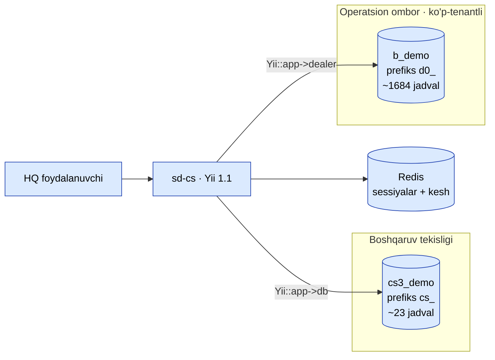
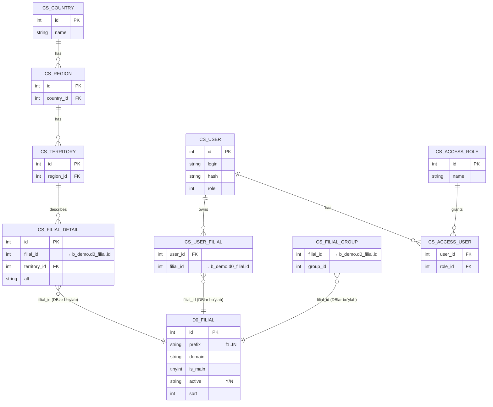
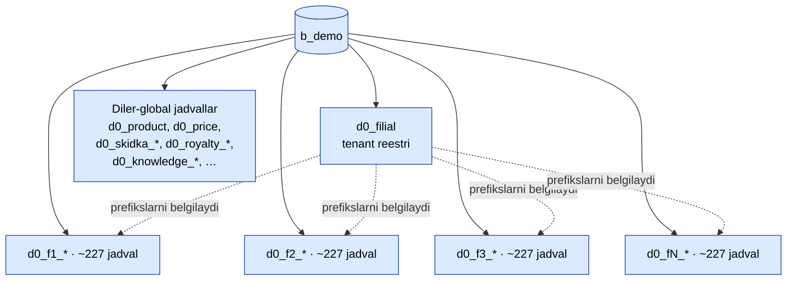
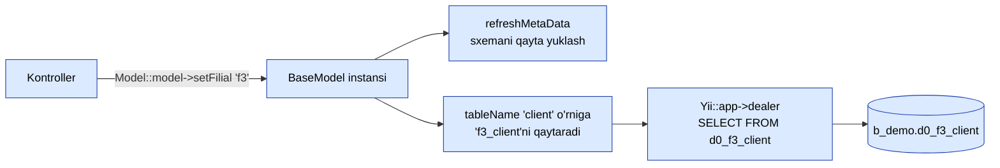
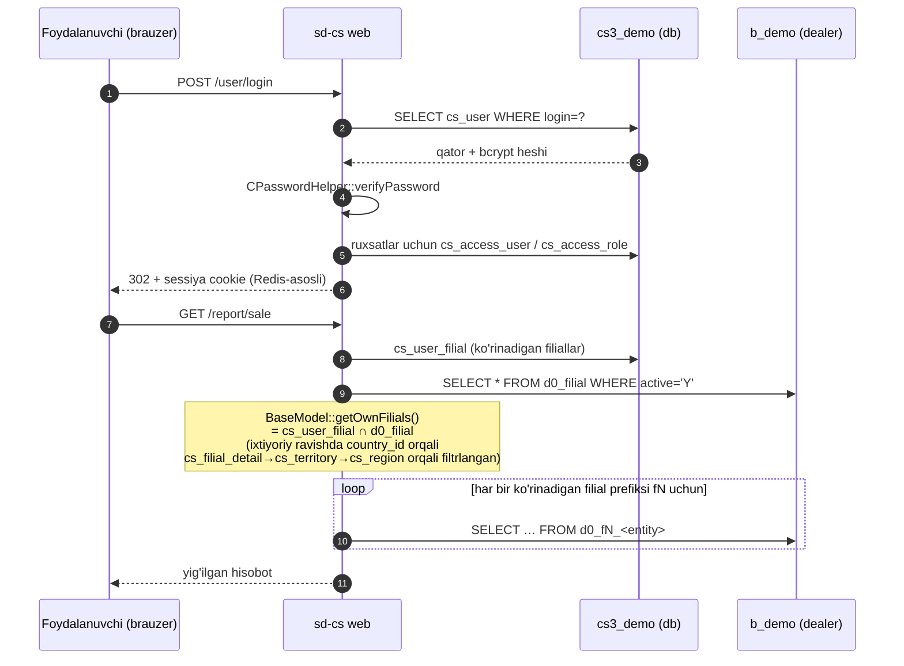
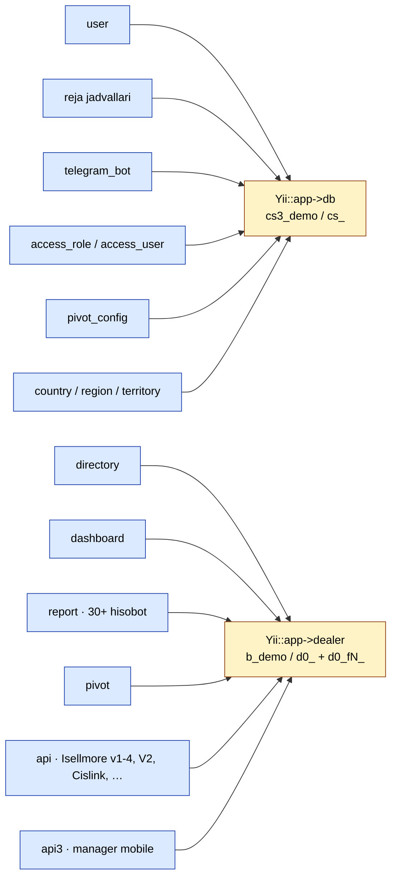

# sd-cs — Arxitektura (ishlaydigan koddan tasdiqlangan)

Ushbu diagrammalar joylashtirilgan sd-cs ning **haqiqiy** xatti-harakatini aks
ettiradi: ikkita MySQL sxemasi (boshqaruv + ombor) va omborning ichida har-tenant
**filial** prefiks sxemasi. `cs3_demo` / `b_demo` sxemalariga va `BaseModel` /
`V2Controller` kod yo'llariga qarshi tasdiqlangan.

> Vizual taksonomiya [Diagramma galereyasi](/docs/diagrams) standartiga
> amal qiladi (ko'k = action, sariq = approval, yashil = success, qizil =
> reject, kulrang = external, binafsha = cron).

## Ikki-DB ulanish xaritasi

`Yii::app()->db` `cs3_demo` ga (boshqaruv tekisligi, 23 jadval, prefiks `cs_`)
ulanadi. `Yii::app()->dealer` `b_demo` ga (operatsion ombor, ~1 684 jadval,
prefiks `d0_`) ulanadi. Ikkalasi ham `protected/config/db.php`da konfiguratsiya
qilinadi.

`cs3_demo` auth, RBAC, geografiya, rejalar, telegram botlari, pivot
konfiguratsiyalarini saqlaydi. `b_demo` filial bo'yicha bo'lingan barcha
operatsion diler ma'lumotlarini saqlaydi.

## DBlar bo'ylab bog'lanish (filial ko'prigi)

Ikki sxema bo'ylab **chet el kalitlari yo'q** — ikki DB `filial_id` orqali
mantiqiy ravishda birlashtirilgan. Kanonik filial reestri `b_demo.d0_filial`da
yashaydi; `cs3_demo` har bir filialni davlat / hudud metaltlari va har-foydalanuvchi
ACLlari bilan boyitadi.

## `b_demo` ichidagi ko'p-tenant joylashuvi

`b_demo` ikki turdagi jadvallarni aralashtiradi: diler-global (filial
prefiksi yo'q) va har-filial (`d0_fN_*`). Demo o'lchami: 7 faol filial
(`f1..f7`), har filial uchun ~227 jadval, plyus ~50 diler-global jadvallar.

Har-filial ob'ektlari `client`, `agent`, `order`, `visit`, `audit`,
`cashbox`, `bonus_*`, `cars`, `catalog_*` va h.k. ni o'z ichiga oladi —
har bir filial o'zining nusxasini oladi, `fN_` prefiksi bilan ko'lamlangan.

## `setFilial()` jadval qayta yozish

Bitta model sinfining ko'p tenantlarni murojaat qilish imkonini beradigan
mexanizm `protected/components/BaseModel.php` (`tableName()`,
`getFilialTable()`, `setFilial()`) da yashaydi. `setFilial('f3')` ni chaqirish
jadval tokeni `{{client}}` dan `{{f3_client}}` ga qayta yozadi, bu Yii ning
`dealer` ulanishining `tablePrefix='d0_'` bilan kengaytirgan, hosil qilingan
`d0_f3_client`.

## Login → filial ko'lamlash → so'rov

Uchidan-uchgacha so'rov oqimi: auth `cs3_demo`da sodir bo'ladi; ma'lumotlarni
olish `b_demo`da sodir bo'ladi, foydalanuvchining ruxsat berilgan filiallariga
`cs_user_filial` orqali (va ixtiyoriy ravishda `country_id` orqali) ko'lamlangan.

## Modul → ulanish matritsasi

Kod-darajasidagi signal: `protected/`da `Yii::app()->dealer`ga ~440 chaqiruv
va `Yii::app()->db`ga ~14 chaqiruv. Boshqaruv DB kichik va metalt-shaklda;
diler DB ish sodir bo'ladigan joy.

## Eski tavsifga nisbatan eslatmalar

[Multi-DB ulanish](./multi-db.md) sahifasida sd-cs har bir diler uchun
qisqa muddatli `CDbConnection` ob'ektlarini quradigan model tasvirlangan
(ko'p alohida diler DBlari). Joriy joylashuv **bitta** diler DB (`b_demo`)
ni **filial prefikslari orqali ichki ko'p-tenantlik** bilan ishlatadi.
Yuqoridagi diagrammalar ishlaydigan kod bugun nima qilishini aks ettiradi;
eski eslatma tarixiy kontekst uchun saqlanadi.
