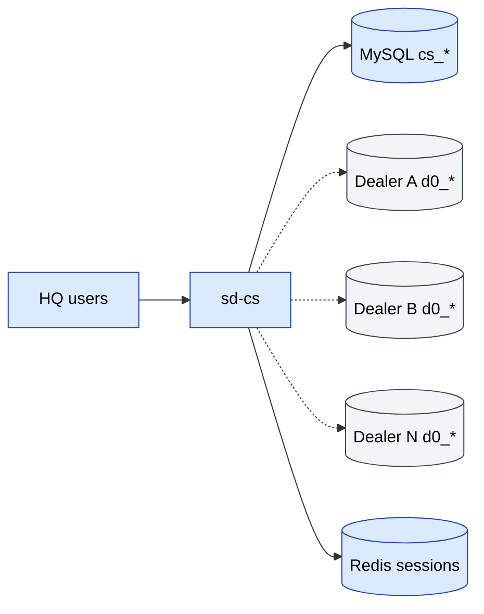

# sd-cs — Country Sales 3

**sd-cs** ("Country Sales 3") — bu ko'plab `sd-main` (diler) o'rnatilishlari
ustida turadigan **bosh ofis** ilovasi. U brend egasiga barcha dilerlari
bo'ylab yagona ko'rinish berish uchun mavjud.

## sd-cs nima qiladi

- **Konsolidatsiyalangan hisobotlar** — sotuvlar, qarz, KPI, AKB (faol
  mijozlar bazasi), bonuslar, defektlar, qaytarishlar — har bir diler
  bo'yicha.
- **Pivot analitika** — RFM, SKU, ekspeditor, tranzaksiyalar.
- **HQ ma'lumotnomasi** — master yozuvlar (mamlakat darajasidagi katalog,
  brendlar, segmentlar).
- **Asosan o'qish uchun** — operatsion yozuvlarning aksariyati `sd-main` da
  amalga oshiriladi. sd-cs diler DB laridan o'qiydi va faqat o'zinikiga yozadi.

## Tech stack

sd-main bilan bir xil oilada:

| Qatlam | Tech |
|-------|------|
| Framework | Yii 1.x |
| Til | PHP |
| DB | MySQL — **ikkita ulanish** (o'zi + diler) |
| Kesh / sessiyalar | Redis (yagona komponent, `redis_cache`) |
| Tema | `themes/classic` (Yii tema tizimi) |
| Asset menejer | symlink qilingan (`linkAssets: true`) |

## Modullar

| Modul | Maqsadi |
|--------|---------|
| `user` | Autentifikatsiya + kirish |
| `directory` | HQ darajasidagi ma'lumotnoma (kataloglar, brendlar, segmentlar) |
| `report` | 30+ konsolidatsiyalangan hisobotlar |
| `pivot` | Pivot jadvallar (RFM, SKU, sotuv tafsilotlari, tranzaksiyalar, defektlar, …) |
| `dashboard` | Yuqori darajadagi KPI lar |
| `api` | Server-to-server endpointlar (operator, billing, telegram-report va h.k.) |
| `api3` | Menejer uchun mobil endpoint(lar) |

## Repozitoriy

```
sd-cs/
├── index.php / cron.php / a.php
├── default_folders.php          one-time bootstrap
├── composer.json
├── themes/                      classic theme files
├── fonts/
├── log/
└── protected/
    ├── config/
    │   ├── main.php
    │   ├── db.php (gitignored)  TWO connections: cs_* and d0_*
    │   └── db_sample.php
    ├── components/
    ├── controllers/             SiteController, CatalogController
    ├── models/                  DbLog (extra models defined per-module)
    ├── modules/                 (api, api3, dashboard, directory, pivot, report, user)
    └── migrations/
```

## Arxitektura (diagramma)

[FigJam doskasidagi](../architecture/diagrams.md) **SalesDoctor — sd-cs
Architecture** ga qarang.



## Yana qarang

- [Multi-DB ulanish](./multi-db.md)
- [Modullar](./modules.md)
- [Hisobotlar va pivotlar](./reports-pivots.md)
- [Lokal o'rnatish](./local-setup.md)
