# sd-cs ↔ sd-main integratsiyasi

Bu platformadagi eng muhim integratsiya: har bir HQ hisoboti uning
to'g'riligiga bog'liq. Har ikki tomonga tegishdan oldin to'liq o'qing.

## Kontekst

| | sd-cs (HQ) | sd-main (Diler) |
|--|------------|------------------|
| Kim ishlatadi | Brend egasi / mamlakat sotuvlari | Har bir diler |
| DB sxema prefiksi | `cs_*` | `d0_*` |
| MySQL host | HQ MySQL klasteri | Dilerning MySQL'i |
| O'qish yo'nalishi | ko'p sd-main DB'lardan o'qiydi | yo'q |
| Yozish yo'nalishi | faqat o'z `cs_*` sxemasiga yozadi | o'z `d0_*` sxemasiga yozadi |
| Maqsad | dilerlar bo'yicha konsolidatsiya / pivot | bitta dilerning kundalik amaliyotini olib borish |

Integratsiya **sd-cs nuqtai nazaridan read-only**. sd-cs hech qachon
dilerning `d0_*` jadvallariga yozmaydi — har bir operatsion yozuv
dilerning o'z sd-main ichida amalga oshadi.

## Ulanish topologiyasi

sd-cs parallel ravishda **ikkita doimiy Yii DB komponentini** saqlaydi
(`protected/config/db.php`):

```php
return [
    'db' => [
        'connectionString' => 'mysql:host=hq-mysql;dbname=cs_country',
        'tablePrefix' => 'cs_',
    ],
    'dealer' => [
        'class' => 'CDbConnection',
        'connectionString' => 'mysql:host=dealer1-mysql;dbname=sd_dealerA',
        'tablePrefix' => 'd0_',
    ],
];
```

- **`db`** — HQ sxemasiga biriktirilgan. `getDbConnection()`'ni
  override qilmagan barcha modellar uchun default.
- **`dealer`** — **almashinadigan** ulanish. Multi-diler hisobotlar
  uchun sd-cs siklda har bir diler uchun yangi `CDbConnection`
  yaratadi va o'sha iteratsiya davomida `Yii::app()->dealer`'ni qayta
  belgilaydi.

## Modellar

`getDbConnection`'ni override qilish orqali diler DB'ga mo'ljallangan
modelni aniqlash:

```php
class DealerOrder extends CActiveRecord {
    public function getDbConnection() {
        return Yii::app()->dealer;
    }
    public function tableName() { return '{{order}}'; }   // {{order}} → d0_order
}
```

`cs_*` ga qaratilgan modellar default `db` ulanishidan foydalanadi —
override kerak emas.

**Qoida**: `db` ulanishiga bog'langan modeldan diler jadval nomlariga
hech qachon murojaat qilmang. `{{order}}` ulanish `db` bo'lsa
`cs_order`'ga, `dealer` bo'lsa `d0_order`'ga aylanadi — ana shu yo'l
bilan xavfsiz qolasiz.

## Cross-diler hisobot namunasi

Kanonik sikl:

```php
$dealers = DealerRegistry::all($filters);   // dealer-list lookup in cs_*
$rows = [];

foreach ($dealers as $dealer) {
    // Construct a fresh dealer connection per iteration.
    $cn = new CDbConnection(
        $dealer['dsn'], $dealer['user'], $dealer['pass']
    );
    $cn->tablePrefix = 'd0_';
    $cn->emulatePrepare = true;
    $cn->charset = 'utf8';
    $cn->active = true;
    Yii::app()->setComponent('dealer', $cn);

    // Run the dealer-side query — narrow projection only!
    $sub = DealerOrder::model()->findAllBySql(
        "SELECT DATE(:dateCol) AS d, SUM(SUMMA) AS total
         FROM {{order}}
         WHERE STATUS IN (:paid, :delivered)
           AND DATE BETWEEN :from AND :to
         GROUP BY d",
        [
            ':dateCol'   => 'DATE',
            ':paid'      => Order::STATUS_PAID,
            ':delivered' => Order::STATUS_DELIVERED,
            ':from'      => $from,
            ':to'        => $to,
        ]
    );
    foreach ($sub as $r) {
        $rows[] = ['dealer' => $dealer['code'], 'd' => $r->d, 'total' => $r->total];
    }

    Yii::app()->dealer->active = false; // release connection — see runbook below
}

// Aggregate in PHP — cross-DB joins are NOT allowed (different hosts).
$result = $aggregator->fold($rows);
```

### Sikl qoidalari

- **Faqat tor proyeksiyalar** — hech qachon `SELECT *` qilmang.
  Filtrlash va guruhlashni diler tarafiga ko'chiring.
- **Bir vaqtda bitta diler** — bitta PHP jarayonidan parallel
  ravishda fan-out qilmang; HQ MySQL ulanish poolini tugatib
  qo'yasiz.
- **Cheklangan** — qattiq cheklov qo'llang (masalan, har bir so'rovga
  200 diler); ko'proq bo'lsa, sahifalashtiring yoki navbatga qo'ying.
- **Agregatni keshlang** — kalit:
  `report:<name>:<filters_hash>:<dealers_hash>`.

### Performans byudjeti

| Bosqich | Maqsad |
|-------|--------|
| HQ DealerRegistry lookup | < 10 ms |
| Per-diler so'rov | < 200 ms median, < 1 s p99 |
| 50-dilerli sikl umumiy vaqti | < 30 s |
| Kesh TTL | HQ hisobotlari uchun 5–15 daq |

## Sxema mapping

### sd-cs `d0_*` dan nimalarni o'qiydi

| Domen | O'qiladigan jadvallar |
|--------|-------------|
| Sotuvlar | `d0_order`, `d0_order_product`, `d0_defect` |
| Mijozlar | `d0_client`, `d0_client_category` |
| Agentlar | `d0_agent`, `d0_visit`, `d0_kpi_*` |
| Katalog | `d0_product`, `d0_category`, `d0_price`, `d0_price_type` |
| Stok | `d0_stock`, `d0_warehouse`, `d0_inventory` |
| Auditlar | `d0_audit`, `d0_audit_result` |
| GPS | `d0_gps_track` |

### sd-cs `cs_*` ga nimalarni yozadi

| Domen | Yozilgan jadvallar |
|--------|----------------|
| HQ katalog | `cs_brand`, `cs_segment`, `cs_country_category` |
| Rejalar / maqsadlar | `cs_plan`, `cs_plan_product` |
| HQ foydalanuvchilari | `cs_user`, `cs_authassignment` |
| Pivot oraliqlari | `cs_pivot_<name>` (juda katta pivotlar uchun) |
| Audit log | `cs_dblog` |

## Sxema-drift bilan ishlash

Turli dilerlar **sd-main ning turli versiyalarini** ishlatishi mumkin.
Taktikalar:

1. **Diler bo'yicha qobiliyat bayroqlari** — registr darajasida har
   bir dilerning sxemasi qaysi xususiyatlarni qo'llab-quvvatlashini
   belgilang (masalan, `has_markirovka_v2`, `kpi_new_controller`).
2. **Bardoshli SELECT'lar** — ixtiyoriy ustunlarga tegadigan
   so'rovlarni `try/catch` ga o'rang va missing-column xatolarini
   "feature not available" deb hisoblang.
3. **Versiyalangan view'lar** — barqaror so'rovlar uchun har bir diler
   uchun SQL view yarating (onboarding paytida yaratiladi), bu
   dilerning sxemasini kanonik shaklga tarjima qiladi.
4. **Versiyalar bo'yicha agregatsiya qilmang** — versiya bo'yicha
   farq qiluvchi ustunga tayanadigan hisobotni faqat versiya kogortasi
   bo'yicha ishga tushiring.

## Xavfsizlik

- **Read-only DB foydalanuvchilari** — sd-cs diler ulanishi uchun
  ishlatadigan hisob ma'lumotlari MySQL darajasida read-only.
- **Tarmoq izolyatsiyasi** — HQ va diler DB hostlari xususiy VPC'larda
  yashaydi; yagona yo'l — HQ ilovasining diler read-only replikasiga
  egress orqali.
- **PII eksporti yo'q** — diler so'rovlari talab qilinmasa va
  tasdiqlanmasa, PII'ni `cs_*` saqlashga tortmasligi kerak.
- **Audit log** — har bir cross-DB so'rov hisobot id, diler, so'rov
  hash va satr soni bilan `cs_dblog` ga loglanadi.

## Yangi dilerni onboarding qilish

```mermaid
flowchart LR
  A(["New dealer signs contract"]) --> B["sd-billing creates Diler row"]
  B --> C["sd-billing pushes licence file"]
  C --> D["Dealer's sd-main is provisioned"]
  D --> E["Dealer DB credentials registered in HQ"]
  E --> F["DealerRegistry row inserted in cs_*"]
  F --> G["Test report against new dealer"]
  G --> H["Capability flags filled in registry"]
  H --> I(["Dealer included in default HQ reports"])

  class A action
  class B,C,D,E,F,G,H action
  class I success
  classDef action   fill:#dbeafe,stroke:#1e40af,color:#000
  classDef approval fill:#fef3c7,stroke:#92400e,color:#000
  classDef success  fill:#dcfce7,stroke:#166534,color:#000
  classDef reject   fill:#fee2e2,stroke:#991b1b,color:#000
  classDef external fill:#f3f4f6,stroke:#374151,color:#000
  classDef cron     fill:#ede9fe,stroke:#6d28d9,color:#000
```



Pre-prod ro'yxati:

- [ ] Diler tarafida read-only MySQL foydalanuvchisi yaratilgan.
- [ ] HQ dilerning MySQL hostini hal qila oladi (DNS / VPN).
- [ ] DSN + qobiliyat bayroqlari bilan DealerRegistry satri qo'shilgan.
- [ ] Smoke hisobot bir kunlik oraliq uchun toza ishlaydi.
- [ ] Diler uchun kesh kaliti bekor qilingan.

## Nosozlik rejimi va runbook

| Simptom | Ehtimoliy sabab | Harakat |
|---------|--------------|--------|
| HQ hisobotda bitta diler uchun nol | Diler DB erishilmas yoki DSN noto'g'ri | Diler registrini tekshiring, ulanishni sinab ko'ring, diler ops'ga ogohlantiring |
| Hisobot timeout | Diler DB sekin / indeks yetishmaydi | Sekin so'rov logini tekshiring, indeks qo'shing yoki oynani qisqartiring |
| sd-main yangilanishidan keyin aralashgan totallar | Sxema drift | Qobiliyat bayrog'ini qo'shing, so'rovni versiyalangan view'ga o'tkazing |
| Cross-diler total bittaga noto'g'ri | PHP agregatsiya bug'i | fold() uchun unit test qo'shing; bitta dilerli natija bilan solishtiring |
| HQ MySQL ulanishlari tugashi | Juda ko'p ochiq `dealer` ulanishlari | Har iteratsiya oxirida `Yii::app()->dealer->active = false` qo'ying |

## Diagrammalar

**sd-cs · Architecture (multi-DB)** va
**sd-cs · Cross-dealer report sequence** ga qarang —
[FigJam — sd-cs (HQ)](https://www.figma.com/board/n7CzNpfgyykdCYYJiuQG7L) da.

## Shuningdek qarang

- [sd-cs umumiy ma'lumot](./overview.md)
- [sd-cs multi-DB ulanish](./multi-db.md)
- [sd-cs hisobotlar va pivotlar](./reports-pivots.md)
- [sd-billing ↔ sd-main + sd-cs](../sd-billing/integration.md)
