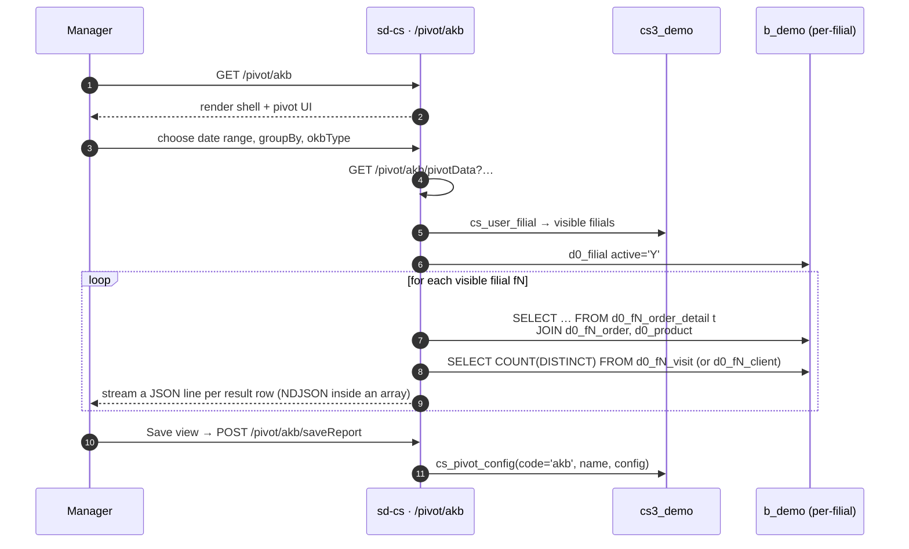

# AKB / OKB pivot

## Maqsad

*"Bu davrda haqiqatan biz bilan qancha aniq mijozlar sotib oldi
(AKB), umumiy mavjud yoki tashrif buyurganlar (OKB) ga nisbatan?"*
degan savolga javob beradi. AKB ÷ OKB sotuv kuchining qamrovi uchun
asosiy KPI; pivot jadvali menejerga mahsulot, brend, agent, mijoz
kategoriyasi, shahar yoki oy bo'yicha bu nisbatni bo'lib ko'rsatishga
imkon beradi.

- **AKB** — *Active Customer Base* — davrda kamida bitta musbat
  miqdorli buyurtma satriga ega bo'lgan aniq mijozlar.
- **OKB** — *Overall Customer Base* — yo faol mijozlar
  (`Client.ACTIVE='Y'`) yoki davrda tashrif buyurilgan aniq mijozlar,
  `okbType` bayrog'iga bog'liq.

## Kim ishlatadi

| Rol | Bu yerda nima qiladi |
|------|-------------------|
| Mamlakat / brend menejeri | Oylar bo'yicha AKB/OKB nisbatini kuzatadi; mahsulot yoki brend bo'yicha drill qiladi |
| Dala sotuvlari rahbari | Agentlar qamrovini solishtirish uchun `AGENT_ID` bo'yicha drill qiladi |
| KPI / komissiya jamoasi | Oylik KPI ko'rib chiqishlari uchun saqlangan konfiguratsiyalardan qayta foydalanadi |

Kirish `cs_access_role` dagi `pivot.akb.*` kalitlari bilan boshqariladi.
Beshta endpoint (`getData`, `reports`, `pivotData`, `saveReport`,
`deleteReport`) `AkbController::$allowedActions` da ro'yxatga olingan va
sahifa darajasidagi kirish tekshiruvini chetlab o'tadi.

## Qayerda joylashgan

| | |
|---|---|
| URL | `/pivot/akb` |
| Kontroller | [`protected/modules/pivot/controllers/AkbController.php`](https://github.com/salesdoctor/sd-cs/blob/master/protected/modules/pivot/controllers/AkbController.php) |
| Index view | `protected/modules/pivot/views/akb/index.php` |
| Ulanish | `Yii::app()->dealer` (the `b_*` warehouse) |
| Saqlangan hisobot kodi | `akb` (constant `ReportConfigCode`; satrlar `cs3_demo.cs_pivot_config` da yashaydi) |

Bu yerda o'qiladigan filial bo'yicha modellar: `Order`, `OrderDetail`,
`Client`, `Visiting`, `Visit` — `setFilial($prefix)` orqali
murojaat qilinadi.

Bu yerda o'qiladigan diler-global modellar: `Product` (`BRAND` va
`PRODUCT_CAT_ID` ustunlari uchun) va `UserProduct` (foydalanuvchi
bo'yicha mahsulot blacklist uchun).

## Ish jarayoni

1. Foydalanuvchi `/pivot/akb`'ni ochadi. Sahifa yupqa shell — pivot UI
   mijoz tarafda.
2. Foydalanuvchi sana oralig'ini, `groupBy` o'lchovini, `date` maydonini
   (DATE vs DATE_LOAD) va `okbType`'ni tanlaydi.
3. Sahifa `GET /pivot/akb/pivotData?…` ni chaqiradi.
4. Server `getOwnModels()`'ni iteratsiya qiladi va har bir filial
   uchun AKB SQL'ini (musbat miqdorli buyurtma satrlariga ega aniq
   mijozlar) va OKB SQL'ini (faol mijozlar yoki tashriflar) ishga
   tushiradi.
5. Server natijalarni massiv literali sifatida **streaming** qiladi:
   `[`'ni chop etadi, so'ng `["id","month","akb","okb","filial","prefix"]`
   header satrini, so'ng har bir natija uchun bitta vergul-prefiksli
   JSON satrini, so'ng `]`'ni. Javob `Content-Type: application/json`,
   ammo bosqichma-bosqich quriladi — mijozlar uni bitta JSON hujjat
   sifatida iste'mol qilishi kerak.
6. Pivot UI streaming satrlardan AKB / OKB / nisbat ustunlarini
   quradi.
7. Foydalanuvchi joriy pivot konfiguratsiyasini (nom + shablon JSON)
   *Save report* orqali `cs_pivot_config` ga saqlashi mumkin;
   saqlangan shablonlar `actionReports` orqali qayta yuklanadi.

## Qoidalar

- **Filial doirasi** `BaseModel::getOwnModels()` — adminlar barcha
  faol filiallarni ko'radi; boshqalar `cs_user_filial` va
  `d0_filial.active='Y'` kesishmasini ko'radi.
- **`date` whitelist'da** — `order.DATE`, `order.DATE_LOAD` dan
  biri bo'lishi kerak. Boshqa qiymat jimgina `order.DATE`'ga
  o'tkaziladi.
- **`groupBy` whitelist'da** — quyidagilardan biri:
  `t.PRODUCT`, `t.PRODUCT_CAT`, `p.BRAND`, `order.AGENT_ID`,
  `order.AGENT_ID, t.PRODUCT_CAT`,
  `order.AGENT_ID, order.CLIENT_CAT`, `order.CITY_ID`,
  `order.CLIENT_CAT`. Boshqa qiymat jimgina `t.PRODUCT`'ga
  o'tkaziladi.
- **Maxsus `groupBy='diler'`**: aniq berilganda (whitelistda emas),
  SQL filial prefiksining literali bo'yicha guruhlaydi — natijada
  har bir filial uchun bitta satr beradi.
- **Sana oralig'i inklyuziv** — tanlangan `date` ustunida
  `firstDate 00:00:00` dan `lastDate 23:59:59` gacha.
- **Foydalanuvchi-mahsulot blacklist'i qo'llaniladi**:
  `t.PRODUCT NOT IN UserProduct::findByUser(userId, 3)`.
- **Ixtiyoriy mahsulot kategoriya filtri** (`prCat`): mavjud bo'lganda,
  SQL `AND p.PRODUCT_CAT_ID IN (…)` qo'shadi, qiymatlar PHP'da
  `intval` zanjiri bilan whitelist'lanadi (har bir id bitta tirnoq
  ichida o'raladi).
- **AKB ta'rifi**: `order_detail` ga qo'shilgan `order` dan
  `COUNT(DISTINCT order.CLIENT_ID)`, bu yerda
  `order_detail.COUNT > 0`.
- **OKB ta'rifi** `okbType`'ga bog'liq:
  - `okbType=true` va agent bo'yicha guruhlangan → har agent uchun
    `COUNT(DISTINCT visiting.CLIENT_ID)` (faqat faol mijozlarga
    qo'shilgan).
  - `okbType=true` aks holda → `COUNT(client.CLIENT_ID)` bu yerda
    `client.ACTIVE='Y'` (bitta raqam, har satr uchun takrorlanadi).
  - `okbType=false` va agent bo'yicha guruhlangan → `visit` dan
    har agent va oyga `COUNT(DISTINCT visit.CLIENT_ID)`.
  - `okbType=false` aks holda → butun davr uchun
    `COUNT(DISTINCT visit.CLIENT_ID)` (bitta raqam, har satr uchun
    takrorlanadi).
- **Saqlangan hisobotlar** `cs3_demo.cs_pivot_config` da
  `code='akb'` kalit bilan saqlanadi. `template` to'liq pivot
  konfiguratsiyasi JSON sifatida.

## Ma'lumot manbalari

| Sxema | Jadval | Nima uchun o'qiladi |
|--------|-------|---------------|
| `cs3_demo` | `cs_pivot_config` | Saqlangan pivot ko'rinishlar (code = `akb`) |
| `cs3_demo` | `cs_user_filial` | Admin bo'lmaganlar uchun filial doirasi |
| `cs3_demo` | `cs_user_product` | Foydalanuvchi bo'yicha mahsulot blacklist (`UserProduct` orqali) |
| `b_demo` | `d0_filial` | Tenant registri (faol filiallar) |
| `b_demo` | `d0_product` | `BRAND` / `PRODUCT_CAT_ID` uchun qo'shilgan |
| `b_demo` | `d0_fN_order_detail` | Sotuv satrlari (AKB raqamlovchi) |
| `b_demo` | `d0_fN_order` | Buyurtma sarlavhasi (sana, agent, mijoz, shahar) |
| `b_demo` | `d0_fN_client` | `okbType=true` bo'lganda OKB uchun faol bayroq |
| `b_demo` | `d0_fN_visit`, `d0_fN_visiting` | Tashrifga asoslangan OKB |

## Gotcha'lar

- **Endpoint JSON streaming qiladi.** Javob `[` bilan ochiladi,
  satrlarni vergul-prefiks bilan chop etadi va `]` bilan yopadi.
  Agar filial sikli stream o'rtasida buzilsa, mijoz noto'g'ri JSON
  oladi. Web log'ni kuzating.
- **Whitelist majburlash jimgina.** `groupBy` dagi xato xato
  qaytarmaydi — u shunchaki `t.PRODUCT`'ga tushadi. Yangi xodimlar
  tez-tez nima uchun ularning `BRAND` guruhi mahsulotlarga o'xshashini
  o'ylab vaqt yo'qotadilar; ular `p.BRAND` o'rniga `BRAND` deb
  yozganlar.
- **`okbType` bu *string* `'true'`** `$_GET` da, boolean emas.
  Kontroller string-tenglikni solishtiradi — `okbType=1` ishlamaydi.
- **AKB ÷ OKB UI'da hisoblanadi**, serverda emas. Agar UI bema'ni
  nisbatlarni ko'rsatsa, server to'g'ri satrlarni noto'g'ri tartibda
  qaytargan (filial / prefiks nomuvofiqligi).
- **`actionReports` har bir chaqiruvda butun saqlangan-konfiguratsiya
  payload'ni qaytaradi**. Sahifalash yo'q — bugun yaxshi (~o'nlab
  shablonlar) ammo bilib qo'yish foydali.

## Shuningdek qarang

- [sd-cs arxitekturasi](../architecture.md) — ikki-DB modeli va
  `setFilial()` mexanizmi.
- *report · OKB* (katalog stub, hali yozilmagan —
  `report/OkbController`) — OKB ning bir ekranli hisobot versiyasi.
- [Uslub qo'llanmasi](./style.md) — bu sahifa qanday yozilgan.
