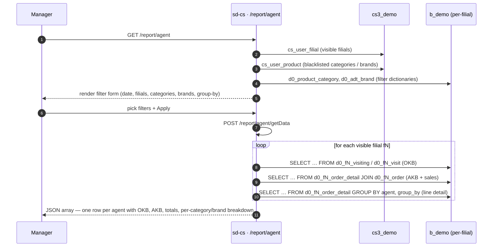

# Agent hisoboti

## Maqsad

*"Mening barcha filiallarimda har bir sotuv agenti qanday ishladi —
ular qancha mijozni tashrif buyurdi (OKB), qancha xarid qiluvchi
mijozga o'tkazdi (AKB) va mahsulot kategoriyasi yoki brendi bo'yicha
qancha hajm / qiymat / birlik sotdi?"* degan savolga javob beradi.
Hisobot HQ uchun individual agent samaradorligini ularning mijoz
qamrovi bazasiga nisbatan baholash bo'yicha asosiy vositadir.

## Kim ishlatadi

| Rol | Bu yerda nima qiladi |
|------|-------------------|
| Mamlakat / brend menejeri | Filiallar bo'yicha agent AKB vs OKB qamrovi koeffitsientini solishtiradi |
| Hududiy supervayzer | Past samaradorlikdagi agentlarni aniqlash uchun filial bo'yicha drill qiladi |
| Sotuv-ops tahlilchi | *List* tab orqali agent spravochnigini ko'radi |

Kirish `cs_access_role` dagi `report.agent.index` bilan boshqariladi.
Uchta endpoint (`getData`, `getAgents`, `list`)
`AgentController::$allowedActions` da ro'yxatga olingan va sahifa
darajasidagi kirish tekshiruvini chetlab o'tadi; sahifaning o'zi
(`actionIndex`) RBAC bilan boshqariladi.

## Qayerda joylashgan

| | |
|---|---|
| URL | `/report/agent` (asosiy grid), `/report/agent/list` (agent spravochnigi) |
| Kontroller | [`protected/modules/report/controllers/AgentController.php`](https://github.com/salesdoctor/sd-cs/blob/master/protected/modules/report/controllers/AgentController.php) |
| Index view | `protected/modules/report/views/agent/index.php` |
| List view | `protected/modules/report/views/agent/list.php` |
| Ulanish | `Yii::app()->dealer` (the `b_*` warehouse) |
| Saqlangan hisobot kodi | *ishlatilmaydi* |

Bu yerda o'qiladigan filial bo'yicha modellar: `Order`, `OrderDetail`,
`Agent`, `Client`, `Visit`, `Visiting` — barchasi `setFilial($prefix)`
orqali murojaat qilinadi, `d0_fN_*` jadvallariga aylanadi.

Bu yerda o'qiladigan diler-global modellar: `Product` (`d0_product`),
`ProductCategory` (`d0_product_category`), `AdtBrand` (`d0_adt_brand`).

Bu yerda o'qiladigan boshqaruv-tekisligi modellari: `UserFilial`
(`cs_user_filial`), `UserProduct` (`cs_user_product`).

## Ish jarayoni

1. Foydalanuvchi `/report/agent`'ni ochadi.
2. Sahifa filtr lug'atlarini yuklaydi: mahsulot kategoriyalari va
   brendlar (ikkalasi ham foydalanuvchining `UserProduct` cheklovlari
   bilan filtrlangan), va ko'rinadigan filiallar ro'yxati.
3. Foydalanuvchi sana oralig'ini, ixtiyoriy filial qism to'plamini,
   guruhlash (kategoriya yoki brend) va OKB rejimini tanlaydi va
   *Apply* bosadi — sahifa `/report/agent/getData` ga POST qiladi.
4. Server har bir ko'rinadigan filialni iteratsiya qiladi. Har bir
   filial uchun u `Yii::app()->dealer` da uchta SQL so'rovni ishga
   tushiradi: OKB so'rovi (`okb_type` ga bog'liq holda visit yoki
   visiting), AKB so'rovi (buyurtma satrlaridan aniq xaridor mijozlar)
   va satr-tafsilot so'rovi (hajm, qiymat, birliklar, tanlangan
   o'lchov bo'yicha guruhlangan).
5. Server PHP'da uchta natija to'plamini birlashtiradi va
   `pre_okb` (har doim `100%`) va `pre_akb` (AKB ÷ OKB × 100) ni
   hisoblaydi. OKB'da paydo bo'lgan, ammo sotuvlari yo'q agentlar
   nol sotuv ustunlari bilan kiritiladi.
6. Server berilgan agent sotmagan har bir kategoriya/brend uchun
   nol qiymatli yozuvlarni to'ldiradi, barcha satrlarda bir xil
   ustun sonini ta'minlaydi.
7. Server to'liq `data` massivni JSON sifatida qaytaradi.

*List* tab (`/report/agent/list`) yengil spravochnik:
u `actionGetAgents`'ni chaqiradi, u har bir ko'rinadigan filial uchun
`d0_fN_agent`'ni so'roviga oladi va agent turi, holati va filial
biriktirilishi bilan tekis jadval qaytaradi.

## Qoidalar

- **Ko'rinadigan filiallar** `BaseModel::getOwnModels()` dan keladi.
  Admin foydalanuvchilari barcha faol filiallarni ko'radi; admin
  bo'lmaganlar `cs_user_filial` va `d0_filial.active='Y'` kesishmasini
  ko'radi.
- **Filial filtri**: agar POST tanasida `filial_id` bo'sh bo'lmasa,
  faqat `id` massivda bo'lgan filiallar so'rovlanadi; boshqalari
  o'tkazib yuboriladi.
- **Sana filtri `order.DATE_LOAD` ga qo'llaniladi** (yuklash sanasi,
  buyurtma sanasi emas). Predikat `BETWEEN date[0] 00:00:00 AND
  date[1] 23:59:59`.
- **Buyurtma holati filtri** `STATUS IN (2, 3)` ga qattiq kodlangan —
  faqat tasdiqlangan va yetkazib berilgan buyurtmalar.
- **Nol miqdorli satrlar chiqarib tashlanadi** AKB va satr-tafsilot
  so'rovlarining ikkalasida ham `t.COUNT > 0` bilan.
- **OKB rejimi** (`okb_type` parametri):
  - `1` → `d0_fN_visiting` dan aniq mijozlarni hisoblaydi, bu yerda
    `client.CREATE_AT ≤ date[1]` va `client.ACTIVE='Y'` (kumulyativ
    faol-mijoz bazasi).
  - boshqa qiymat → tanlangan sana oralig'ida `d0_fN_visit` dan
    aniq mijozlarni hisoblaydi (davrdagi tashriflar bazasi).
- **Guruhlash o'lchovi** (`group_by` parametri):
  - `1` → satrlar `product.PRODUCT_CAT_ID` (kategoriya) bo'yicha
    guruhlanadi; pastki bo'linish kaliti `category_id`.
  - boshqa qiymat → `product.BRAND` bo'yicha guruhlanadi; pastki
    bo'linish kaliti `brand_id`.
- **UserProduct blacklist'i** (turi `3` — mahsulot ID lar oddiy
  massivi) `CDbCriteria::addNotInCondition('t.PRODUCT', $ups)` orqali
  satr-tafsilot va AKB so'rovlarida qo'llaniladi. UI'da ko'rsatilgan
  filtr lug'ati ham filtrlar muvofiq qolishi uchun alohida
  `getUserRestrictions()` chaqiruvlari orqali blacklist'dagi
  kategoriyalar va brendlarni chiqarib tashlaydi.
- **Agent turi yorlig'i** `actionGetAgents` da `AGENT_TYPES =
  ['Торговый представитель', 'Van-selling', 'Продавец']` doimiysidan
  `VAN_SELLING` butun (0, 1, 2) bo'yicha hal qilinadi.
- **Sotuvlari yo'q, lekin OKB'siga ega agentlar** javobga barcha
  sonli maydonlari `0` ga o'rnatilgan va `pre_akb = 0` bilan kiritiladi.
- **Sotuvi bor, lekin OKB'si yo'q agentlar** jimgina chiqarib
  tashlanadi (PHP merge sharti `$all_okb` va `$all_akb` ikkalasida
  ham bo'sh bo'lmagan yozuvni talab qiladi).

## Ma'lumot manbalari

| Sxema | Jadval | Nima uchun o'qiladi |
|--------|-------|---------------|
| `cs3_demo` | `cs_user_filial` | Admin bo'lmaganlar uchun filial-ko'rinish ACL |
| `cs3_demo` | `cs_user_product` | Foydalanuvchi bo'yicha mahsulot/kategoriya/brend blacklist |
| `b_demo` | `d0_filial` | Tenant registri — prefiks va `active` beradi |
| `b_demo` | `d0_product` | Mahsulot master (buyurtma tafsilotiga qo'shilishlar) |
| `b_demo` | `d0_product_category` | Kategoriya filtr lug'ati + guruhlash yorlig'i |
| `b_demo` | `d0_adt_brand` | Brend filtr lug'ati + guruhlash yorlig'i |
| `b_demo` | `d0_fN_order` | Buyurtma sarlavhasi — `STATUS`, `DATE_LOAD`, `AGENT_ID`, `CLIENT_ID` |
| `b_demo` | `d0_fN_order_detail` | Sotuv satrlari — `COUNT`, `VOLUME`, `SUMMA` |
| `b_demo` | `d0_fN_agent` | Agent master — `FIO`, `XML_ID`, `TEL`, `VAN_SELLING`, `ACTIVE` |
| `b_demo` | `d0_fN_client` | Mijoz yozuvi — `okb_type=1` da `ACTIVE='Y'` filtr uchun ishlatiladi |
| `b_demo` | `d0_fN_visit` | Tashrif logi — `okb_type ≠ 1` bo'lganda OKB manbai |
| `b_demo` | `d0_fN_visiting` | Visiting log — `okb_type = 1` bo'lganda OKB manbai |

Ustun ma'lumotnomasi uchun [data schemes](../data-schemes.md) ga qarang.

## Gotcha'lar

- **Sotuvi bor, lekin OKB'si yo'q agentlar jimgina tashlanadi.**
  Merge sikli (`if ($all_okb[$model['agent_id']] && $all_akb[$model['agent_id']])`)
  ikkala xaritada ham truthy yozuvni talab qiladi. Sotuv qilgan, lekin
  tanlangan davrda nol tashrif yozuvlariga ega bo'lgan agent shunchaki
  griddan g'oyib bo'ladi. Foydalanuvchi "agent X sotgan, lekin
  ko'rsatilmaydi" desa, o'sha agent va davr uchun visit / visiting
  jadvalini tekshiring.
- **`pre_okb` har doim `'100%'`** (qattiq kodlangan string). U tashrif
  buyurilgan mijozlarning umumiy mijoz portfeliga nisbatini aks
  ettirmaydi; u joy egallovchi ustun. Haqiqiy qamrov hisoblari uchun
  unga tayanmang.
- **Filial bo'yicha uchta SQL aylanish.** 20 filiali bor admin uchun
  bu har bir `getData` chaqiruvi uchun 60 so'rov. Tor sana oralig'i
  va filial-id filtri yukni sezilarli darajada kamaytiradi.
- **`okb_type=1` sana oralig'ining boshlanishini e'tiborsiz qoldiradi.**
  Visiting so'rovi `CREATE_AT BETWEEN 0000-00-00 AND date[1]`'ni
  ishlatadi, shuning uchun u har doim vaqt boshidan tugash sanasigacha
  to'planadi. Bir xil davrda `okb_type=0` natijalari bilan solishtirish
  turli OKB raqamlarini ko'rsatadi — bu ataylab qilingan, lekin
  intuitiv emas.
- **`actionGetAgents` da filial filtri yo'q.** U asosiy tabdan har
  qanday filtr holatidan qat'i nazar har bir ko'rinadigan filialni
  so'rovga oladi. To'liq agent ro'yxati har doim qaytariladi.

## Shuningdek qarang

- [sd-cs arxitekturasi](../architecture.md) — ikki-DB modeli va
  `setFilial()` mexanizmi.
- [report · Sale](./report-sale.md) — bir xil `getOwnModels()` /
  `UserProduct` qamrov shabloniga ega mahsulot bo'yicha sotuv hisoboti.
- [report · Agent Visit](./report-agent-visit.md) — sotuv natijalari
  emas, balki tashrif chastotasiga e'tibor qaratuvchi hamroh hisobot
  (`AgentVisitController`).
- [`protected/modules/report/controllers/AgentController.php`](https://github.com/salesdoctor/sd-cs/blob/master/protected/modules/report/controllers/AgentController.php) — manba fayl.
