# RAG / vektor DB indekslash

sd-docs sayti jamoaning **retrieval-augmented generation (RAG) /
vektor ma'lumotlar bazasi** ga yetkaziladi, shunda har bir jamoa
a'zosi "to'lov tasdig'i qanday ishlaydi?" yoki "yangi diler
qo'shganimizda nima o'zgaradi?" deb so'rashi va to'g'ri parchani
qaytarib olishi mumkin. Ushbu sahifa o'zlashtirishni toza saqlaydigan
konventsiyalarni hujjatlashtiradi.

## Talab qilinadigan frontmatter (har bir sahifa)

Har bir sahifa uni qidirish uchun teglovchi frontmatter bilan
boshlanishi SHART:

```yaml
---
sidebar_position: <N>
title: <Human title>
audience: <comma-separated roles>     # e.g. "Backend engineers, QA, PM"
summary: <1–2 sentence chunk summary> # what the page covers, in plain language
topics: [<tag>, <tag>, …]             # short keywords for the embedding index
---
```

To'rt maxsus maydon (`audience`, `summary`, `topics`) plus `title` —
RAG tizimi ushbu sahifadan ajratilgan har bir parchaga biriktiradigan
**metadata**. Ular har bir auditoriya bo'yicha filtrlashni ("menga
faqat RBAC haqidagi PM sahifalarini ko'rsat") imkon yaratadi va eslab
qolishni yaxshilaydi.

## O'zini o'zi tutish qoidasi

Izolyatsiyada o'qilgan parcha mantiqiy bo'lishi kerak. Quyidagilardan
qoching:

- ❌ "yuqoriga qarang" / "yuqorida aytib o'tilgani kabi" — haqiqiy
  tushunchani nomlang
- ❌ Uni nomlamasdan "ushbu modul" — buning o'rniga `sd-main · orders`
  deyish
- ❌ Bo'lim boshida olmoshlar ("U kunlik ishlaydi…") — ot bilan
  almashtiring ("Settlement command kunlik ishlaydi…")
- ❌ Jadvallarga indeks raqami bo'yicha murojaat qilish ("quyidagi
  jadval") — unga sarlavha bering

Parcha quyidagilarni eslatishi kerak:

- Bo'lim boshiga bir marta **loyiha** (`sd-main` / `sd-cs` /
  `sd-billing`).
- Oddiy so'zlar bilan **modul / soha**.
- Paydo bo'ladigan har qanday **rol nomlari** yoki **status
  qiymatlari** (o'quvchi rollar ro'yxatini bilishini taxmin qilmang).

## Parchalash strategiyasi

Quvur hozirda **bo'lim darajasidagi parchalash** dan foydalanadi:

- Har bir `H2` sarlavha boshiga bitta parcha.
- 1500 belgidan past parchalar keyingisi bilan birlashtiriladi.
- 4000 belgidan ortiq parchalar keyingi paragraf bo'shlig'ida
  ajratiladi.
- Har bir parcha sahifaning `audience`, `topics` va `summary` ni
  meros qiladi.

Agar juda uzun bo'limlarni yozsangiz, **birinchi paragraf** ni qisqa va
o'zini o'zi tutuvchi qiling — o'sha paragraf eng ko'p qaytarib olinadigan
qismdir.

## Parchalardagi jadvallar

Jadvallar parchalashdan yaxshiroq omon qoladi:

- Sarlavha qatori bor.
- Har bir qator to'liq fakt (oldingisiga bog'liq qator yo'q).
- Hujayralar to'liq jumlalardan foydalanadi, "X ga qarang" emas.

Keng jadvallardan qoching (6 dan ortiq ustun) — ular embedding modeli
tomonidan kesiladi.

## Kod bloklari

Har bir kod blokini til tegi bilan belgilang (`php`, `bash`, `mermaid`,
`sql`, `yaml`). RAG quvuri til-tegli bloklarni alohida indekslaydi va
ularni IDE assistantida ko'rsatadi.

## Mermaid diagrammalari

Inline Mermaid o'zlashtirish orqali matn sifatida saqlanadi. Vektor DB
ularni kod bloklari sifatida ko'radi. Mermaid blokini har doim yuqorida
1–2 jumlali oddiy til xulosasi bilan juftlashtiring — foydalanuvchi
diagrammani so'zlar bilan tasvirlaganda o'sha xulosa qaytarib olinadi.

## Sahifalararo havolalar

`/docs/` bilan boshlanadigan mutlaq ichki yo'llardan foydalaning:

```md
✅  See [Order lifecycle](/docs/architecture/diagrams)
❌  See "Diagrams" (above)
```

RAG quvuri ichki yo'llarni qidiruv-natija UI ga qayta yozadi; bu faqat
yo'l mutlaq bo'lganda ishlaydi.

## O'zlashtirish quvuri (yuqori darajada)

```mermaid
flowchart LR
  REPO(["sd-docs git repo"]) --> BUILD["Docusaurus build"]
  BUILD --> RAW["Markdown + frontmatter"]
  RAW --> CHUNK["Section chunker"]
  CHUNK --> EMB[("Embedding model")]
  EMB --> VDB[("Vector DB")]
  VDB --> CHAT(["Team chat / IDE assistant"])

  classDef action   fill:#dbeafe,stroke:#1e40af,color:#000
  classDef approval fill:#fef3c7,stroke:#92400e,color:#000
  classDef success  fill:#dcfce7,stroke:#166534,color:#000
  classDef reject   fill:#fee2e2,stroke:#991b1b,color:#000
  classDef external fill:#f3f4f6,stroke:#374151,color:#000
  classDef cron     fill:#ede9fe,stroke:#6d28d9,color:#000

  class REPO,BUILD,RAW,CHUNK action
  class EMB,VDB external
  class CHAT success
```



Qayta indekslash tezligi: **`main` ga har bir merge da** (CI hook).

## Qaytarib olishga do'st tekshirish ro'yxati

Yangi hujjat sahifasini merge qilishdan oldin:

- [ ] Frontmatter da `audience`, `summary`, `topics` bor.
- [ ] H1 dan keyingi birinchi paragraf 1-jumlali lift maydoni.
- [ ] Har bir H2 bo'limi to'liq fikrli paragraf bilan boshlanadi.
- [ ] "yuqoriga qarang" / "aytib o'tilgan" / "quyida" yo'q.
- [ ] Jadvallar 6 dan kam ustunli.
- [ ] Kod bloklarida til tegi bor.
- [ ] Mermaid diagrammalari nasr xulosalari bilan juftlashtirilgan.
- [ ] Ichki havolalar mutlaq (`/docs/...`).

## Bu yangi dasturchilar uchun nima uchun muhim

Yangi dasturchilarni onboarding qilish ([Onboarding](./onboarding.md)
ga qarang) RAG bilim bazasiga juda ko'p tayanadi. Yangi xodim chat
assistantiga "dilerlar bo'ylab hisobotni qanday ishga tushiraman" deb
yozadi va keltirma bilan tegishli parchani oladi. Bu faqat manba
sahifasi parchaga do'st bo'lganda ishlaydi.
