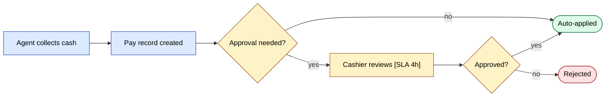
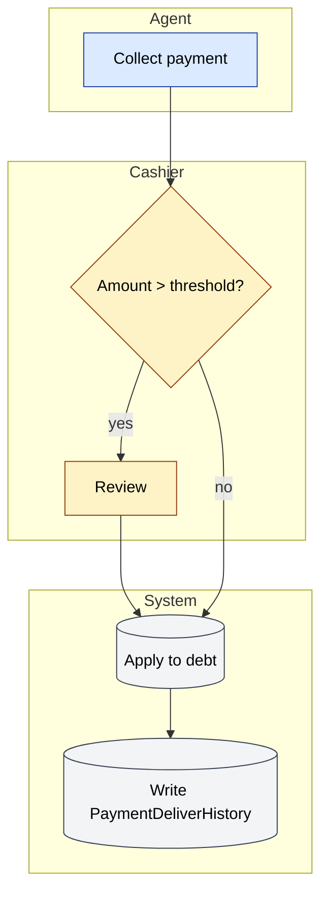

# Workflow dizayn standartlari

Har bir SalesDoctor workflow i — buyurtma tasdig'i, to'lov tasdig'i,
mijoz tasdig'i, audit, settlement, integratsiya — bir xil dizayn
tartib-intizomini kuzatadi. Ushbu sahifa o'sha intizomni qamrab oladi
va bizning har bir mavjud oqimimiz bugun qayerda turganini ko'rsatadi.

## Manba — "yaxshi" qanday ko'rinadi

Cflow ning *Beginner's Guide to Workflow Design* va ularning AI bilan
kuchaytirilgan workflow avtomatlashtirish bo'yicha 2026 trend
hisobotidan moslashtirilgan:

| # | Tamoyil | Bu nimani anglatadi |
|---|---------|---------------------|
| 1 | **Avval qo'lda jarayonni hujjatlashtiring** | Avtomatlashtirishdan oldin qo'lda qadamlarni o'tkazing. Agar uni chiza olmasangiz, avtomatlashtira olmaysiz. |
| 2 | **Modulli dizayn** | Butun oqimni qayta yozmasdan qadamlarni qo'shish / olib tashlash / qayta tartiblash mumkin bo'ladigan tarzda dizayn qiling. |
| 3 | **Vizual taksonomiya** | Maxsus qadamlarni — tasdiqlar, tarmoqlar, integratsiyalar, eskalatsiyalarni belgilash uchun shakl va rangdan foydalaning. |
| 4 | **Aniq rollar** | Har bir vazifa o'z egasi rolini nomlaydi (`agent`, `manager`, …). "Kimdir buni qiladi" yo'q. |
| 5 | **Aniq bosqichlar** | Bosqichlar inson uchun o'qiladigan nomlarga ega (masalan, *So'rovchi* → *Menejer Tasdig'i* → *Yakuniy Tasdiq*). |
| 6 | **Parallel bosqichlar** | Ikki tasdiqlovchi bir vaqtda ko'rib chiqishi mumkin bo'lganda, uni sun'iy ravishda ketma-ket emas, parallel sifatida modellashtiring. |
| 7 | **Chegaralar va qoidalar** | Tasdiqlash triggerlari **o'lchanadigan** mezonlarda ishga tushadi (`> credit_limit`, `> discount_cap`, `< stock_available`). |
| 8 | **Eskalatsiya qoidalari** | Har bir qadam uchun SLA aniqlang. SLA dan keyin yuqoridagi rolga eskalatsiya qiling. |
| 9 | **Istisnolarni boshqarish** | Har bir qadamda kamida bitta aniq baxtsiz yo'l tarmog'i bor (rad etish, kechiktirish, qayta urinish). |
| 10 | **Boshqaruv va audit** | Har bir o'tish audit qatorini yozadi (kim, nima, qachon, oldin/keyin). |
| 11 | **Xavfga sifatlangan nazoratlar** | Yuqori xavfli o'tishlarga (bekor qilish, qaytarish, ommaviy yangilash) kuchliroq nazoratlar (4-ko'z, MFA, audit) kerak. |
| 12 | **ROI isbotlanadigan joydan boshlang** | Avval yuqori hajmli, qoidalarga boy, o'lchanadigan qadamlarni avtomatlashtiring. Bir martalik narsalarni avtomatlashtirmang. |

## Bizning standart workflow spetsifikatsiyamiz

Har qanday yangi workflow uchun ushbu shablonni ishlating. PRD da yangi
oqim kiritadigan xususiyatni taklif qilganingizda, buni to'ldiring va
PRD dan unga havola qiling.

```md
# Workflow: <name>

## Owner
Role(s) accountable for the flow's correctness and SLA.

## Stages
| # | Stage | Owner role | SLA | Action |

## Triggers
What event(s) start the workflow.

## Approval rules
| Criterion | Threshold | Approver |

## Escalation rules
| If stuck for | Escalate to |

## Exception paths
- Reject
- Defer / send back
- Cancel
- Manual override (with audit)

## Audit log
- Table: `<table>`
- Columns: actor, before_status, after_status, reason, timestamp

## Notifications
| Event | Channel | Recipients |

## Metrics
- Lead time
- Cycle time per stage
- Reject rate
- Escalation rate
- SLA-miss rate
```

## Vizual taksonomiya (FigJam / Mermaid rang kodi)

Har bir diagrammada izchil qo'llang. **Tugun**ni rangli qiling, qirrani
emas.

| Rang | Ma'no |
|------|-------|
| **Ko'k** | Standart qadam (harakat) |
| **Sariq** | Tasdiqlash talab qiladi |
| **Yashil** | Muvaffaqiyat / yakuniy yopilgan holat |
| **Qizil** | Rad etish / bekor qilish / muvaffaqiyatsiz yakuniy holat |
| **Kulrang** | Tashqi tizim (1C, Didox, gateway, FCM) |
| **Binafsha** | Vaqtga asoslangan qadam (cron, rejalashtirilgan ish) |
| **Nuqtali chegara** | Parallel tarmoq (ikki tasdiqlovchi bir vaqtda ishlashi mumkin) |

## Mavjud SalesDoctor workflow lari auditi

Mavjud oqimlar 12 tamoyilga qarshi audit qilingan. ✅ = o'tadi,
⚠️ = qisman, ❌ = bo'shliq.

### sd-main · Buyurtma hayotiy davri

| Tamoyil | Status | Izohlar |
|---------|--------|---------|
| 1 Avval qo'lda | ✅ | Legacy qog'oz waybill oqimi asosida modellashtirilgan |
| 2 Modulli | ✅ | Har bir STATUS alohida o'tish; yangilarini qo'shish mumkin |
| 3 Vizual taksonomiya | ⚠️ | FigJam diagrammalari hali yuqoridagi rang kodidan foydalanmaydi |
| 4 Aniq rollar | ✅ | Har bir harakat egasiga ega (`agent` yaratadi, `kassir` tasdiqlaydi va h.k.) |
| 5 Aniq bosqichlar | ✅ | `Draft → New → Reserved → Loaded → Delivered → Paid → Closed` |
| 6 Parallel bosqichlar | ❌ | Hammasi ketma-ket — chegirma tasdig'i va kredit tasdig'i parallel bo'lishi mumkin edi |
| 7 Chegaralar | ⚠️ | Kredit chegarasi + chegirma cheklovi tekshiriladi, lekin kodda kodlangan, declarativ konfigda emas |
| 8 Eskalatsiya | ❌ | SLA taymerlari yo'q; buyurtmalar `New` da abadiy o'tirishi mumkin |
| 9 Istisno yo'llari | ✅ | `Cancelled` / `Defect` / `Returned` |
| 10 Audit | ✅ | `OrderStatusHistory` |
| 11 Xavfga sifatlangan | ⚠️ | Bekor qilish admin rolini talab qiladi, lekin MFA yo'q |
| 12 ROI | ✅ | Yuqori hajm, yaxshi aniqlangan |

**Harakat elementlari**: ham chegirma, ham kredit tasdig'iga muhtoj
buyurtmalar uchun parallel tasdiqlash tarmog'i; qotib qolgan
buyurtmalarni `Manager Review` ga ko'chiruvchi SLA taymerlar.

### sd-main · To'lov yig'ish va tasdiqlash

| Tamoyil | Status | Izohlar |
|---------|--------|---------|
| 1 Avval qo'lda | ✅ | Kassir-stoli amaliyotining to'g'ridan-to'g'ri xaritasi |
| 2 Modulli | ✅ | Naqd / naqdsiz / onlayn ajratish toza |
| 3 Vizual taksonomiya | ⚠️ | – |
| 4 Aniq rollar | ✅ | Agent yig'adi, Kassir tasdiqlaydi |
| 5 Aniq bosqichlar | ✅ | `Pending → Approved → Applied` (yoki `Rejected`) |
| 6 Parallel bosqichlar | n/a | Bitta tasdiqlovchi — mos |
| 7 Chegaralar | ❌ | Barcha to'lovlar tasdiqlash talab qiladi; N dan past avtomatik tasdiqlash yo'q |
| 8 Eskalatsiya | ❌ | To'lov bir necha kun kutishi mumkin |
| 9 Istisno yo'llari | ✅ | Rad etish |
| 10 Audit | ⚠️ | `PaymentDeliver` da tasdiqlovchi bor, lekin sabab maydoni yo'q |
| 11 Xavfga sifatlangan | ❌ | ₽1 va ₽1,000,000 uchun bir xil nazoratlar |
| 12 ROI | ✅ | Yuqori hajm |

**Harakat elementlari**: avtomatik tasdiqlash chegarasini joriy qilish
(masalan, to'liq mosligi bilan o'rtacha bitta-buyurtma summasidan past
to'lovlar); SLA → 4 soatdan keyin menejerga eskalatsiya; rad etish
sababini olish.

### sd-main · Mijoz tasdig'i

| Tamoyil | Status | Izohlar |
|---------|--------|---------|
| 1 Avval qo'lda | ✅ | – |
| 2 Modulli | ✅ | – |
| 3 Vizual taksonomiya | ⚠️ | – |
| 4 Aniq rollar | ✅ | Agent → Menejer |
| 5 Aniq bosqichlar | ✅ | `Pending → Approved` (yoki `Rejected`) |
| 8 Eskalatsiya | ❌ | SLA yo'q |
| 9 Istisno yo'llari | ⚠️ | Rad etish mavjud; "tuzatish uchun qaytarish" yo'q |
| 10 Audit | ⚠️ | Faqat `ClientPending.CREATE_BY` — to'liq tarix yo'q |

**Harakat elementlari**: menejerlar rad etmasdan tuzatish so'rashi
uchun *Qaytarib yuborish* holatini qo'shish; SLA + eslatma qo'shish.

### sd-main · Audit jo'natish

| Tamoyil | Status | Izohlar |
|---------|--------|---------|
| 5 Aniq bosqichlar | ⚠️ | Rasmiy `Pending review` bosqichi yo'q — jo'natilgan = yakuniy |
| 7 Chegaralar | ❌ | "60% facing dan past → qayta-audit uchun belgilash" qoidasi yo'q |
| 8 Eskalatsiya | ❌ | – |

**Harakat elementlari**: *Pending Supervisor Review* bosqichini
qo'shish; muvofiqlik balliga asoslangan qoidaga asoslangan belgilash.

### sd-billing · Obuna hayotiy davri

| Tamoyil | Status | Izohlar |
|---------|--------|---------|
| 1 Avval qo'lda | ✅ | – |
| 7 Chegaralar | ✅ | `MIN_SUMMA`, `MIN_LICENSE`, valyuta mosligi |
| 8 Eskalatsiya | ⚠️ | Eslatmalar faqat -7/-3/-1 kunlarda ishga tushadi |
| 10 Audit | ⚠️ | Faqat litsenziya pushi uchun `IntegrationLog` |
| 11 Xavfga sifatlangan | ⚠️ | Qo'lda litsenziya o'zgartirish mavjud, lekin audit qatori yo'q |

**Harakat elementlari**: har bir qo'lda litsenziya o'zgarishini maxsus
audit jadvalida olish; 0-kun (muddati tugash kuni) eslatmasini
qo'shish; N kundan ortiq bepul davr uzaytmalari uchun 4-ko'z talabini
qo'shish.

### sd-billing · To'lov gateway round-trip (Click / Payme / Paynet)

| Tamoyil | Status | Izohlar |
|---------|--------|---------|
| 1 Avval qo'lda | n/a | Gateway-aniqlangan |
| 7 Chegaralar | ✅ | Imzo tekshirish |
| 9 Istisno yo'llari | ✅ | Idempotent; har bir holat bo'yicha xatolik javoblari |
| 10 Audit | ✅ | `log/` da kun va harakat bo'yicha JSON (sanitatsiyalang!) |
| 11 Xavfga sifatlangan | ⚠️ | Barcha gateway lar teng deb qaraladi — Paynet (SOAP) eng yuqori xavfli |
| 12 ROI | ✅ | Eng yuqori hajm |

**Harakat elementlari**: Paynet imzo tekshirishni mahkamlash + gateway
boshiga circuit breaker qo'shish.

### sd-cs · Dilerlar bo'ylab hisobot

| Tamoyil | Status | Izohlar |
|---------|--------|---------|
| 5 Aniq bosqichlar | ✅ | Dilerlarni ro'yxatlash → ulanishni almashtirish → so'rov → aggregat → kesh |
| 9 Istisno yo'llari | ⚠️ | Bir dilerning muvaffaqiyatsizligi hozirda butun hisobotni buzadi |
| 10 Audit | ❌ | Qaysi dilerlar qaysi parametrlar bilan so'rov qilinganligi loglari yo'q |
| 12 ROI | ✅ | – |

**Harakat elementlari**: bir diler o'chganda yumshoq pasayish (o'tkazib
yuborish + belgilash); hisobot ishi boshiga audit qatori; kesh kaliti
diler ro'yxati va filtr xashini hujjatlashtiradi.

## Yangi workflow ni taklif qilish jarayoni

1. **Workflow spetsifikatsiyasi** shablonini to'ldiring (yuqorida).
2. Uni **12 tamoyildan** o'tkazing — har bir ❌ yoki ⚠️ ni belgilang.
3. **Mermaid** da rang taksonomiyasi bilan chizing.
4. SLA + eskalatsiya jadvalini qo'shing.
5. Sizga kerak bo'ladigan **audit ustunlarni** sanab o'ting.
6. **Ko'rib chiqish tasdiqlarini oling — har biridan bittadan:**
   - **Mahsulot** — PRD ga sharh qiladi (loyiha PM ini jamoa
     katalogida toping; ishonchsiz bo'lsangiz `#sd-product` ga post
     qiling).
   - **Engineering** — PR ga sharh qiladi (GitHub `CODEOWNERS` orqali
     avtomatik ping qilinadi; bo'lmasa, [Onboarding · Kimdan so'rash
     kerak](./onboarding.md#kimdan-sorash-kerak) da sanab o'tilgan
     loyiha tech lead ni eslang).
   - **QA** — PR ga yoki test-rejasi ticketiga sharh qiladi (sohani
     kim egallashini bilmasangiz `#qa` ga post qiling).
   Uchta tasdiq parallel bo'lishi mumkin; ular merge dan oldin barchasi
   talab qilinadi. PR ga 👍 reaktsiya + ko'rib chiqish tabidagi yozma
   tasdiq tasdiq deb hisoblanadi.
7. Jo'natilgandan so'ng, **metrikalarni** asboblang va workflow
   sog'ligi kanalida (`#sd-workflows`) oylik ko'rib chiqing.

## Mermaid styling cookbook

Yuqoridagi vizual taksonomiyani Mermaid diagrammalariga qo'llash uchun
nusxa ko'chiriladigan ma'lumotnoma. Faqat workflow diagrammalari —
`erDiagram`, `classDiagram` yoki `sequenceDiagram` bloklariga
qo'llanmang.

### Shakl lug'ati

Tugun roli boshiga bitta shakl. Tugun nima *qiladi*ga qarab tanlang,
qanday ko'rinishiga emas.

```
A(["Start / End"])           %% terminator — entry or final state
B["Action"]                  %% standard step — agent does X
C{"Decision?"}               %% branch — must have a measurable predicate
D[("External system")]       %% 1C, Didox, Click, Payme, FCM, …
E(["02:00 cron"])            %% time-driven step (cron, scheduled job)
```

### Rang sinflari

Ushbu blokni har bir workflow `flowchart` ning pastiga tashlang. Hex
kodlari yuqoridagi rang-taksonomiya jadvaliga 1:1 ga mos keladi.

```
classDef action   fill:#dbeafe,stroke:#1e40af,color:#000
classDef approval fill:#fef3c7,stroke:#92400e,color:#000
classDef success  fill:#dcfce7,stroke:#166534,color:#000
classDef reject   fill:#fee2e2,stroke:#991b1b,color:#000
classDef external fill:#f3f4f6,stroke:#374151,color:#000
classDef cron     fill:#ede9fe,stroke:#6d28d9,color:#000
```

`class NodeId className` (bir yoki bir nechta tugun ID lari, vergul bilan
ajratilgan) bilan tayinlang:

```
class A,B action
class C approval
```

### Oldin / keyin — to'lov tasdig'i oqimi

Saytning eng oddiy workflow i,
[`docs/modules/payment.md`](../modules/payment.md) dan. Bir xil
semantika — shakllar yangilangan, sinflar tayinlangan, hech narsa
qayta nomlanmagan.

**Oldin:**

```
flowchart LR
  A[Agent collects cash] --> B[Pay record created]
  B --> C{Approval needed?}
  C -- yes --> D[Cashier reviews]
  D --> E[Approved / Rejected]
  C -- no --> F[Auto-applied]
  E --> F
```

**Keyin:**



Keyingi versiya implicit "Approved / Rejected" tugunini aniq rad etish
tarmog'iga ajratadi (tamoyil #9) va SLA maslahatini inline qiladi
(tamoyil #8).

### Subgraph foni — faqat oq

Workflow guruhlari (subgraflar / suzish yo'laklari) yumshoq kulrang
chiziq bilan bir xil oq fonni ishlatishi KERAK. Guruhlarni jamoa /
loyiha / bosqich bo'yicha rangbermang — guruh identifikatsiyasi
**yorliqqa** tegishli, fon rangiga emas. Rang tinchlari rangli
kodlangan *tugunlar* bilan urishadi (cookbook ning classDef paletti) va
diagrammalarni o'qish qiyin qiladi.

```
style SubgraphID fill:#ffffff,stroke:#cccccc
```

Har bir workflow va arxitektura flowchart dagi har bir subgraph uchun
ushbu `style` qatorini qo'llang. (ER diagrammalari, sequence
diagrammalari va state diagrammalarda subgraflar yo'q — o'tkazib
yuboring.)

### Suzish yo'lakchasi retsepti

Rol chegaralarini kesib o'tadigan har qanday oqim uchun rol bo'yicha
`subgraph` dan foydalaning. BPMN ko'rsatmasi: 3–7 yo'lak max, yo'laklar
shaxslarni emas, **rollarni** nomlaydi, nomlangan-rol yo'laklari
(`"Kassir"`) noaniqlardan emas (`"Operatsiyalar jamoasi"`). Har bir
yo'lak 4-tamoyilga (aniq rollar) mos keladi va yo'lak tartibi
5-tamoyildan (aniq bosqichlar) bosqich tartibiga mos kelishi kerak.



Agar parallel tarmoqlar mavjud bo'lsa (tamoyil #6), ularni oluvchi rol
bilan ikkala chetni yorliqlang va ularni aniq join tugunida birlashtiring.

### SLA va audit izohlari

Tugun matnida SLA maslahatlarini `[SLA <duration>]` bilan inline qiling;
audit yon ta'sirlarini `Note over` qatori bilan yozib oling. Bu
ilgaklar #8 (eskalatsiya) va #10 (audit) tamoyillarni diagrammada
ko'rinadigan qiladi.

```
D["Cashier reviews [SLA 4h]"]
S2[("Write PaymentDeliverHistory")]

%% In sequenceDiagrams:
Note over System: writes OrderStatusHistory(actor, before, after, reason, ts)
```

Biznes holatini o'zgartiradigan har bir o'tish o'z audit qatorini
ko'rsatishi yoki unga havola qilishi kerak. Agar audit jadvali hali
mavjud bo'lmasa, bu styling o'tishidan oldin fayl qilish uchun
bo'shliq — quyida qarang.

### Anti-patternlar

- O'lchanadigan predikatsiz qaror olmosi. `{"Valid?"}` yomon;
  `{"BALANS ≥ Package.PRICE?"}` yaxshi (tamoyil #7).
- Faqat baxtli yo'l ko'rsatilgan. Har bir workflow ga kamida bitta
  aniq rad etish / xato / bekor qilish tarmog'i kerak (tamoyil #9).
- Bitta diagrammada 7 dan ortiq suzish yo'lakchasi. Topshirish
  tugunida kalitlangan ikki bog'langan diagrammaga ajrating.
- Rang taksonomiyasini `erDiagram`, `classDiagram` yoki
  `sequenceDiagram` bloklariga qo'llash. Taksonomiya faqat
  workflow uchun.
- Faqat-Mermaid-ekspertlari diagrammalari. Agar muhandis bo'lmagan
  ko'rib chiquvchi uni birinchi marta o'qiy olmasa, soddalashtiring.
- Noaniq rol yo'laklari (`"Operatsiyalar"`, `"Jamoa"`). Yo'laklar
  kirish-huquqlari jadvalidan rolni nomlaydi yoki kirmaydi (tamoyil #4).

### Styling o'zgarishlarini amalga oshirishdan oldin

Styling o'tishi ranglarni, shakllarni va sinf tayinlashlarini
o'zgartiradi — semantikani hech qachon. Agar diagrammada noto'g'ri
tugunlar, yetishmayotgan tarmoqlar yoki eskirgan rol bo'lsa, masala
fayl qiling va uni alohida o'zgarishda tuzating. Ikkalasini aralashtirish
ko'rib chiqishni imkonsiz qiladi va modelni ishlayotgan tizimdan
sezilmas tarzda uzoqlashtiradi.

## Foydali ma'lumotnomalar

- [Cflow — Beginner's Guide to Workflow Design](https://www.cflowapps.com/workflow/workflow-design/)
- [Cflow — Approval Flows](https://www.cflowapps.com/approval-flows/)
- [Cflow — 7 Things to Do in Workflow Design](https://www.cflowapps.com/workflow-automation-design-best-practices/)
- [Cflow — AI Workflow Automation Trends 2026](https://www.cflowapps.com/ai-workflow-automation-trends/)

Manbalar:
- [The Beginner's Guide to Workflow Design (Cflow)](https://www.cflowapps.com/workflow/workflow-design/)
- [Cflow — 7 Workflow Design Best Practices](https://www.cflowapps.com/workflow-automation-design-best-practices/)
- [Cflow — AI Workflow Automation Trends 2026](https://www.cflowapps.com/ai-workflow-automation-trends/)
